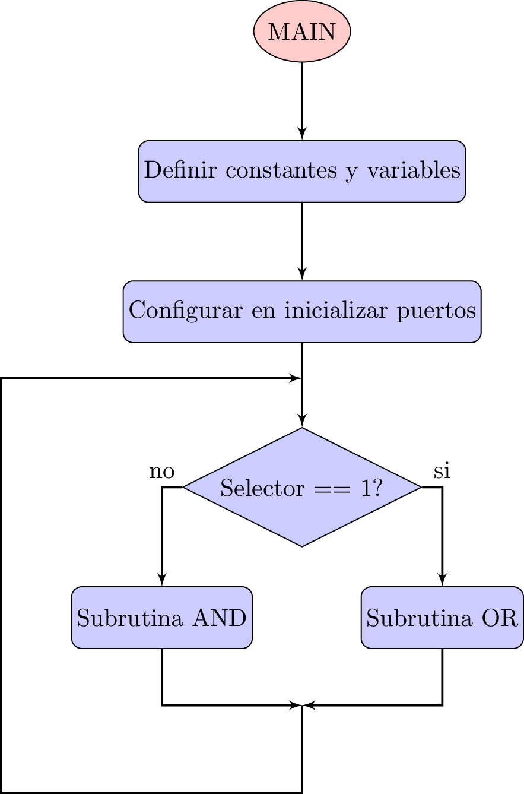
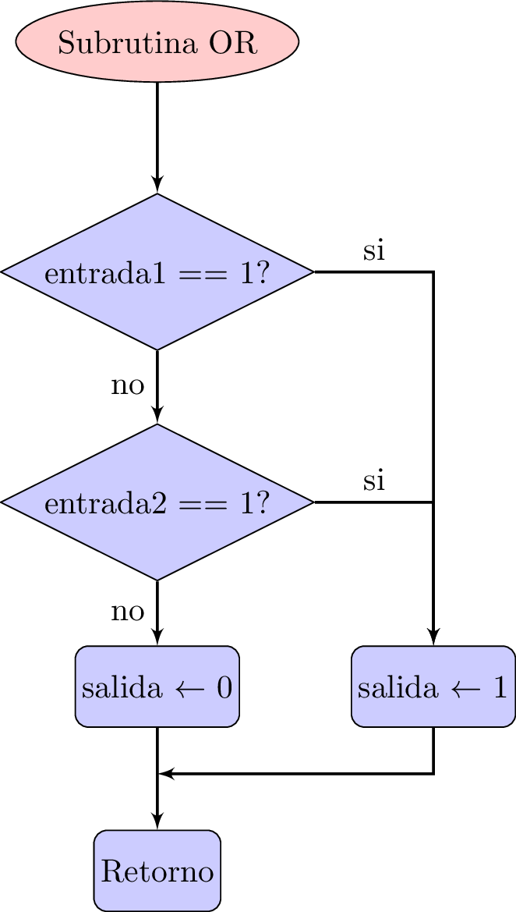
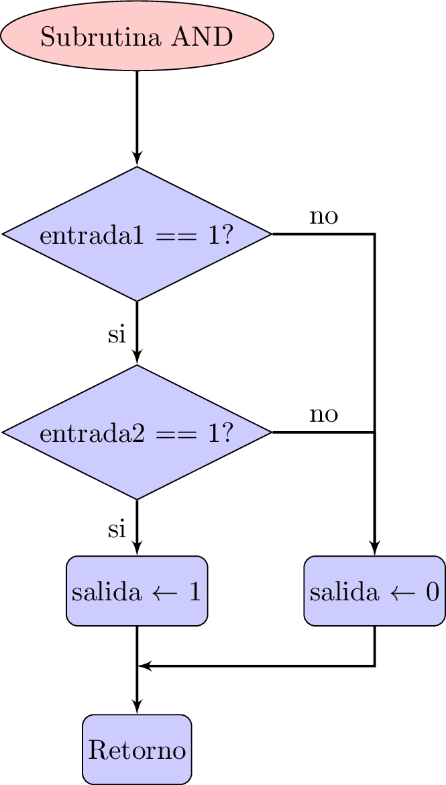

En este post muestro el circuito, el diagrama de flujo, el código en lenguage 
ensamblador y la implementación de un programa para que el microcontrolador 
<a href="http://ww1.microchip.com/downloads/en/devicedoc/41291f.pdf">PIC 16F886</a> 
realice de forma controlada por el usuario las operaciones 
lógicas: AND o OR cada una de dos entradas y una salida.

El propósito es aplicar las instrucciones de:

1. Llamada a una subrutina: **CALL**.
2. Prueba de Bits: **BTFSS** y **BTFSC** para realizar ciclos con el uC.

La implementación consta de 3 interruptores de entrada, uno para seleccionar la 
operación lógica que el usuario desea realizar, y dos que serán las entradas de 
la operación lógica seleccionada. Por otra parte, la salida consta de un led para 
indicar el resultado de según el estado de las entradas.

<h2>Configuración de entradas y salidas</h2>
Se utilizarán algunos pines del puerto A y del Puerto B. La siguiente tabla 
muestra a detalle los bits utilizados por el programa:

| Bit   |   Función           |  Descripción  |
|-------|:-------------------:|:-------------:|
| RA0 |  Entrada | Selector de la operación lógica a realizar |
| RA1 |  Entrada | Entrada 1 |
| RA2 |  Entrada | Entrada 2 |
| RB0 |  Salida | Salida de la operación lógica|
{: .table .table-striped .table-hover}

<h2>Diagrama eléctrico</h2>
El diagrama del circuito respectivo es el que se muestra a continuación:

  <figure>
    
    <figcaption>
      Figura 1: Circuito eléctrico.
    </figcaption>
  </figure>

<h2>Diagrama de flujo</h2>
El diagrama de flujo de la implementación se encuentra divido en tres partes, la primera corresponde al *programa principal*, mientras que las dos restantes se refieren cada una a las subrutinas de las operaciones *AND* y *OR*.

<figure style="text-align: center">
  
 
    
  

  <figcaption>
    Figura 2: Diagrama de flujo de la rutina principal
  </figcaption>
</figure>

 
<figure style="text-align: center">
  
 
    
  

  <figcaption>
    Figura 3: Diagrama de flujo de la subrutina para la función lógica OR
  </figcaption>
</figure>

 
<figure style="text-align: center">
  
 
    
  

  <figcaption>
    Figura 4: Diagrama de flujo de la subrutina para la función lógica AND
  </figcaption>
</figure>
 

## Programa
El código en lenguage ensamblador es el siguiente:
	
    PORTA   EQU	05
    PORTB   EQU	06
    TRISB   EQU	06
    ANSEL   EQU	08
    STATUS  EQU	03
    RP0     EQU	05
    RP1     EQU	06
    RA0     EQU	00
    RA1     EQU	01
    RA2     EQU	02
    RA3     EQU	03
    RA4     EQU	04
    RA6     EQU	06
    RA7     EQU	07
    RB0     EQU	00
    ;*****************************************************************************
    ; Reset Vector
    ;*****************************************************************************
    RES_VECT  CODE    0x0000            ; processor reset vector
      GOTO    START                   ; go to beginning of program
    ;*****************************************************************************
    ; MAIN PROGRAM
    ;*****************************************************************************
    MAIN_PROG CODE                      ; let linker place main program
    START
    ; TODO Step #5 - Insert Your Program Here
      BSF     STATUS,RPO      ;move to bank 3
      BSF     STATUS,RP1      ;move to bank 3
      CLRF    ANSEL           ;PORTA as digital I/O
      BSF     STATUS,RP0      ;move to bank 1
      BCF     STATUS,RP1      ;move to bank 1
      MOVLW   b'11111111'     ;configure PORTA as input
      MOVWF   TRISA
      MOVLW   b'00000000'     ;configure PORTB as output
      MOVWF   TRISB
      BCF     STATUS,RP0      ;move to bank 0
      BCF     STATUS,RP1      ;move to bank 0
      CLRF    PORTA
      CLRF    PORTB
    FOREVER
    BTFSS   PORTA,RA0
    GOTO    X10
    CALL    SUBOR
    GOTO    FOREVER
    X10
    CALL    SUBAND
    GOTO    FOREVER
    SUBAND
      BTFSS   PORTA,RA1
      GOTO    X20
      BTFSS   PORTA,RA2
      GOTO    X20
      BSF     PORTB,RB0
      RETURN
    X20
      BCF     PORTB,RB0
      RETURN
    SUBOR
      BTFSS   PORTA,RA1
      GOTO    X30
      GOTO    X40
    X30
      BTFSS   PORTA,RA2
      GOTO    X50
    X40
      BSF     PORTB,RB0
      RETURN
    X50
      BCF     PORTB,RB0
      RETURN
      END

<h1>Video de la implementación</h1>

 
  <video width="100%" controls poster="../assets/images/Post01/snapShotVideo.png">
    <source src="../assets/images/Post01/video.mp4" type="video/mp4">
  </video>

