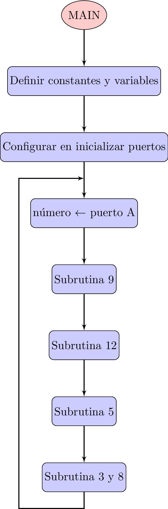
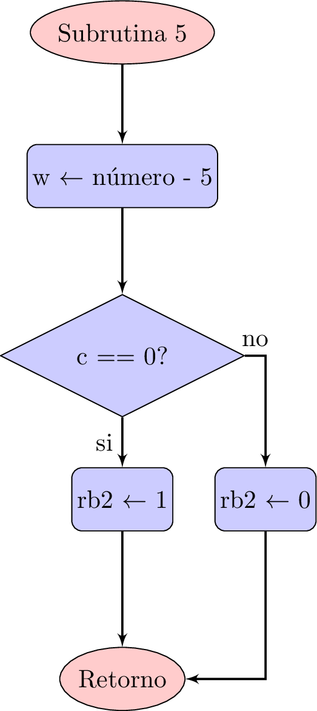
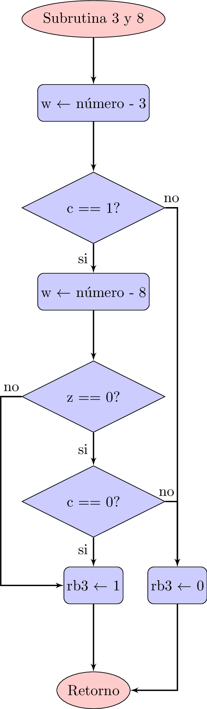

En este post muestro el circuito, el diagrama de flujo, el código y la implementación de un programa en lenguaje ensamblador en el microcontrolador microcontrolador [PIC 16F886](http://ww1.microchip.com/downloads/en/devicedoc/41291f.pdf) para realizar una comparación de números utilizando los bits **Z** y **CARRY** del registro **STATUS**.

EL propósito es aplicar las instrucciones de prueba de bits para poder realizar las comparaciones:

1. **BTFSS**
2. **BTFSC** 

La implementación consta de 4 entradas en los bits menos significativos del *puerto A* para introducir el número de referencia y con el cual se desea trabajar. Este número estará en un rango de 0 a 15. Como resultado se dispone de 4 posibles condiciones de salida a través de los bits RB0 - RB3:

1. El número es igual a 9
2. El número es mayor a 12
3. El número es menor a 5
4. El número se encuentra entre 3 y 8

<h2>Configuración de entradas y salidas</h2>
Se utilizarán algunos pines del puerto A y del Puerto B. La siguiente tabla muestra a detalle los bits utilizados por el programa:

| Bit | Función | Descripción                                |
|-----|:-------:|:------------------------------------------:|
| RA0 | Entrada | Posición *menos* significativa del número  |
| RA1 | Entrada | Siguiente posición del número              |
| RA2 | Entrada | Siguiente posición del número              |
| RA0 | Entrada | Posición *más* significativa del número    |
| RB0 | Salida  | Indicador de la condición 1                |
| RB1 | Salida  | Indicador de la condición 2                |
| RB2 | Salida  | Indicador de la condición 3                |
| RB3 | Salida  | Indicador de la condición 4                |
{: .table .table-striped .table-hover}

<h2>Diagrama eléctrico</h2>
El diagrama del circuito respectivo es el que se muestra a continuación:

  <figure>
    
    <figcaption>
      Figura 1: Circuito eléctrico.
    </figcaption>
  </figure>

<h2>Diagrama de flujo</h2>
El diagrama de flujo de la implementación se encuentra divido en cinco partes, la primera corresponde al *programa principal*, mientras que las restantes hacen referencia a cada una de las subrutinas para las comparaciones.

  <figure>
    
    <figcaption>
      Figura 2: Diagrama de flujo de la rutina principal
    </figcaption>
  </figure>

 

  <figure>
    
    <figcaption>
      Figura 3: Comparación con la condición: número == 9
    </figcaption>
  </figure>

 

  <figure>
     12" width="200"/>
    <figcaption>
      Figura 4: Comparación con la condición: número > 12
    </figcaption>
  </figure>

 

  <figure>
    
    <figcaption>
      Figura 5: Comparación con la condición: número < 5
      </figcaption>
  </figure>

 

  <figure>
    
    <figcaption>
      Figura 6: Comparación con la condición: 3 <= número <=8
      </figcaption>
  </figure>

 

<h2>Programa</h2>
El código en lenguage ensamblador es el siguiente:

    #include "p16f886.inc"
    ; CONFIG1
    ; __config 0xEFE5
      __CONFIG _CONFIG1, _FOSC_INTRC_CLKOUT & _WDTE_OFF & _PWRTE_ON & _MCLRE_ON  & _CP_OFF & _CPD_OFF & _BOREN_ON & _IESO_ON & _FCMEN_ON & _LVP_OFF
    ; CONFIG2
    ; __config 0xFFFF
      __CONFIG _CONFIG2, _BOR4V_BOR40V & _WRT_OFF
    ; TODO PLACE VARIABLE DEFINITIONS GO HERE
    porta	EQU	05
    trisa	EQU	85
    ansel	EQU	188
    portb	EQU	06
    trisb	EQU	86
    status	EQU	03
    c	EQU	00
    z	EQU	02
    rp0	EQU	05
    rp1	EQU	06
    ra0	EQU	00
    ra1	EQU	01
    ra2	EQU	02
    ra3	EQU	03
    rb0	EQU	00
    rb1	EQU	01
    rb2	EQU	02
    rb3	EQU	03
    numero	EQU	20
    ;****************************************************************************
    ; Reset Vector
    ;****************************************************************************
    RES_VECT  CODE    0x0000            ; processor reset vector
      GOTO    START                   ; go to beginning of program
    ;***************************************************************************
    ; MAIN PROGRAM
    ;***************************************************************************
    MAIN_PROG CODE                      ; let linker place main program
    START
      ; TODO Step #5 - Insert Your Program Here
      bsf     status,rp0    ;move to bank 3
      bsf     status,rp1    ;move to bank 3
      clrf    ansel         ;PORTA as digital I/O
      bsf     status,rp0    ;move to bank 1
      bcf     status,rp1    ;move to bank 1
      MOVLW   b'11111111'   ;configure porta as input
      MOVWF   trisa
      MOVLW   b'00000000'   ;configure portb as output
      MOVWF   trisb
      BCF     status,rp0    ;move to bank 0
      BCF     status,rp1    ;move to bank 0
      CLRF    porta
      CLRF    portb
    MAIN
      MOVF    porta,w
      MOVWF   numero
      CALL    N9
      CALL    N12
      CALL    N5
      CALL    N3N8
      GOTO    MAIN
    N9
      MOVLW   d'9'
      SUBWF   numero,W
      BTFSS   status,z
      GOTO    LED9OFF
      BSF     portb,rb0
      RETURN
    LED9OFF
      BCF     portb,rb0
      RETURN    
    N12  
      MOVLW   d'12'
      SUBWF   numero,w
      BTFSC   status,z
      GOTO    LED12OFF
      BTFSS   status,c
      GOTO    LED12OFF
      BSF     portb,rb1
      RETURN
    LED12OFF
      BCF     portb,rb1
      RETURN   
    N5
      MOVLW   d'5'
      SUBWF   numero,w
      BTFSC   status,c
      GOTO    LED5OFF
      BSF     portb,rb2
      RETURN
    LED5OFF
    BCF     portb,rb2
    RETURN    
    N3N8
      MOVLW   d'3'
      SUBWF   numero,w
      BTFSS   status,c
      GOTO    LED38OFF
      MOVLW   d'8'
      SUBWF   numero,w
      BTFSC   status,z
      GOTO    LED38ON
      BTFSC   status,c
      GOTO    LED38OFF
      GOTO    LED38ON
    LED38OFF
      BCF     portb,rb3
      RETURN
    LED38ON
      BSF     portb,rb3
      RETURN
    END
