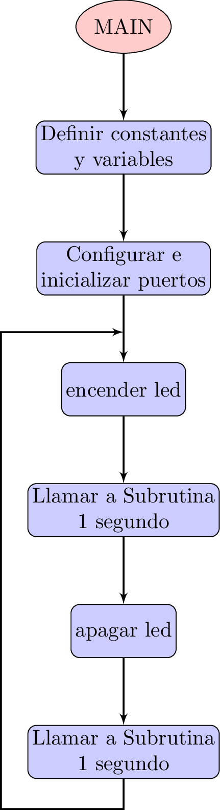
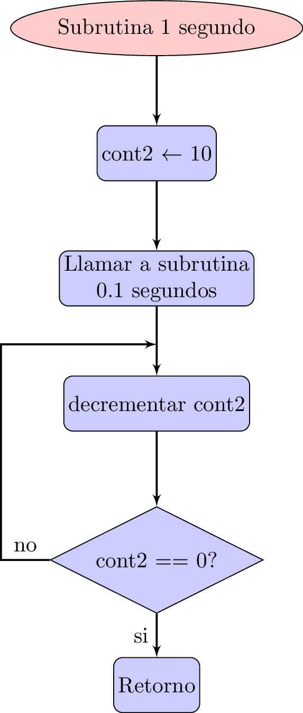
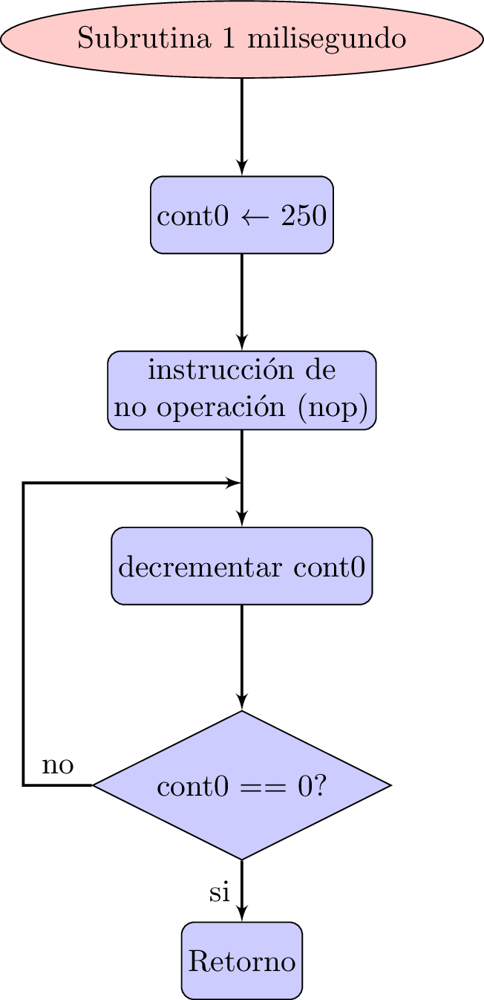

En este post muestro el circuito, el diagrama de flujo, el código y la implementación de un programa en lenguaje ensamblador en el microcontrolador [PIC 16F886](http://ww1.microchip.com/downloads/en/devicedoc/41291f.pdf) para realizar una temporización que permita cambiar el estado de un LED cada segundo haciendo uso de rutinas de demora tipo **delay**

EL propósito es aplicar las instrucciones de *no operation*: **NOP**
y de decremento-prueba de un registro: **DECFSZ** para realizar las temporizaciones.

La implementación consta de 1 salida por el pin de RB0 conectada a un led para realizar un ciclo de temporización de 1 segundo. La configuración es la siguiente:

1. RB0: 1 segundo ON - 1 segundo OFF

Hay que tener en cuenta que la realización las temporizaciones de esta forma es secuencial y restringe el PIC a **no** poder realizar otra tarea mientras se esta ejecutando el programa.

<h2>Configuración de entradas y salidas</h2>
La siguiente tabla muestra a detalle los bits utilizados por el programa:

| Bit | Función | Descripción                                |
|:---:|:-------:|:------------------------------------------:|
| RB0 | Salida | Temporización del led                       |
{: .table .table-striped .table-hover}

<h2>Diagrama eléctrico</h2>
El diagrama del circuito respectivo es el que se muestra a continuación:

  <figure>
    
    <figcaption>
      Figura 1: Circuito eléctrico.
    </figcaption>
  </figure>

<h2>Diagrama de flujo</h2>
El diagrama de flujo de la implementación se encuentra divido en varias partes, la primera corresponde al *programa principal*, mientras que las restantes hacen referencia a cada una de las subrutinas para la realización de las temporizaciones mediante demoras **delays**.

  <figure>
    
    <figcaption style="font-size: 12pt">
      Figura 2: Diagrama de flujo de la rutina principal
    </figcaption>
  </figure>

 

  <figure>
    
    <figcaption>
      Figura 3: Rutina de demora de 1 segundo
    </figcaption>
  </figure>

 

  <figure>
    
    <figcaption>
      Figura 4: Rutina de demora de 0.1 segundos
    </figcaption>
  </figure>

 

  <figure>
    
    <figcaption>
      Figura 5: Rutina de demora de 1 milisegundo
    </figcaption>
  </figure>

<h2>Programa</h2>
El código en lenguage ensamblador es el siguiente:

    #include "p16f886.inc"
    ; CONFIG1
    ; __config 0xEFE5
    __CONFIG _CONFIG1, _FOSC_INTRC_CLKOUT & _WDTE_OFF & _PWRTE_ON & _MCLRE_ON & _CP_OFF & _CPD_OFF & _BOREN_ON & _IESO_ON & _FCMEN_ON & _LVP_OFF
    ; CONFIG2
    ; __config 0xFFFF
    __CONFIG _CONFIG2, _BOR4V_BOR40V & _WRT_OFF
    cont0	EQU	20
    cont1	EQU	21
    cont2	EQU	22
    ;*******************************************************************************
    ; Reset Vector
    ;*******************************************************************************
    RES_VECT  CODE    0x0000            ; processor reset vector
      GOTO    START                   ; go to beginning of program
    ;*******************************************************************************
    ; MAIN PROGRAM
    ;*******************************************************************************
    MAIN_PROG CODE                      ; let linker place main program
    START
      ; TODO Step #5 - Insert Your Program Here
      bsf     STATUS,RP0    ;move to bank 3
      bsf     STATUS,RP1    ;move to bank 3
      clrf    ANSEL         ;PORTA as digital I/O
      bsf     STATUS,RP0    ;move to bank 1
      bcf     STATUS,RP1    ;move to bank 1
      MOVLW   b'11111111'   ;configure porta as input
      MOVWF   TRISA
      MOVLW   b'00000000'   ;configure portb as output
      MOVWF   TRISB
      BCF     STATUS,RP0    ;move to bank 0
      BCF     STATUS,RP1    ;move to bank 0
      CLRF    PORTA
      CLRF    PORTA
    main
      bsf     PORTB,RB0
      call    delay2
      bcf     PORTB,RB0
      call    delay2
      goto    main
      
    delay0
      movlw   d'250'
      movwf   cont0
    d0
      nop
      decfsz  cont0,f
      goto    d0
      return
      
    delay1
      movlw   d'100'
      movwf   cont1
    d1
      call    delay0
      decfsz  cont1,f
      goto    d1
      return
    delay2
      movlw   d'10'
      movwf   cont2
    d2
      call    delay1
      decfsz  cont2,f
      goto    d2
      return 
      END

<h2>Video de la implementación</h2>

  <video width="100%"  controls poster="../assets/images/Post03/snapShotVideo.png">
  <source src="../assets/images/Post03/video.mp4" type="video/mp4">
  </video>

