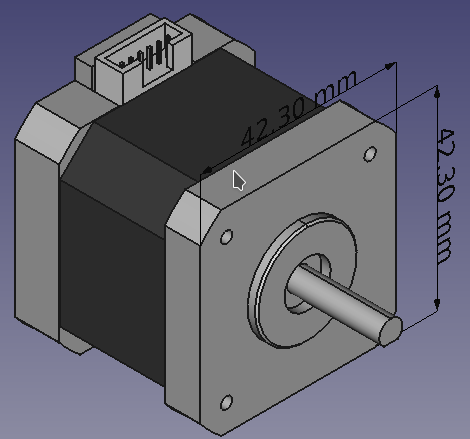

<h2>Descripción</h2>
Los motores paso a paso son motores DC que giran en **pasos discretos**. Se caracterizan por tener varias bobinas organizadas en grupos denominados **fases**. Al energizar de forma controlada cada fase, el motor rotará un paso a la vez.

Mediante la implementación de una secuencia de activación digital se puede lograr un posicionamiento  y/o un control de velocidad de forma precisa. Por esta razón, los motores paso a paso son utilizados en aplicaciones donde se requiere un control preciso de la posición de un dispositivo. Por ejemplo, en las impresoras 3D y en las máquinas de control numérico computarizado (CNC) *(Computer Numerical Control)*.

Los motores paso a paso se encuentran disponibles en una gran variedad de tamaños que dependen de sus características eléctricas y mecánicas.

<h2>Ventajas</h2>
1. **Posicionamiento:** Dado que los motores paso a paso se mueven de forma precisa en un número de pasos, son utilizados en dispositivos que requieren un control preciso de posicionamiento, por ejemplo en las impresoras 3D, máquinas CNC, unidades de cámaras *pan-til* y *Plotters*

2.  **Control de Velocidad:** El incremento preciso de rotación en cada paso permite que los motores paso a paso sean adecuados en aplicaciones de robótica y automatización donde se requiera un control en la velocidad de rotación de un dispositivo o mecanismo

3. **Torque a Baja Velocidad:** Los motores DC comunmente **no** tienen gran torque a bajas velocidades. En cambio, un motor paso a paso presenta el mayor torque a bajas velocidades. Por esta razón, son la elección indicada en aplicaciones con rotaciones de bajas velocidades y que requieren de una alta precisión.

<h2>Desventajas</h2>
1. **Baja eficiencia:** A diferencia de los motores DC, en los motores paso a paso el consumo de corriente es **independiente** de la carga de trabajo que tiene que hacer rotar. De hecho, estos consumen la mayor cantidad de corriente cuando están detenidos sin realizar trabajo alguno, aspecto que conlleva a una baja eficiencia y al sobrecalentamiento.

2. **Torque limitado a alta velocidad:** En general, los motores paso a paso tienen menos torque a altas velocidades que a bajas velocidades. Sin embargo, algunos pueden estar optimizados para un mejor torque a altas velocidades pero requieren de un controlador *(driver)* adecuado para lograrlo.

3. **No realimentación:** A diferencia de los servomotores, la mayoría de los motores paso a paso no poseen de una señal de realimentación de su posición. Aunque dadas sus características se puede lograr una gran precisión con un ciclo control abierto, se hace necesario implementar interruptores de posición inicial ó *home* para establecer una posición de referencia inicial y establecer su posición para el inicio del ciclo de trabajo.

<h2>Tipos de motores paso a paso </h2>
Existe una gran variedad de motores paso a paso. Sin embargo, algunos requieren de controladores muy específicos. La clasificación general se enfoca en los motores paso a paso que utilizan los controladores más utilizados por su bajo costo y disponibilidad. Los motores paso a paso se clasifican según su construcción y el tipo de conexión eléctrica en las bobinas que lo conforman, estos son:

1. Motores paso a paso de imanes permanentes ó híbridos
2. Motores paso a paso bipolares ó unipolares.

  <figure>
    
    <figcaption>
      Figura 1: Tipos de motores paso a paso <a href="https://www.adafruit.com">Adafruit</a>.
    </figcaption>
  </figure>

<h2>Tamaño de los motores paso a paso </h2>
Los motores paso a paso se encuentran en un amplio rango de tamaños dependiendo de la carga de trabajo a la que van a estar sometidos. El tamaño es proporcional al torque que pueden entregar y también a su costo.

Uno de los estándares más comúnmente aceptados es el estándar <a href="https://www.nema.org/pages/default.aspx">NEMA</a> *(National Electrical Manufacturers Association).* La designación NEMA hace referencia a las **dimensiones en pulgadas de la cada frontal del motor** en donde van los tornillos. Por ejemplo, un motor paso a paso NEMA17 quiere decir su cara frontal mide 1.7×1.7 pulgadas. Tal como se puede observar en la siguiente figura. Por otro lado, la dimensión restante, es decir la longitud, es variable y determina las propiedades mecánicas del motor.

  <figure>
    
    <figcaption>
      Figura 2: Modelo de un motor paso a paso NEMA17
    </figcaption>
  </figure>

La siguiente tabla detalla los tamaños de los motores paso a paso según la designación NEMA:

| NEMA | Lado (in) | Lado (mm) (dimensión estándar)  |
|:----:|:---------:|:-------------------------------:|
|  8 | 0.8 x 0.8 | 20 x 20  |
| 11 | 1.1 x 1.1 | 28 x 28  |
| 14 | 1.4 x 1.4 | 35 x 35  |
| 16 | 1.6 x 1.6 | 39 x 39  |
| 17 | 1.7 x 1.7 | 42 x 42  |
| 23 | 2.3 x 2.3 | 57 x 57  |
| 24 | 2.4 x 2.4 | 60 x 60  |
| 34 | 3.4 x 3.4 | 86 x 86  |
| 42 | 4.2 x 4.2 | 110 x 110  |
{: .table .table-striped .table-hover}

<h2>Algunas consideraciones importantes:</h2>
1. Dos motores NEMA con igual número pueden tener características eléctricas y/o mecánicas totalmente diferentes. Por ejemplo, un motor paso a paso NEMA 17 con dimensiones de 42x42x21mm tiene un torque de 11Ncm mientras que un NEMA 17 con dimensiones de 42x42x40mm tiene un torque de 45Ncm.

2. Un número de designación mayor no necesariamente quiere decir un torque mayor. Por ejemplo, un motor NEMA 14 con dimensiones de 35x35x52mm tiene un torque de 40Ncm, mientras que un NEMA 17 42x42x21mm tiene un torque de 11Ncm.

3. En general, un menor tamaño implica menos peso, pero en rangos de torque donde se traslapan con los motores del siguiente tamaño, los más pequeños tienden a ser más costosos. Por ejemplo, un motor paso a paso NEMA14 de similar torque que un NEMA17 es más costoso.

4. Probablemente, los motores paso a paso NEMA17 sean los motores más sencillos de conseguir dado su uso en impresoras 3D y máquinas CNC de escritorio, al igual que en diversos proyectos con Arduino, Raspberry Pi, BeagleBone, etc.
