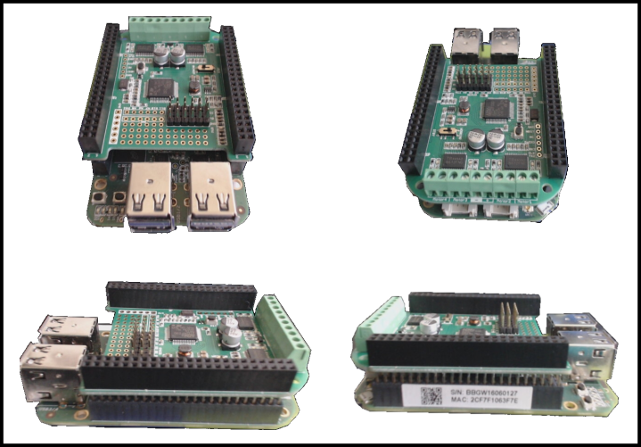
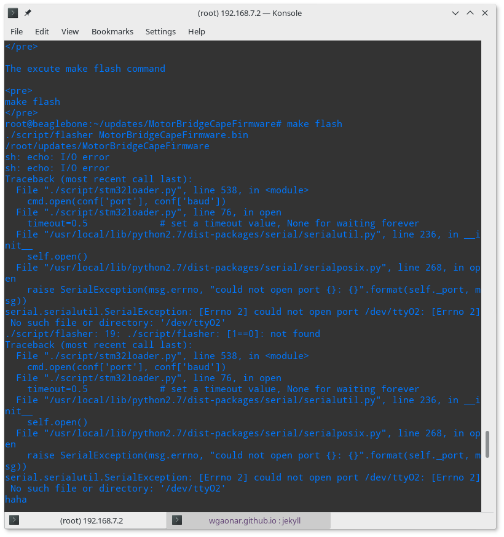
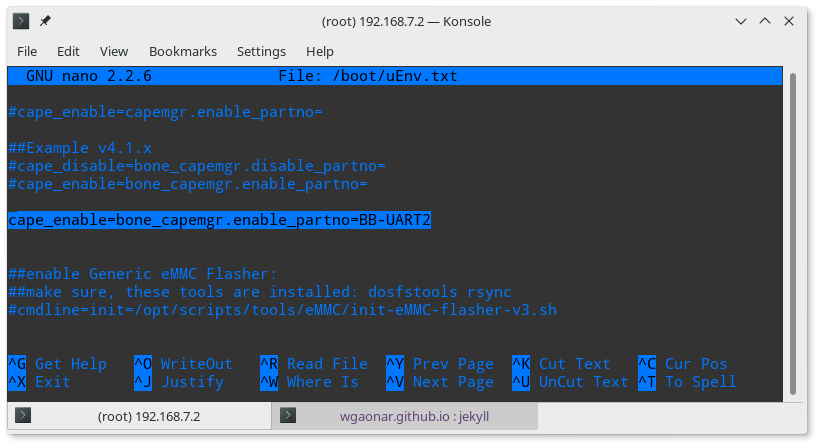
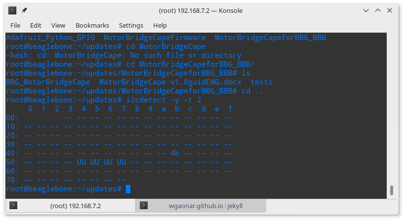

En este post muestro cómo configurar el <a href="https://www.seeedstudio.com/Motor-Bridge-Cape-p-2569.html">Motor Cape</a> de <a href="https://www.seeedstudio.com">Seeed Studio</a> para realizar el control de motores de corriente continua (motores DC), servomotores y motores paso a paso con nuestra BeagleBone. Específicamente, se pueden manejar hasta 4 motores DC y 6 servomotores simultáneamente ó hasta 2 motores paso a paso y 6 servomotores, ó una combinación de 1 motor paso a paso, 2 motores Dc y 6 servomotores en una forma simultánea.

En este caso trabajo con la <a href="https://www.seeedstudio.com/SeeedStudio-BeagleBone-Green-Wireless-p-2650.html">BeagleBone Green Wireless</a> (BBGW). Sin embargo, la Motor Cape es compatible con el ecosistema de boards de la familia <a href="https://Beagleboard.org">Beagleboard.org</a> 

El objetivo es poder controlar un motor DC de forma precisa y elegante con esta bellísima *Motor Cape*.

<h2>Conectar la Motor Cape a la BBGW</h2>
Antes que nada, tenemos que conectar la MotorCape a la BBGW. Para ello hay que insertar los pines de la Motor Cape en los conectores de la BBGW cuidando la orientación y que cada uno de los pines quede correctamente insertado. A manera de guía, en las siguientes imágenes se pueden observar diferentes vistas de cómo debe quedar conectada.

  <figure>
    
    <figcaption>
      Figura 1: Conexión de la Motor Cape a la BBGW.
    </figcaption>
  </figure>

<h2>Instalación del Driver de la Motor Cape</h2>

El primer paso, como es costumbre, consiste en actualizar el software en nuestra BBGW

	sudo apt-get update && apt-get upgrade

El segundo paso consiste en instalar algunos pre-requisitos para `Python`, sí es que no lo hemos hecho anteriormente.

	sudo apt-get install build-essential python python-all-dev
	sudo apt-get install python-pip python-numpy python-smbus

Si no tenemos instalada la librería Adafruit_GPIO para Python, procederemos a instalarla desde las fuentes. Creamos una carpeta denominada: `updates`, sí es que no la hemos creado ya!. Esta carpete será el lugar donde se guarde todo el software de terceros que en un futuro descarguemos:

	mkdir updates && cd updates
	git clone https://github.com/adafruit/Adafruit_Python_GPIO.git
	cd Adafruit_Python_GPIO
	sudo python setup.py install
	cd ..

Instalar el `Firmware` del motor cape el cual se encuentra en el repositorio: [GitHub-MotorBridgeCapeFirmware](https://github.com/Seeed-Studio/MotorBridgeCapeFirmware)

	git clone https://github.com/Seeed-Studio/MotorBridgeCapeFirmware
	cd MotorBridgeCapeFirmware/
	make flash
	cd ..

En caso de que se llegue a presentar el error de comunicación del tipo: *serial.serialutil.SerialException* como el que se muestra en la siguiente imagen, es necesario **habilitar el puerto serial 2** de la BBGW mediante la edición del archivo:

  <figure>
    
    <figcaption>
      Figura 2: Error presentado por NO estar habilitado el puerto serie 2 de la BBGW.
    </figcaption>
  </figure>

Para solucionar esto basta con adicionar la línea de código: *cape_enable=bone_capemgr.enable_partno=BB-UART2* al archivo `/boot/uEnv.txt`.

Para ello podemos hacer uso del editor de texto `nano`, el cual corre en la terminal, para adicionar la línea anteriormente mencionada. Para abrir nano, basta con la ejecución de la siguiente instrucción:

	sudo nano /boot/uEnv.txt

Una vez que hayamos adicionado la línea, el aspecto final del archivo `/boot/uEnv.txt` debe ser el siguiente:

  <figure>
    
    <figcaption>
      Figura 3: Archivo /boot/uEnv.txt editado.
    </figcaption>
  </figure>

Posteriormente, es necesario reiniciar nuestra BBGW y realizar nuevamente el proceso de instalación del driver

	sudo reboot

	cd updates/MotorBridgeCapeFirmware/
	make flash
	cd ..

Sí no se presentó el error de comunicación ó una vez editado el archivo `/boot/uEnv.txt` y reiniciada la `BBGW`; la salida en la terminal al teclear el comando: `make flash` debe ser el mensaje: `Verification OK`

Para verificar que nos podemos comunicar con la Motor Cape, basta con ejecutar el siguiente comando, el cual nos dará como salida la dirección Hexadecimal que atiene asignada la Motor Cape, la cual por defecto es: *4b*

	i2cdetect -y -r 2

  <figure>
    
    <figcaption>
      Figura 4: Detección de la Motor Cape a través del protocolo i2c.
    </figcaption>
  </figure>

En caso de que se presente un error diferente, podemos consular el [forum sobre el Motor Cape](https://www.seeed.cc/search/Motor%20Cape.html) de Seeed-Studio

<h2>Prueba del Motor Cape</h2>

Una vez instalado el driver del Motor Cape, el siguiente paso es instalar las librerías para el control de motores. Para ello Seeed -Studio nos ofrece el siguiente repositorio en [GitHub-MotorBridgeCapeforBBG_BBB](https://github.com/Seeed-Studio/MotorBridgeCapeforBBG_BBB) el cual debemos clonar a través del siguiente comando:

	git clone https://github.com/Seeed-Studio/MotorBridgeCapeforBBG_BBB

Una vez clonado el repositorio vamos a utilizar la librería para activar un motor DC. Para ello, tecleamos los siguientes comandos en la terminal:

	cd MotorBridgeCapeforBBG_BBB
	cp BBG_MotorBridgeCape/MotorBridge.py tests/
	cd tests
	python DCMotorTest.py

Se puede dar el caso de que se presente el siguiente error:

  <figure>
    
    <figcaption>
      Figura 5: Error presentado por NO estar especificado el puerto serie 2 en el archivo MotorBridge.py.
    </figcaption>
  </figure>

Este error es debido a que falta especificar en el archivo: `MotorBridge.py` el número de puerto serie al que accedemos para comunicarnos con la Motor Cape, que en este caso  corresponde al **2**. Por lo tanto, para solucionarlo basta con modificar en este archivo la línea de código *MotorBridge = Adafruit_I2C(0x4b)* a:

	MotorBridge = Adafruit_I2C(0x4b,2)

En seguida procedemos a probar nuevamente el programa de prueba de motores DC y debemos observar los leds de color rojo y azul del motor 3 pulsado alternadamente. Esto significa que el driver de nuestra Motor Cape ha sido instalado correctamente y que está lista para ser usada.

  <video width="100%"  controls poster="../assets/images/Post05/snapShotVideo.png">
  <source src="../assets/images/Post05/motorDriveTest.webm" type="video/mp4">
  </video>

