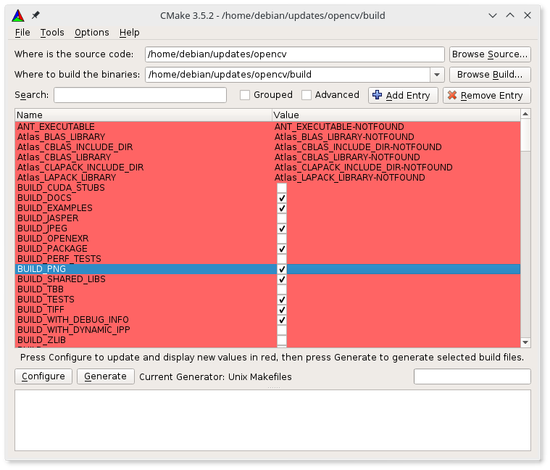
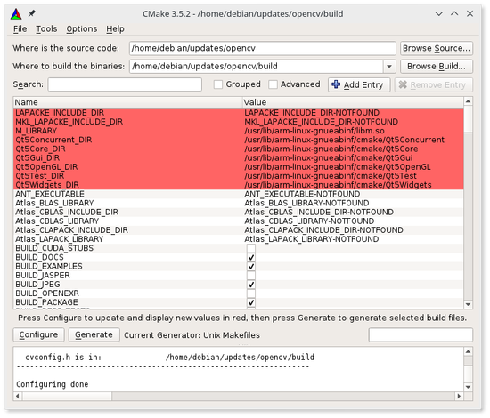
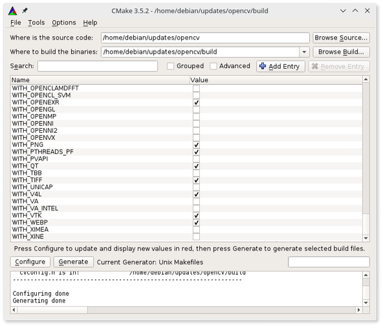

Lo primero que tengo que decir es que [opencv](http://opencv.org/) es una de las más completas librerías para el procesamiento digital de imágenes. Yo la usé en mi tesis doctoral por poner un ejemplo. Además, openCV es Open Source, tiene una excelente documentación, bastantes tutoriales y puede ser programada en varios lenguajes, yo la he usado con C++ y Python.

Uno de sus objetivos es que no tengas que empezar desde 0 con el procesamiento de tus imágenes, sino que utilices los algoritmos que ya tiene implementados, que por cierto, corresponden con la investigación actúal en visión artificial.

Ahora vamos a ver cómo la instalamos en nuestra BeagleBoneBlack `(BBB)`:

Antes de comenzar recomiendo a los nuevos usuarios utilizar la imagen oficial de Debian para la BeagleBone: [Beagleboard](http://beagleboard.org/latest-images)

<h2>Compilación e instalación de OpenCV</h2>
El primer paso es actualizar el software en nuestra BBB:

    sudo apt-get update
    sudo apt-get upgrade

Instalar algunos prerequisitos de OpenCV:

    sudo apt-get install build-essential cmake cmake-qt-gui pkg-config swig git
    sudo apt-get install libtiff5-dev libjpeg-dev libpng12-dev libv4l-dev v4l-utils

Instalar algunas utilidades para el manejo de imágenes, videos y cámaras web:

    sudo apt-get install fswebcam gpicview libav-tools qt5-default libvtk6-dev

Instalar o verificar que `Python` y algunas de sus librerias estén instaladas:

    sudo apt-get install python3 python3-all-dev python3-pip python3-numpy
    sudo apt-get install python python-all-dev python-pip python-numpy python-opencv

El siguiente paso es descargar OpenCV desde su repositorio en GitHub, para ello creamos una carpeta denominada: `updates`, sí es que no la hemos creado ya!, para contener todo el software de terceros que en un futuro descarguemos:

    mkdir updates
    cd updates/
    git clone https://github.com/opencv/opencv

Una vez que se haya clonado todo el repositorio, el siguiente paso es preparar la compilación de OpenCV:

    cd opencv
    mkdir build
    cd build

En este punto, tenemos dos opciones:

1. Realizarlo desde la *terminal*
2. Realizarlo de *forma gráfica*

Desde la terminal: Ejecutar el comando de preparación de compilación con todas sus opciones

    cmake -D CMAKE_BUILD_TYPE=RELEASE -D CMAKE_INSTALL_PREFIX=/usr/local -D BUILD_EXAMPLES=ON -D BUILD_DOCS=ON -D WITH_CUDA=OFF -D WITH_CUFFT=OFF -D WITH_CUBLAS=OFF -D WITH_NVCUVID=OFF -D WITH_OPENCL=OFF -D WITH_OPENCLAMDFFT=OFF -D WITH_OPENCLAMDBLAS=OFF -D BUILD_opencv_apps=ON -D BUILD_PERF_TESTS=OFF -D BUILD_TESTS=ON ..

Las primeras líneas en la terminal deben ser similares a las que muestro a continuación, de aquí un punto importante: sí deseas utilizar OpenCV con Python deben aparecer las dos últimas líneas que hacen referencia a que se encontró el interprete de Python tanto en la versión 2.7 y 3.4 según la fecha en que realizé este post.

    -- The CXX compiler identification is GNU 4.9.2
    -- The C compiler identification is GNU 4.9.2
    -- Check for working CXX compiler: /usr/bin/c++
    -- Check for working CXX compiler: /usr/bin/c++ -- works
    -- Detecting CXX compiler ABI info
    -- Detecting CXX compiler ABI info - done
    -- Detecting CXX compile features
    -- Detecting CXX compile features - done
    -- Check for working C compiler: /usr/bin/cc
    -- Check for working C compiler: /usr/bin/cc -- works
    -- Detecting C compiler ABI info
    -- Detecting C compiler ABI info - done
    -- Detecting C compile features
    -- Detecting C compile features - done
    -- Detected version of GNU GCC: 49 (409)
    -- Found PythonInterp: /usr/bin/python2.7 (found suitable version "2.7.9", minimum required is "2.7")
    -- Found PythonLibs: /usr/lib/arm-linux-gnueabihf/libpython2.7.so (found suitable exact version "2.7.9")
    -- Found PythonInterp: /usr/bin/python3.4 (found suitable version "3.4.2", minimum required is "3.4")

De forma gráfica, basta con ejecutar el comando para lanzar la interfaz de preparación para compilar OpenCV:

    cmake-gui

  <figure>
    
    <figcaption>
      Figura 1. Interfaz inicial de cmake-gui.
    </figcaption>
  </figure>

Lo primero que tendremos que hacer es seleccionar manualmente las rutas de origen y destino de los archivos de compilación. En este caso: `home/debian/updates/opencv` y `home/debian/updates/opencv/build`, respectivamente.

La principal ventaja de la forma gráfica, es que permite una selección personalizada de opciones, en mi caso, yo seleccioné compilar la documentación, los ejemplos y los formatos de imagen y video que uso de forma regular.

  <figure>
    
    <figcaption>
      Figura 2. Rutas de directorios y opciones configuradas para la preparación de la compilación.
    </figcaption>
  </figure>

Posteriormente se tiene que hacer click en el botón de `Configure` y en caso de que se presenten **opciones resaltadas en rojo**, hacer click de nuevo en `Configure`.

  <figure>
    
    <figcaption>
      Figura 3. Resultado de hacer clik una vez en Configure.
    </figcaption>
  </figure>

En seguida, hacer click en `Generate`. Sí todo fluyó de forma adecuada, se deben poder visualizar los mensajes de: *Configuring done* y *Generating done*.

  <figure>
    
    <figcaption>
      Figura 4. Resultado de hacer clik en Generate.
    </figcaption>
  </figure>

Después de haber realizado este proceso de preparación para la compilación de OpenCV, bien desde la terminal ó de forma gráfica, procederemos a compilar OpenCV. Una advertencia, este proceso **puede llevar hasta un par de horas!!!**

    make
    sudo make install
    sudo ldconfig

<h2>Verificación de la instalación de OpenCV</h2>

Para verificar que se haya instalado OpenCV de forma correcta, se puede utilizar el siguiente programa escrito en `C++`. Es suficiente con copiar su contenido en un archivo de nombre: *version.cpp*

    :::c++
    // version.cpp
    // Programa para verificar la versión de OpenCV en C++
    // Compilar así:
    // g++ version.cpp -o version -lopencv_core
    // Ejecutar así:
    // ./version
    #include <iostream>
    #include <opencv/cv.h>
    #include <opencv/highgui.h>
    using namespace cv;
    using namespace std;
    int main() {
      cout << "Hola, La versión instalada de OpenCV es: "<< CV_VERSION << endl;
      return 0;
    }

Para su compilación y ejecución bastará con escribir en la terminal:

    g++ version.cpp -o version -lopencv_core
    ./version

Para los que prefieran `Python`, la misma prueba se puede haer mediante el siguiente programa, el cual tiene el nombre: *version.py*

    :::python
    #version.py
    #Programa para verificar la versión de OpenCV en Python
    #Ejecutar así:
    #python version.py
    import cv2
    print ("Hola, La versión instalada de OpenCV es: {}" .format(cv2.__version__))

Para su ejecución únicamente es necesario escribir en la terminal:

    python version.py

Finalmente, en cualquiera de los dos casos, la salida debe ser similar a la línea que se muestra a continuación:

    Hola, La versión instalada de OpenCV es: 3.2.0
