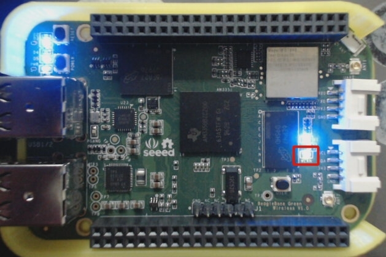

En este post que va a ser muy cortito, muestro cómo conectar la <em>BeagleBone black</em> y la <em>Beagle Bone Green Wireless</em> a internet a través de Wifi.

Lo primero que tiene que quedar claro es que las últimas versiones de Debian utilizan la utilidad <a href="https://wiki.archlinux.org/index.php/Connman#Wi-Fi">Connman</a> para el manejo de las conexiones wifi.

<h2>Habilitar el wifi</h2>

Para verificar que el wifi esté habilitado basta con ejecutar el siguiente comando en la terminal:

	connmanctl technologies

En la salida, que debe ser similar a la que se muestra enseguida, se debe verificar que la línea: **Powered: True** esté presente.

	connmanctl services
	/net/connman/technology/bluetooth
	Name = Bluetooth
	Type = bluetooth
	Powered = True
	Connected = False
	Tethering = False
	/net/connman/technology/p2p
	Name = P2P
	Type = p2p
	Powered = False
	Connected = False
	Tethering = False
	/net/connman/technology/wifi
	Name = WiFi
	Type = wifi
	bold>Powered = True
	Connected = True
	Tethering = False
	TetheringIdentifier = BeagleBone-0419
	TetheringPassphrase = BeagleBone

En caso contrario, ejecutar la siguiente instrucción:

	connmanctl enable wifi

<h2>Buscar las redes wifi disponibles</h2>

Para escanear la red wifi a la que se desea conectar, basta con ejecutar el siguiente comando:

	connmanctl scan wifi
	
Una vez terminado el proceso de escaneo, se debe pedir que muestre las redes wifi encontradas. Para ello, ejecutamos el siguiente comando:

	connmanctl services

El resultado debe ser una lista con todas las redes encontradas. A manera de ejemplo muestro la lista de redes encontradas por mi BeagleBone.

	AO HITRON-2C80		wifi_2cf7f1063f7e_484954524f4e2d32433830_managed_psk
	ARRIS-8982		wifi_2cf7f1063f7e_41525249532d38393832_managed_psk
	Calzada			wifi_2cf7f1063f7e_43616c7a616461_managed_psk
	ARRIS-A6F2		wifi_2cf7f1063f7e_41525249532d41364632_managed_psk
	LOKI-RED		wifi_2cf7f1063f7e_4c4f4b492d524544_managed_psk

<h2>Conectarse a la red wifi deseada</h2>

El siguiente paso es conectarse a la red deseada, para ello se debe ejecutar la utilidad `Connman` en modo interactivo, es decir, en un modo en el que la terminal únicamente recibe comandos de dicha utilidad. Para ello, basta con ejcutar el comando:

	connmanctl

Una vez, en el modo interactivo, la terminal cambia de aspecto y queda en espera de recibir las instrucciones correspondientes para conectarse a la red deseada, recuerda que puedes utilizar la tecla `TAB` para completar la línea: wifi_2cf7f106....

	connmanctl> agent on
	connmanctl> connect wifi_2cf7f1063f7e_484954524f4e2d32433830_managed_psk

En seguida, se pedirá introducir la clave de la red a la que se desea conectar. Una vez hecho esto, salimos del modo interactivo a través de:

	connmanctl> quit

Para verificar que todo resultó de forma correcta, basta con esperar unos segundos a que se efectúe la conexión y ejecutar el comando `ifconfig` para verificar que en `wlan0` aparezca la dirección IP de conexión.

En el caso de la *Beagle Bone Green Wireless* el led de color **rojo** se quedará encendido, indicando así que hay una conexión wifi activa.

  <figure>
    
    <figcaption>
      Figura 1: Led rojo encendido indicando una conexión wifi activa
    </figcaption>
  </figure>

Es todo por ahora espero que les sea de utilidad.

