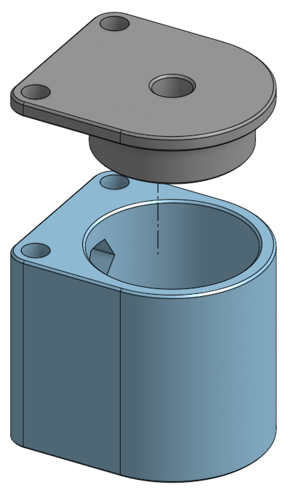

This post shows another filament dust filter make of 2 parts, a cover and a base parts.
Both are shown in the Figure 2a and 2b, respectively. 

  

    <figure>
      
      <figcaption>
        Figure 2a: Exploded view of the design in a translucent aspect. 
      </figcaption>
    </figure>
  

  

    <figure>
      
      <figcaption>
        Figure 2b: Exploded view of the design in a shaded aspect.
      </figcaption>
    </figure>
  

It has 2 cutouts for inner 3mm nuts that can be used to mount the filter on a 
wall of the printer with the help of 1 or 2 button screws of 3 x 12mm.

The cover was designed with a 0.5mm of tolerance in radius for a tight fit. 
Moreover, both parts have 3mm holes to secure these with button screws of 
3mm x 6mm, just in case.

<h1>Parts</h1>

	
	The STL files can be downloaded from: 
	<a href="https://www.thingiverse.com/thing:4692868">Thingiverse</a>
	and was designed in:
	<a href="https://cad.onshape.com/documents/59e1375141750ded6f4ef554/w/ab098c12c1c48917df4b5c81/e/935f1d50e0a015fb6865d9bc">
		Onshape</a>. 

The design is so simple, enjoy it.

