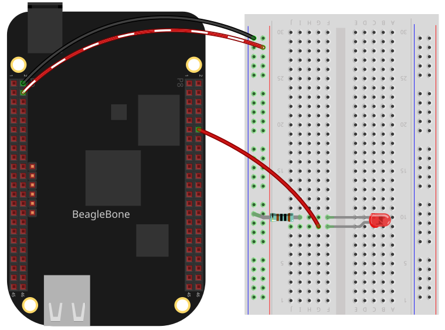

In this post I will show you how to turn a led On and Off using the C++ library described in the post <a href="{{ site.baseurl }}"> Beaglebone and C++</a> to access and control the general purpose digital pins (GPIO) pins of the BeagleBone.

## Circuit and components

The circuit can be seen in Figure 1. Please keep in mind that the BeagleBone
works at <font color="red">3.3V</font> and not 5V like microcontrollers 
as Arduino. It is so muy important to avoid damage to the board. The components are:
<ul>
  <li>1 Red Led of 3mm</li>
  <li>1 Resistor of 1 KΩ</li>
  <li>Jumpers male-male to make the connections</li>
</ul>

<figure style="text-align: center; width:70%; 
              margin-left: auto; 
              margin-right: auto;">
    
  <figcaption>
    Figure 1: Circuit to turn a Led On
  </figcaption>
</figure>

## Coding

I coded some lines and have used functions available in GPIO.h header file:

- `digitalWrite()`
- `digitalRead()`
- `delayms()`
 
The first part of the code defines the pin to be used as an output, 
in this case, the P8_12: 

```cpp
GPIO ledPin(P8_12, OUTPUT);
```
In the second part of the code, a for loop is used to turn on and off the 
Led 10 times with an interval of 1000 ms between each on and off cycles, i.e., 
to make a blinking pattern on the Led:  

```cpp
for (int i = 0; i < 10; i++)   
{
  cout << "Blinking " << i+1 << " times out of " << 10 <<  endl;
  ledPin.digitalWrite(HIGH);
  ledPin.delayms(1000);
  ledPin.digitalWrite(LOW);
  ledPin.delayms(1000);
}
```

### Listing_1.1
```cpp
/* Listing_1.1: ledOn.cpp */
#include <iostream>
#include "GPIO.h"
using namespace std;
int main()
{
  string message = "Main program starting here...";
  cout << rainbowText(message,"Blue", "Bold") << endl;
  GPIO ledPin(P8_12, OUTPUT);
  for (int i = 0; i < 10; i++)   
  {
    cout << "Blinking " << i+1 << " times out of " << 10 <<  endl;
    ledPin.digitalWrite(HIGH);
    ledPin.delayms(1000);
    ledPin.digitalWrite(LOW);
    ledPin.delayms(1000);
  }
  message = "Main program finishes here...";
  cout << rainbowText(message,"Blue", "Bold") << endl;
  return 0;
}
```

## Execution of the program
<figure style="text-align: center; width:100%; 
              margin-left: auto; 
              margin-right: auto;">
  <video width="100%" controls poster="../assets/images/Post11/VideoConsoleCover.jpeg">
    <source src="../assets/images/Post11/VideoConsole.mp4" type="video/mp4">
  </video>
  <figcaption>
    Video: Console output of the program.
  </figcaption>
</figure>

<figure style="text-align: center; width:100%; 
              margin-left: auto; 
              margin-right: auto;">
  <video width="100%" controls poster="../assets/images/Post11/VideoCircuitCover.jpeg">
    <source src="../assets/images/Post11/VideoCircuit.mp4" type="video/mp4">
  </video>
  <figcaption>
    Video: Turning a Led On and Off each 1000 milliseconds.
  </figcaption>
</figure>

Se you in the next post.
