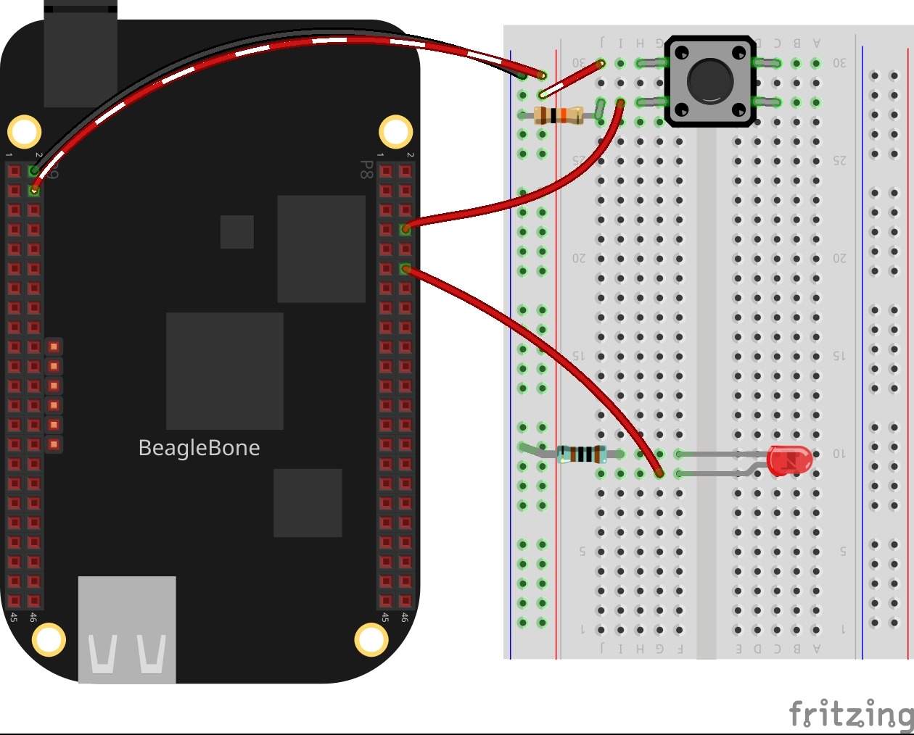

In this post, I will show you how to read the input from a button and turn a led On 
each time it will be pressed. I will be using the C++ library described 
in the post <a href="{{ site.baseurl }}"> BeagleBone and C++</a> to access and control the general purpose digital pins (GPIO) pins of the BeagleBone.

## Circuit and components

The circuit can be seen in Figure 1. Please keep in mind that the BeagleBone
works at <font color="red">3.3V</font>> and not 5V like microcontrollers 
as Arduino. It is so muy important to avoid damage to the board, specially
when your are working with buttons or digital inputs in general. 

The components are:
<ul>
  <li>1 Red Led of 3mm</li>
  <li>1 Resistor of 1KΩ</li>
  <li>1 Resistor of 10KΩ</li>
  <li>1 Push button of 12mm</li>
  <li>Jumpers male-male to make the connections</li>
</ul>

<figure style="text-align: center; width:70%; 
              margin-left: auto; 
              margin-right: auto;">
    
  <figcaption>
    Figure 1: Circuit to turn a Led On when a button is pressed
  </figcaption>
</figure>

## Coding

I coded some lines and have used functions available in the header file the GPIO.h 
The functions are:
- `digitalWrite()`
- `digitalRead()`
- `delayms()`

The first part of the code defines the pins to be used as input from a button
and output for the Led, P8_08 and P8_12, respectively: 

```cpp
GPIO buttonPin(P8_08, INPUT);
GPIO ledPin(P8_12, OUTPUT);
```

In the second part of the code, a counter is used to record each time the button
is pressed to a maximum of 10 times. In this case, the while loop finishes and then 
the main program.  

Inside this while loop, there are another two while loops. The first waits until the 
button is pressed, immediately the Led is turned On and the counter is incremented. After that, 
the second loop waits until the button is released to turn the Led Off.  


```cpp
int count = 0;
while (count < 10)
{
  while (buttonPin.digitalRead() == LOW);
  count++;
  cout << "The button was pressed, turning the led ON " 
       << rainbowText(to_string(count), "Red") << " times" << endl;
  ledPin.digitalWrite(HIGH);
  while (buttonPin.digitalRead() == HIGH)
    ledPin.delayms(10);
  cout << "The button was released, turning the led OFF" << endl << endl;
  ledPin.digitalWrite(LOW);
  ledPin.delayms(10);
}
```

### Listing_1.2
```cpp
#include <iostream>
#include "GPIO.h"
using namespace std;
int main()
{
  string message = "Main program starting here...";
  cout << rainbowText(message,"Blue", "White", "Bold") << endl;
  GPIO buttonPin(P8_08, INPUT);
  GPIO ledPin(P8_12, OUTPUT);
  int count = 0;
  while (count < 10)
  {
    while (buttonPin.digitalRead() == LOW);
    count++;
    cout << "The button was pressed, turning the led ON " 
         << rainbowText(to_string(count), "Red") << " times" << endl;
    ledPin.digitalWrite(HIGH);
    while (buttonPin.digitalRead() == HIGH)
      ledPin.delayms(10);
    cout << "The button was released, turning the led OFF" << endl << endl;
    ledPin.digitalWrite(LOW);
    ledPin.delayms(10);
  }
  message = "Main program finishes here...";
  cout << rainbowText(message,"Blue", "Bold") << endl;
  return 0;
}
```

## Execution of the program
<figure style="text-align: center; width:100%; 
              margin-left: auto; 
              margin-right: auto;">
  <video width="100%" controls poster="../assets/images/Post12/VideoConsoleCover.png">
    <source src="../assets/images/Post12/VideoConsole.mp4" type="video/mp4">
  </video>
  <figcaption>
    Video: Console output of the program.
  </figcaption>
</figure>

<figure style="text-align: center; width:100%; 
              margin-left: auto; 
              margin-right: auto;">
  <video width="100%" controls poster="../assets/images/Post12/VideoCircuitCover.jpeg">
    <source src="../assets/images/Post12/VideoCircuit.mp4" type="video/mp4">
  </video>
  <figcaption>
    Video: Turning a Led On each time a button is pressed until it happens 10 times.
  </figcaption>
</figure>

Se you in the next post.
