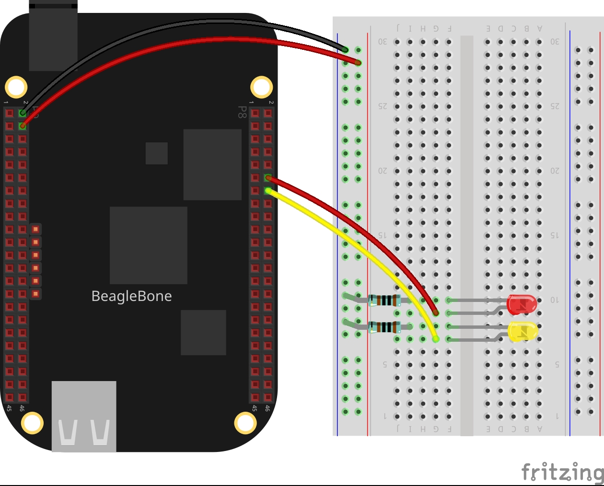

In this post, I will show you how to make a blinking on a pair of LEDs. I will be using the LED C++ Class described in the post <a href="{{ site.baseurl }}"> Implementation of the LED Class for BeagleBone</a> to use methods for controlling LEDs attached to GPIO pins in the BeagleBone.

## Circuit and components

The circuit can be seen in Figure 1. Please keep in mind that the BeagleBone works at <font color="red">3.3V</font> and not 5V like microcontrollers as Arduino. It is so important to avoid damage to the board, especially when you are working with buttons or digital inputs in general. 

The components are:
- 1 Red Led of 3mm
- 1 Resistor of 1KΩ
- 1 Yellow Led of 3mm
- 1 Resistor of 1KΩ
- Jumpers male-male to make the connections


<figure style="text-align: center; width:70%; 
              margin-left: auto; 
              margin-right: auto;">
    
  <figcaption>
    Figure 1: Circuit to make a blinking on a pair of LEDs in the BeagleBone Black.
  </figcaption>
</figure>

## Coding

This occurs when the user enters the character `y`
from the keyboard due that the main thread of the program can be used to wait for 
this input without affecting the blinking.

```cpp
char userInput = '\0';
while (userInput != 'y')
{
  message = "Do you want to stop blinking? Enter 'y' for yes: ";
  cout << rainbowText(message, "Violet");
  cin >> userInput;
  if (userInput == 'y') {
    ledPinRed.stopBlink(true);
    ledPinYellow.stopBlink(true);
  }
}
```

### Listing 2.1
```cpp
#include <iostream>
#include "GPIO.h"
#include "LED.h"

using namespace std;

int main()
{
  string message = "Main program starting here...";
  cout << rainbowText(message,"Blue", "White", "Bold") << endl;
  LED ledPinRed(P8_12,OUTPUT);
  LED ledPinYellow(P8_14, OUTPUT);
  message = "Start a blinking on a red led";
  cout << rainbowText(message, "Red") << endl;
  ledPinRed.blink(1000);
  message = "Start a blinking on a yellow led";
  cout << rainbowText(message, "Yellow") << endl;
  ledPinYellow.blink(100);
  char userInput = '\0';
  while (userInput != 'y')
  {
      message = "Do you want to stop blinking? Enter 'y' for yes: ";
      cout << rainbowText(message, "Violet");
      cin >> userInput;
      if (userInput == 'y') {
          ledPinRed.stopBlink(true);
          ledPinYellow.stopBlink(true);
      }
  }
  message = "Main program finishes here...";
  cout << rainbowText(message,"Blue", "White","Bold") << endl;
  return 0;
}
```

### Execution of the program
<figure style="text-align: center; width:100%; 
              margin-left: auto; 
              margin-right: auto;">
  <video width="100%" controls poster="../assets/images/Post14/VideoCover.png">
    <source src="../assets/images/Post14/Video.mp4" type="video/mp4">
  </video>
  <figcaption>
    Video: Execution of the program.
  </figcaption>
</figure>

Se you in the next post.
