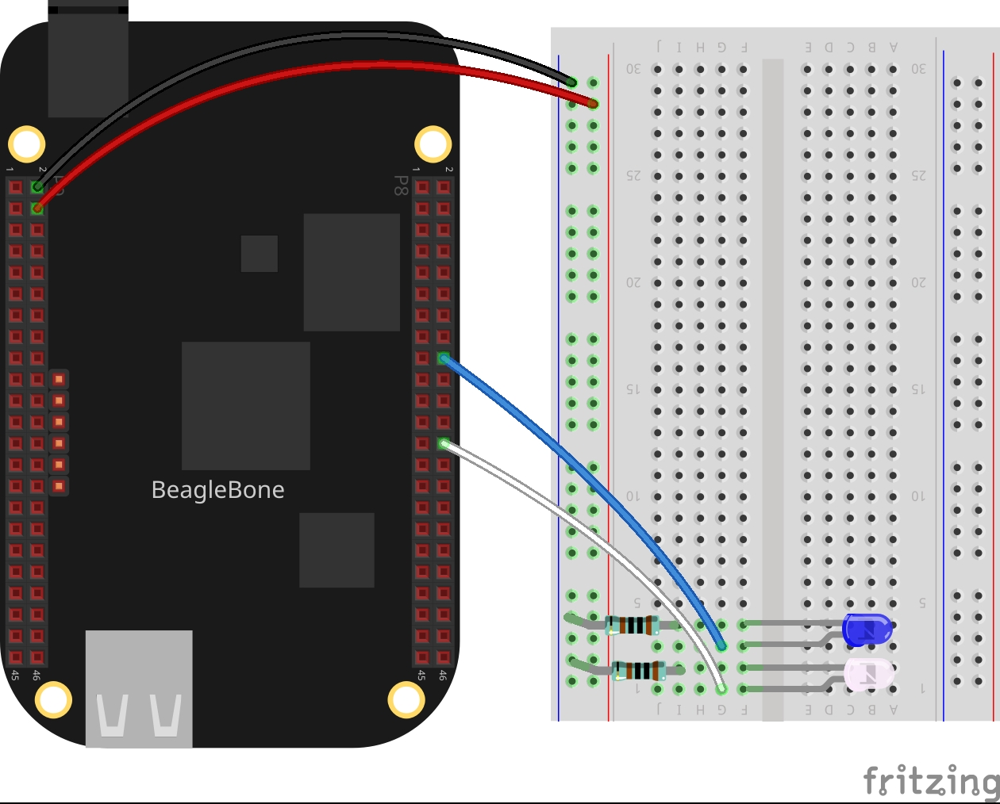

In this post, I will show you how to make a flashing on a pair of LEDs, i.e., turn
on and off a Led but with a different duration between the state on and state off.  
I will be using the C++ library described in the post 
<a href="{{ site.baseurl }}"> BeagleBone Black and C++</a> to 
access and control the general purpose digital pins (GPIO) pins of the BeagleBone.


## Circuit and components
The circuit can be seen in Figure 1. Please keep in mind that the BeagleBone works at <font color="red">3.3V</font> and not 5V like microcontrollers as Arduino. It is so important to avoid damage to the board, especially when you are working with buttons or digital inputs in general. 

The components are:
<ul>
  <li>1 Blue Led of 3mm</li>
  <li>1 Resistor of 1KΩ</li>
  <li>1 White Led of 3mm</li>
  <li>1 Resistor of 1KΩ</li>
  <li>Jumpers male-male to make the connections</li>
</ul>

<figure style="text-align: center; width:70%; 
              margin-left: auto; 
              margin-right: auto;">
    
  <figcaption>
    Figure 1: Circuit to make a flashing on a pair of LEDs.
  </figcaption>
</figure>

## Coding
I added the corresponding methods to do the flashing to the class called <b>LED</b> 
and introduced in the post <a href=""> 
Blinking a pair of LEDs with the BeagleBone Black</a> who is derived from GPIO class 
mentioned earlier in the introduction. The methods are:

- Public methods:
  - `flash()`
  - `stopFlash()`

- Private methods:
  - `makeFlash()`

The `flash()` method receives the duration for turning on and the duration for turning off the Led from the main program and it constructs the thread for the flashing pattern through a function pointer called `makeFlash()`. This method contains the routine to do the flashing. The most important contribution is about the way that flashing is performed through a <b>thread</b> execution. The advantage is that one o more flashing patterns can be done at the <span style="color: red;font-weight: bold;">same time in a parallel way`.

The thread construction is done by the next line, where the `makeFlash()`  method is called as a function pointer in the thread. It receives 2 arguments: `timeOn` and 
`timeOff`, which corresponding to the duration that the led will be On and Off, respectively.

```cpp
flashThread = std::thread(&LED::makeFlash, this, timeOn, timeOff);
```

The code that makes the flashing uses the `digitalWrite()` and `delayms()` methods which are inherited from the GPIO class.

```cpp
while (this->stopFlashFlag == false)
{
  digitalWrite(HIGH);
  delayms(timeOn);
  digitalWrite(LOW);
  delayms(timeOff);
}
```

To stop the flashing pattern the user can access the public method 
`stopFlash()` and set the boolean variable `stopFlashFlag` to true. 
The next line shows how the method reads and assigns the new value to this variable.

```cpp
stopFlashFlag = newStopFlashFlag;
```
Finally, in the destructor of the LED class, the flashing thread is waited to join
once the variable stopFlash has been set to true from the main program and the 
destructor of the base class GPIO is called to unset the pin assigned to the Led. 

```cpp
if (flashThread.joinable())
  flashThread.join(); 
```

This occurs when the user enters the character `'y'span> from the keyboard due that the  main thread of the program can be used to wait for this input without affecting the flashing.

```cpp
char userInput = '\0';
while (userInput != 'y')
{
  message = "Do you want to stop flashing? Enter 'y' for yes: ";
  cout << rainbowText(message, "Violet");
  cin >> userInput;
  if (userInput == 'y') {
    ledPinBlue.stopFlash(true);
    ledPinWhite.stopFlash(true);
  }
}
```

## Coding

The code is shown in the next listings:

### LED.h
```cpp
#ifndef LED_H
#define LED_H
#include <thread>
#include "GPIO.h"
class LED: public GPIO 
{
  private:
    bool stopBlinkFlag = false;
    bool stopFlashFlag = false;
    std::thread blinkThread;
    std::thread flashThread;
    void makeBlink(int); 
    void makeFlash(int, int);

  public:
    // Overload constructor
    LED (int, int);

    // Method for doing a blinking pattern
    void blink(int);

    // Method for doing a flashing pattern
    void flash(int, int);

    // Method for stoping a blinking
    void stopBlink(bool);

    // Method for stoping a flashing
    void stopFlash(bool);

    // Destructor
    virtual ~LED();
};
#endif // LED_H
```

### LED.cpp

```cpp
#include <iostream>
#include <chrono>
#include <thread>
#include "LED.h"
#include "../../Sources/RainbowColors.h"

// Overload constructor
LED::LED(int newId, int newMode) : GPIO(newId, newMode) {}

/*
  Public method to make a blink on the pin 
  @param int: The desired duration in milliseconds
*/
void LED::blink(int duration)
{
  string message 
  {
    "Blinking has been activated with duration of: "
    + to_string(duration) + "ms on pin: " + to_string(id)
  };
  std::cout << rainbowText(message, "Pink", "Default", "Bold") << endl; 
  blinkThread = std::thread(&LED::makeBlink, this, duration);
}

/*
  Private method that contains the routine to blink 
  @param int: The desired duration in milliseconds
*/
void LED::makeBlink(int duration)
{
  while (this->stopBlinkFlag == false)
  {
    digitalWrite(HIGH);
    delayms(duration);
    digitalWrite(LOW);
    delayms(duration);
  }
}

/*
  Public method to stop the blinking on the pin 
  @param bool: Flag to stop the thread
*/
void LED::stopBlink (bool newStopBlinkFlag)
{
  stopBlinkFlag = newStopBlinkFlag;
}

/*
    Public method to make a flash on the pin 
    @param int: The desired time ON in milliseconds
    @param int: The desired time OFF in milliseconds
*/
void LED::flash(int timeOn, int timeOff)
{
  string message 
  {
    "Flashing has been activated time on: "
    + to_string(timeOn) + "ms and time off: " 
    + to_string(timeOff) + "ms on pin: " + to_string(id)
  };
  std::cout << rainbowText(message, "Pink", "Default", "Bold") << endl; 
  flashThread = std::thread(&LED::makeFlash, this, timeOn, timeOff);
}

/*
  Private method that contains the routine to flash
  @param int: The desired time ON in milliseconds
  @param int: The desired time OFF in milliseconds
*/
void LED::makeFlash(int timeOn, int timeOff)
{
  while (this->stopFlashFlag == false)
  {
    digitalWrite(HIGH);
    delayms(timeOn);
    digitalWrite(LOW);
    delayms(timeOff);
  }
}

/*
  Public method to stop the blinking on the pin 
  @param bool: Flag to stop the thread
*/
void LED::stopFlash (bool newStopFlashFlag)
{
  stopFlashFlag = newStopFlashFlag;
}

LED::~LED()
{
  if (blinkThread.joinable())
    blinkThread.join();
  if (flashThread.joinable())
    flashThread.join();
}
```

### Listing_2.2
```cpp
#include <iostream>
#include "GPIO.h"
#include "LED.h"

using namespace std;

int main()
{
  string message = "Main program starting here...";
  cout << rainbowText(message,"Blue", "White", "Bold") << endl;
  
  LED ledPinBlue(P8_18,OUTPUT);
  LED ledPinWhite(P8_26, OUTPUT);

  message = "Start a flashing on a blue led";
  cout << rainbowText(message, "Blue") << endl;
  ledPinBlue.flash(50,500);

  message = "Start a flashing on a white led";
  cout << rainbowText(message, "White") << endl;
  ledPinWhite.flash(100, 1000);

  char userInput = '\0';
  while (userInput != 'y')
  {
    message = "Do you want to stop flashing? Enter 'y' for yes: ";
    cout << rainbowText(message, "Violet");
    cin >> userInput;
    if (userInput == 'y') {
        ledPinBlue.stopFlash(true);
        ledPinWhite.stopFlash(true);
    }
  }
    
  message = "Main program finishes here...";
  cout << rainbowText(message,"Blue", "White","Bold") << endl;
  return 0;
}
```

### Execution of the program
<figure style="text-align: center; width:100%; 
              margin-left: auto; 
              margin-right: auto;">
  <video width="100%" controls poster="../assets/images/Post15/VideoCover.png">
    <source src="../assets/images/Post15/Video.mp4" type="video/mp4">
  </video>
  <figcaption>
    Video: Execution of the program.
  </figcaption>
</figure>

Se you in the next post.
