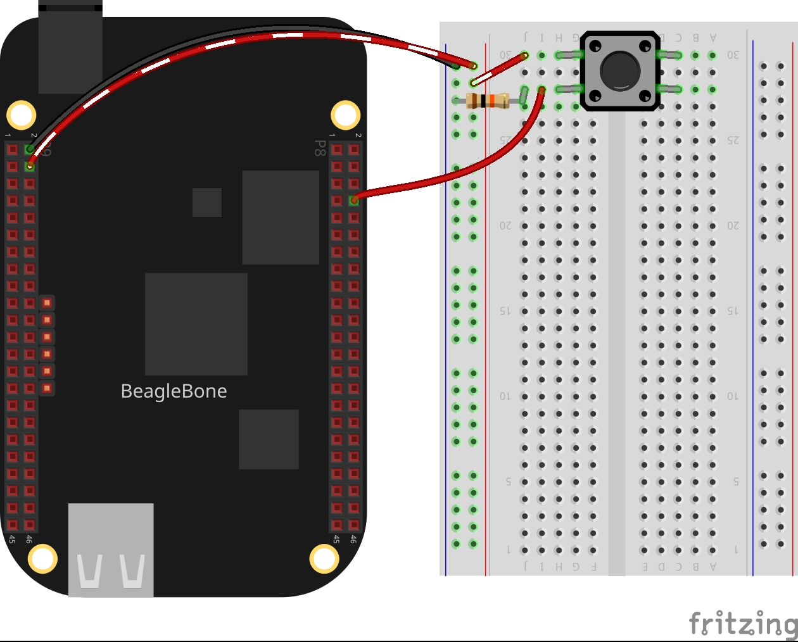

In this post, I will continue to show you how to read a button with the BeagleBone Black. In the <a href="{{ site.baseurl }}"> second entry</a> I showed how to wait for the press of a button stopping the main program until a button has been pressed. 

On the other hand, in this post, I show a new method named `WhenButtonWasPressed(*)` 
that executes a USER customized function when the button has been pressed.

## Circuit and components

The circuit can be seen in Figure 1. Please keep in mind that the BeagleBone works at <font color="red">3.3V</font> and not 5V like microcontrollers as Arduino. It is so muy important to avoid damage to the board, especially when you are working with buttons or digital inputs in general. 


The components are:
<ul>
  <li>1 Resistor of 10KΩ as a pull-down resistor</li>
  <li>1 Push button of 12mm</li>
  <li>Jumpers male-male to make the connections</li>
</ul>


<figure style="text-align: center; width:70%; 
              margin-left: auto; 
              margin-right: auto;">
    
  <figcaption>
    Figure 1: Circuit to read the input from a button.
  </figcaption>
</figure>

## Coding

The new method was added to the C++ class `BUTTON` which is derived from the `GPIO` class:
- `WhenButtonWasPressed(*)`
 
For this, in the `BUTTON` class was defined a callbackType for the function pointer that will be used as an argument to the method. This can be done in the header file BUTTON.h with the next line:

```cpp
using callbackType = int (*)();
```

The `WhenButtonWasPressed(*)` method receives a user customized function when the button has been pressed and creates a thread with a function pointer to that function which is executed in a **parallel** way to the main function in the program.  In this user customized function any other methods of the class can be called, for example: `WaitForButton()` without affect the behavior of the
main function. 

```cpp
int BUTTON::WhenButtonWasPressed(callbackType callbackFunction)
{
  if (this->mode != INPUT)
  {
    perror("'waitForButton' method only works on INPUT mode");
    return -1;
  }

  string message = "'WhenButtonWasPressed' method has been activated!!!";
  cout << RainbowText(message, "Orange") << endl;

  whenButtonWasPressedThread = thread(callbackFunction);

  return 1;
}
```

A new method named `StopWaitForButton()` was added to control the execution of the `WaitForButton()` method. This is done through a bool member variable `stopWaitForButtonFlag` that can be set with a the right timing to stop that method.

```cpp
void BUTTON::StopWaitForButton(bool newStopWaitForButtonFlag)
{
  stopWaitForButtonFlag = newStopWaitForButtonFlag;
}
```

The button can be declared as a **global** `BUTTON` object specifying the pin attached to it:

```cpp
BUTTON redButtonPin(P8_08);
```

In the main program, a user function can be defined to do some process, for example, wait for the press on the button:

```cpp
int UserCallBackFunction_ButtonRed() 
{
  string message;
  message = "Hello, I am a USER defined callback function!"; 
  cout << RainbowText(message, "Orange", "Indigo", "Bold") << endl;

  int isButtonPushed = 0;
  isButtonPushed = redButtonPin.WaitForButton();
  
  if (isButtonPushed == 1) {
    message = "The red button was pressed!!!";
    cout << RainbowText(message, "Red") << endl;
  }

  return 0;   
}
```

Just before the main program ends, the method
`StopWaitForButton()` has to be called in order
for joining and exiting the thread corresponding to the user defined function.

```cpp
redButtonPin.StopWaitForButton(true);
```

### Complete code

The next program will be pending for the press of a button and, at the same time is in a routine of delay for 5 seconds. Once the button has been pressed, a message is printed on the console. If the button was never pressed, the program ends after the 5 seconds.


### Listing_3.3
```cpp
#include <iostream>
#include <chrono>

#include "../../Sources/GPIO.h"
#include "../../Sources/BUTTON.h"
#include "../../Sources/LED.h"

using namespace std;

void delayms(int millisecondsToSleep) {
    this_thread::sleep_for(chrono::milliseconds(millisecondsToSleep));
}

// Global pin declaration
BUTTON redButtonPin(P8_08);

int UserCallBackFunction_ButtonRed() 
{
  string message;
  message = "Hello, I am a USER defined callback function!"; 
  cout << RainbowText(message, "Orange", "Indigo", "Bold") << endl;

  int isButtonPushed = 0;
  isButtonPushed = redButtonPin.WaitForButton();
  
  if (isButtonPushed == 1) {
    message = "The red button was pressed!!!";
    cout << RainbowText(message, "Red") << endl;
  }

  return 0;   
}

int main()
{
  string message = "Main function starting here...";
  cout << endl << RainbowText(message,"Blue", "White", "Bold") << endl;
  
  message = "The program is timing for ";
  cout << RainbowText(message, "Yellow");
  message = "5 seconds"; 
  cout << RainbowText(message, "Yellow", "Default", "Blink");
  message = " and is pending if a press on a button occurs";
  cout << RainbowText(message, "Yellow") << endl;

  redButtonPin.WhenButtonWasPressed(&UserCallBackFunction_ButtonRed);
  delayms(5000);

  redButtonPin.StopWaitForButton();

  message = "Main function ends here...";
  cout << RainbowText(message,"Blue", "White","Bold") << endl << endl;
  return 0;
}
```

### Execution of the program:
<figure style="text-align: center; width:100%; 
              margin-left: auto; 
              margin-right: auto;">
  <video width="100%" controls poster="../assets/images/Post19/VideoCover.png">
    <source src="../assets/images/Post19/Video.mp4" type="video/mp4">
  </video>
  <figcaption>
    Video: Execution of the program.
  </figcaption>
</figure>

Se you in the next post. 
