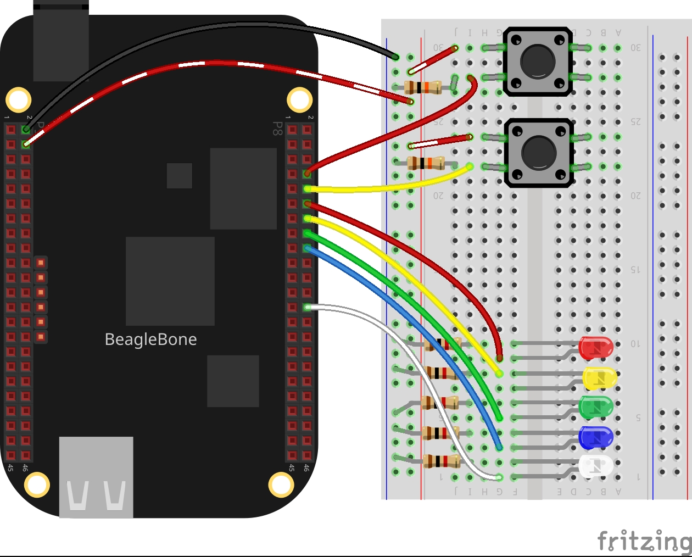

In this post, I will resume the applications of LEDs and Buttons using the methods described in the last posts. In this case, one LED will be blinking, the other flashing, another will be doing a heartbeat pattern. At the same time, two buttons will be pending for a press for the user and If it occurs, two LEDs will be turned On. All these processes will be executed for 10 seconds, which are timing within
the main routine of the program.


## Circuit and components

The circuit can be seen in Figure 1. Please keep in mind that the BeagleBone works at <font color="red">3.3V</font> and not 5V like microcontrollers as Arduino. It is so important to avoid damage to the board, especially when you are working with buttons or digital inputs in general. 

The components are:
<ul>
  <li>2 Resistor of 10KΩ as a pull-down resistor</li>
  <li>5 Resistor of 1KΩ</li>
  <li>2 Push button of 12mm</li>
  <li>5 LEDs of different colors</li>
  <li>Jumpers male-male to make the connections</li>
</ul>

<figure style="text-align: center; width:70%; 
              margin-left: auto; 
              margin-right: auto;">
    
  <figcaption>
    Figure 1: Circuit for doing some processes at the same time.
  </figcaption>
</figure>

### Listing_3.4
```cpp
#include <iostream>
#include <chrono>

#include "../../Sources/GPIO.h"
#include "../../Sources/BUTTON.h"
#include "../../Sources/LED.h"

using namespace std;

void delayms(int millisecondsToSleep) {
    this_thread::sleep_for(chrono::milliseconds(millisecondsToSleep));
}

// Global BUTTON pins declaration
BUTTON redButtonPin(P8_08);
BUTTON yellowButtonPin(P8_10);

// GLobal LEDS pins declaration
LED redLedPin(P8_12);
LED yellowLedPin(P8_14);
LED greenLedPin(P8_16);
LED blueLedPin(P8_18);
LED whiteLedPin(P8_26);

int UserCallBackFunction_RedButton() 
{
  string message;
  message = "Callback function for the red button has been activated!"; 
  cout << RainbowText(message, "Red", "Indigo", "Bold") << endl;

  int isButtonPushed = 0;
  isButtonPushed = redButtonPin.WaitForButton(RISING);
  
  if (isButtonPushed == 1) {
    message = "The red button was pressed -> turning the red Led On!!!";
    cout << RainbowText(message, "Red") << endl;
    redLedPin.TurnOn();
  }

  return 0;   
}

int UserCallBackFunction_YellowButton()
{
  string message;
  message = "Callback function for the yellow button has been activated"; 
  cout << RainbowText(message, "Yellow", "Indigo", "Bold") << endl;

  int isButtonPushed = 0;
  isButtonPushed = yellowButtonPin.WaitForButton(FALLING);
  
  if (isButtonPushed == 1) {
    message = "The yellow button was pressed -> turning the yellow Led On!!!";
    cout << RainbowText(message, "Yellow") << endl;
    yellowLedPin.TurnOn();
  }

  return 0;   
}

int main()
{
  string message = "Main function starting here...";
  cout << endl << RainbowText(message,"Blue", "White", "Bold") << endl;

  message = "Activating blinking, flashing and heartbeat on different Leds";
  cout << RainbowText(message, "Orange") << endl;

  greenLedPin.Blink(100);
  blueLedPin.Flash(100,200);
  whiteLedPin.HeartBeat(100,10);

  message = "The program is timing for ";
  cout << RainbowText(message, "Indigo");
  message = "10 seconds"; 
  cout << RainbowText(message, "Indigo", "Default", "Blink");
  message = " and is pending if a press on any button occurs";
  cout << RainbowText(message, "Indigo") << endl;

  redButtonPin.WhenButtonWasPressed(&UserCallBackFunction_RedButton);
  yellowButtonPin.WhenButtonWasPressed(&UserCallBackFunction_YellowButton);
  delayms(10000);

  // Stop the processes on the Buttons and Leds
  redButtonPin.StopWaitForButton(true);
  yellowButtonPin.StopWaitForButton(true);
  greenLedPin.StopBlink();
  blueLedPin.StopFlash();
  whiteLedPin.StopHeartBeat();

  message = "Main function ends here...";
  cout << RainbowText(message,"Blue", "White","Bold") << endl << endl;
  return 0;
}
```

### Execution of the program:
<figure style="text-align: center; width:100%; 
              margin-left: auto; 
              margin-right: auto;">
  <video width="100%" controls poster="../assets/images/Post20/VideoCover.png">
    <source src="../assets/images/Post20/Video.mp4" type="video/mp4">
  </video>
  <figcaption>
    Video: Execution of the program.
  </figcaption>
</figure>

Se you in the next post. 
