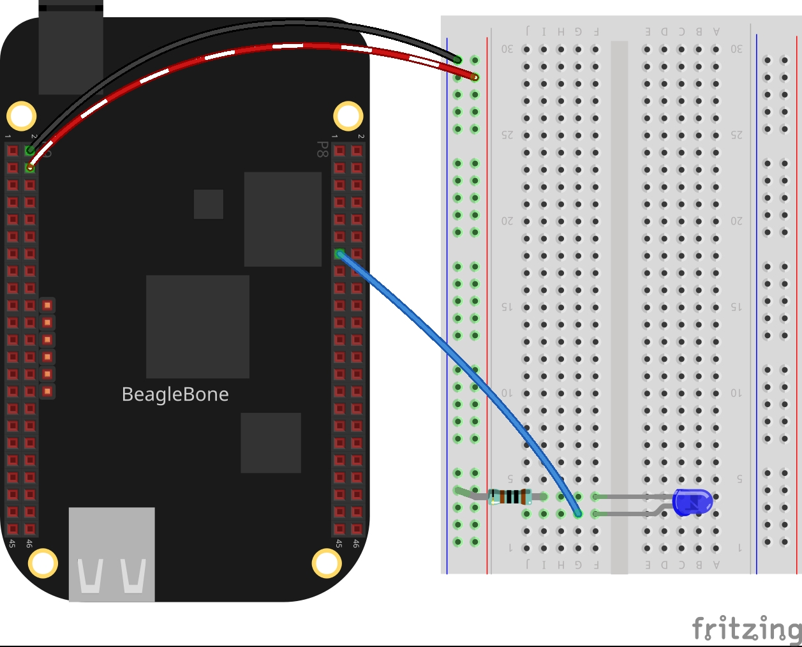
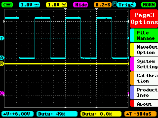

In this post, I start with the PWM technique applied to control the brightness of a LED. Remembering the PWM is a technique that lets us emulate an analog signal in a digital pin. This is done by changing the time that a signal is On in a fixed period of time. The ratio between the time ON and OFF is named duty cycle. The more duty cycle, the more is the "analog" average voltage measured on the digital pin. In  
<a href="{{ site.baseurl }}"> this post </a> You can find the complete code of the class.

## Circuit and components

The circuit can be seen in Figure 1. Please keep in mind that the BeagleBone works at <font color="red">3.3V</font> and not 5V like microcontrollers as Arduino. It is so important to avoid damage to the board, especially when you are working with buttons or digital inputs in general. 

The components are:
<ul>
  <li>5 Resistor of 1KΩ</li>
  <li>1 LED</li>
  <li>Jumpers male-male to make the connections</li>
</ul>

<figure style="text-align: center; width:70%; 
              margin-left: auto; 
              margin-right: auto;">
    
  <figcaption>
    Figure 1: Circuit to control the brightness of a LED through the PWM technique.
  </figcaption>
</figure>

## Coding
  
First an `PWM` class object is declared, for example:

```cpp
PWM pwmBlueLedPin(P8_13);
```

After, a variable is declared, initialized, and used to set the initial pwm value.

```cpp
int pwmValue = 50;
pwmBlueLedPin.SetDutyCycle(pwmValue);
```

Finally, this PWM value can be updated in this manner:

```cpp
pwmBlueLedPin.SetDutyCycle(pwmValue += 10);
```

The complete code for this application is shown in the next listing together with its corresponding execution video.

### Listing_4.1

```cpp
#include <iostream>
#include "../../Sources/PWM.h"

using namespace std;

int main()
{
  string message = "Main program starting here...";
  cout << RainbowText(message,"Blue", "White", "Bold") << endl;
  
  message = "Setting a PWM mode on a blue led";
  cout << RainbowText(message, "Blue") << endl;
  PWM pwmBlueLedPin(P8_13);

  int pwmValue = 50;
  message = "Set a pwm duty cycle of 50%' on a blue led and wait 1 second";
  cout << RainbowText(message, "Violet") << endl;
  pwmBlueLedPin.SetDutyCycle(pwmValue); 

  message = "If you want to stop the program, enter 'y' for yes";
  cout << RainbowText(message, "Blue") << endl;
  message = "Or enter 'w' for increase brightness or 's' for decrease it";
  cout << RainbowText(message, "Blue") << endl;

  char userInput = '\0';
  while (userInput != 'y')
  {
    message = "Enter an option 'y', 'w', 's': ";
    cout << RainbowText(message, "Blue");
    cin >> userInput;

    switch (userInput)
    {
    case 'w':
      pwmBlueLedPin.SetDutyCycle(pwmValue += 10);
      break;
    case 's':
      pwmBlueLedPin.SetDutyCycle(pwmValue -= 10);
      break;
    default:
      break;
    }
  }

  message = "Main program finishes here...";
  cout << RainbowText(message,"Blue", "White","Bold") << endl;

  return 0;
}
```

### Execution of the program:
<figure style="text-align: center; width:100%; 
              margin-left: auto; 
              margin-right: auto;">
  <video width="100%" controls poster="../assets/images/Post22/VideoCover.png">
    <source src="../assets/images/Post22/Video.mp4" type="video/mp4">
  </video>
  <figcaption>
    Video: Execution of the program.
  </figcaption>
</figure>

<figure style="text-align: center; width:100%; 
              margin-left: auto; 
              margin-right: auto;">
  
  <figcaption>
    Figure 2: Screen capture from the oscilloscope with a DC of 50% and a PWM period of 500us approximately.
  </figcaption>
</figure>
Se you in the next post. 
