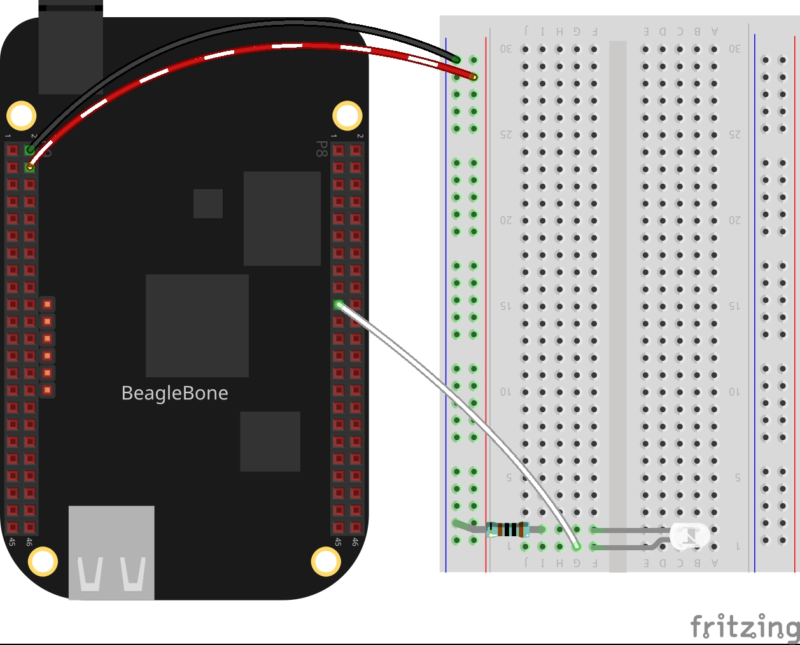

In this post, I start applying the PWM technique to do a light pulse effect on a LED. This is inspired by the work by Sparkfun titled <a href="https://www.sparkfun.com/tutorials/329">Pulse a LED</a>, where the brightness of a LED is changed using a sine wave, instead of a classic ramp or linear function. 

## Circuit and components

The circuit can be seen in Figure 1. Please keep in mind that the BeagleBone works at <font color="red">3.3V</font> and not 5V like microcontrollers as Arduino. It is so important to avoid damage to the board, especially when you are working with buttons or digital inputs in general. 

The components are:
<ul>
  <li>5 Resistor of 1KΩ</li>
  <li>1 LED</li>
  <li>Jumpers male-male to make the connections</li>
</ul>

<figure style="text-align: center; width:70%; 
              margin-left: auto; 
              margin-right: auto;">
    
  <figcaption>
    Figure 1: Circuit to Pulse an LED through a sine wave.
  </figcaption>
</figure>

## Coding
  
First an `PWM` class object is declared,  initializing the pin and its period:

```cpp
// Global pwm pin declaration
PWM pwmWhiteLedPin(P8_19,600000);
```

After, a user function is defined. This function changes the duty cycle using a  sine wave on 100 samples in a range of values between 0 and 100. This function uses a flag to stop it when the user presses a specific key.

```cpp
bool stopPulse = false;
int PulseLed()
{
  while (stopPulse == false)
  {
    for (float in = 0; in < 6.28; in += 0.0628)
    {
      float out = sin(in) * 50 + 50;
      pwmWhiteLedPin.SetDutyCycle(out);
      pwmWhiteLedPin.Delayms(10);
    }
  }
  return 0;
}
```

In the main code, this `PulseLed()` function 
is used and a function pointer argument to the PWM class method 
`DoUserFunction(&)` which inside the class
constructs a thread to run this function in parallel with the main program.  

```cpp
// Call the function to pulse the LED
pwmWhiteLedPin.DoUserFunction(&PulseLed);
```

Finally, the main program is always waiting for the press of "y" key to finish the program  stopping the  `PulseLed()` function and setting the true the flag to finish the execution of the `DoUserFunction(&)` method.

```cpp
char userInput = '\0';
while (userInput != 'y')
{
  message = "Do you want to stop the pulse on the led? Enter 'y' for yes: ";
  cout << RainbowText(message, "Violet");
  cin >> userInput;
  if (userInput == 'y') 
  {
    stopPulse = true;
    pwmWhiteLedPin.StopUserFunction();
  }
}
```

The complete code for this application is shown in the next listing together with its corresponding execution video.

### Listing_4.2
```cpp
#include <iostream>
#include <cmath>
#include "../../Sources/PWM.h"

using namespace std;

// Global pwm pin declaration
PWM pwmWhiteLedPin(P8_19,600000);

bool stopPulse = false;
int PulseLed()
{
  while (stopPulse == false)
  {
    for (float in = 0; in < 6.28; in += 0.0628)
    {
      float out = sin(in) * 50 + 50;
      pwmWhiteLedPin.SetDutyCycle(out);
      pwmWhiteLedPin.Delayms(10);
    }
  }
  return 0;
}

int main()
{
  string message = "Main program starting here...";
  cout << RainbowText(message,"Blue", "White", "Bold") << endl;
  
  message = "Pulse a white led";
  cout << RainbowText(message, "White") << endl;

  // Call the function to pulse the LED
  pwmWhiteLedPin.DoUserFunction(&PulseLed);
  
  char userInput = '\0';
  while (userInput != 'y')
  {
    message = "Do you want to stop the pulse on the led? Enter 'y' for yes: ";
    cout << RainbowText(message, "Violet");
    cin >> userInput;
    if (userInput == 'y') 
    {
      stopPulse = true;
      pwmWhiteLedPin.StopUserFunction();
    }
  }

  message = "Main program finishes here...";
  cout << RainbowText(message,"Blue", "White","Bold") << endl;

  return 0;
}
```

### Execution of the program:
<figure style="text-align: center; width:100%; 
              margin-left: auto; 
              margin-right: auto;">
  <video width="100%" controls poster="../assets/images/Post23/VideoCover.png">
    <source src="../assets/images/Post23/Video.mp4" type="video/mp4">
  </video>
  <figcaption>
    Video: Execution of the program.
  </figcaption>
</figure>

Se you in the next post. 
