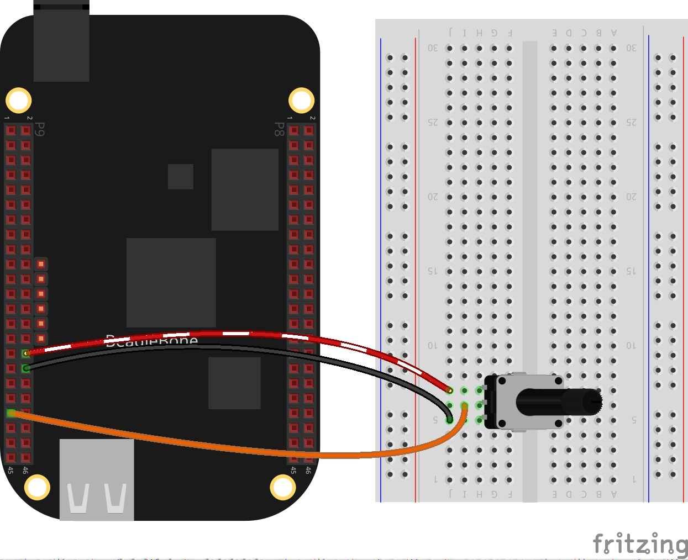

In this post, I show a simple application of the analog to digital converter (ADC) C++ class implementation shown previously in <a href="{{ site.baseurl }}"> this post</a>. Remembering that the BeagleBone has 7 analog inputs and ADC of 12 bits that let to de user to represent an analog signal within a range of 4096 values. It is important to remember that the reference for analog voltage is <font color="red">1.8V</font>. If the user provides a greater voltage, the BeagleBone could be damaged. 

## Circuit and components

The circuit can be seen in Figure 1. It consists of a Potentiometer with a power supplied using the analog ground pin **0V** located at the pin **P9_34** and to analog VDD pin at <font color="purple"><b>1.8V</b></font> located at the pin <font color="purple"><b>P9_32</b></font>. Finally, its output is connected to the **P9_39** pin.

The components are:
- 1 Potentiometer of 200KΩ
- Jumpers male-male to make the connections

<figure style="text-align: center; width:70%; 
              margin-left: auto; 
              margin-right: auto;">
    
  <figcaption>
    Figure 1: Circuit to read an analog value from a potentiometer in the BeagleBone Black.
  </figcaption>
</figure>

## Coding
  
First an <span class="label coding">ADC</span> class object is declared, for example:

```cpp
ADC adcPin(P9_39);
```

An integer variable is declared and initialized to store the digital converted values.

```cpp
int adcValue = 0;

```

The digital values can be obtained through the next class method:

```cpp
adcValue = adcPin.ReadADC();
```
 
Now, this method can be inside of a <span class="code">for loop</span> to take 100 readings for example every 100 milliseconds:

```cpp
for (int i = 0; i < 100; i++)
  {
    adcValue = adcPin.ReadADC();
    cout << "Reading " << i+1 << " of " << " 100: ";
    cout << adcValue << endl;
    adcPin.Delayms(100);
  }
```

The complete code for this application is shown in the next listing together with its corresponding execution video.

### Listing_5.1

```cpp
#include <iostream>
#include "../../Sources/ADC.h"

using namespace std;

int main()
{
  string message = "Main program starting here...";
  cout << RainbowText(message,"Blue", "White", "Bold") << endl;
  
  message = "Setting  ADC mode on a pin";
  cout << RainbowText(message, "Blue") << endl;
  ADC adcPin(P9_39);

  message = "Read an analog value and wait 100 milliseconds between each read";
  cout << RainbowText(message, "Blue") << endl;

  int adcValue = 0;
  for (int i = 0; i < 100; i++)
  {
    adcValue = adcPin.ReadADC();
    cout << "Reading " << i+1 << " of " << " 100: ";
    cout << adcValue << endl;
    adcPin.Delayms(100);
  }

  message = "Main program finishes here...";
  cout << RainbowText(message,"Blue", "White","Bold") << endl;

  return 0;
}
```

### Execution of the program:

<figure style="text-align: center; width:100%; 
              margin-left: auto; 
              margin-right: auto;">
  <video width="100%" controls poster="../assets/images/Post25/VideoCover.png">
    <source src="../assets/images/Post25/Video.mp4" type="video/mp4">
  </video>
  <figcaption>
    Video: Execution of the program.
  </figcaption>
</figure>

Se you in the next post. 
