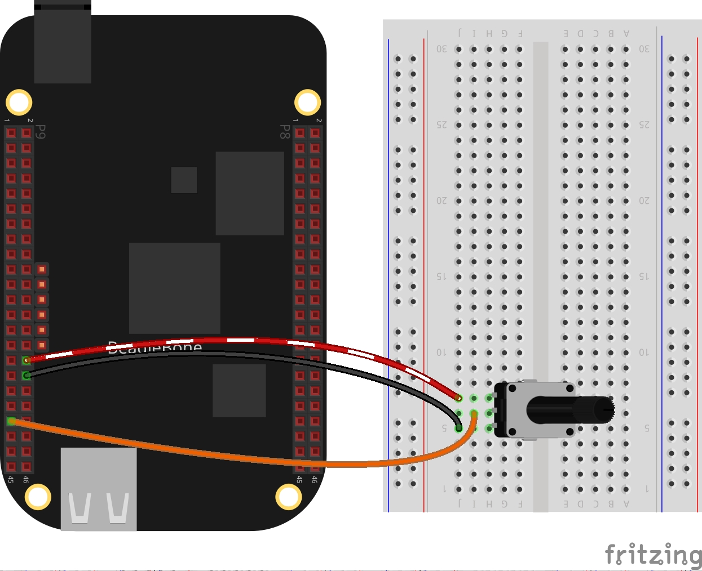

In this post, I show a simple application to read and analog voltage with the ADC C++ class implementation shown previously in <a href="{{ site.baseurl }}"> this post</a>. Remembering that the BeagleBone has 7 analog inputs and ADC of 12 bits that let to de user to represent an analog signal within a range of 4096 values. It is important to remember that the reference for analog voltage is <font color="red">1.8V</font>. If the user provides a greater voltage, the BeagleBone could be damaged. 

## Circuit and components

The circuit can be seen in Figure 1. It consists of a Potentiometer with a power supplied using the analog ground pin **0V** located at the pin **P9_34** and to analog VDD pin at <font color="purple"><b>1.8V</b></font> located at the pin <font color="purple"><b>P9_32</b></font>. Finally, its output is connected to the **P9_39** pin.

The components are:
- 1 Potentiometer of 200KΩ
- Jumpers male-male to make the connections

<figure style="text-align: center; width:70%; 
              margin-left: auto; 
              margin-right: auto;">
    
  <figcaption>
    Figure 1: Circuit to read an analog value from a potentiometer in the BeagleBone
  </figcaption>
</figure>

## Coding
  
First an <span class="label coding">ADC</span> class object is declared, for example:

```cpp
ADC adcPin(P9_39);
```

A float variable is declared and initialized to store the analog voltage.

```cpp
float adcVoltage = 0.0;
```

The voltage values can be obtained through the next class method:

```cpp
adcVoltage = adcPin.ReadVoltage();
```

In this case, the readings are taken through a user-defined function that runs on the background from the main program until a key from the keyboard will be pressed. It can be attached to the pin through the next method: 

```cpp
adcPin.DoUserFunction(&AnalogRead);
```  
 
This callback type function can be a <span class="code">while loop</span> which reads not only the analog voltage but the digital value too. For example:

```cpp
int AnalogRead()
{
  while (stopAnalogRead == false)
  {
    adcValue = adcPin.ReadADC();
    cout << "ADC value on pin: " << adcValue << endl;
    adcVoltage = adcPin.ReadVoltage();
    cout << "Voltage on the pin: " << adcVoltage << endl;
    adcPin.Delayms(100);
  }
  return 0;
}
```

An aspect to take into account is the declaration of global variables in order to make it possible this function works.

```cpp
// Global variables
bool stopAnalogRead = false;
int adcValue = 0;
float adcVoltage = 0.0;
```

The complete code for this application is shown in the next listing together with its corresponding execution video.


### Listing_5.2
```cpp
#include <iostream>
#include "../../Sources/ADC.h"

using namespace std;

// Global ADC pin declaration 
ADC adcPin(P9_39);

// Global variables
bool stopAnalogRead = false;
int adcValue = 0;
float adcVoltage = 0.0;
int AnalogRead()
{
  while (stopAnalogRead == false)
  {
    adcValue = adcPin.ReadADC();
    cout << "ADC value on pin: " << adcValue << endl;
    adcVoltage = adcPin.ReadVoltage();
    cout << "Voltage on the pin: " << adcVoltage << endl;
    adcPin.Delayms(100);
  }
  return 0;
}

int main()
{
  string message = "Main program starting here...";
  cout << RainbowText(message,"Blue", "White", "Bold") << endl;

  // Call the function to read the pin
  adcPin.DoUserFunction(&AnalogRead);

  char userInput = '\0';
  while (userInput != 'y')
  {
    message = "Do you want to stop the readings on the pin? Enter 'y' for yes: ";
    cout << RainbowText(message, "Blue")  << endl;
    cin >> userInput;
    if (userInput == 'y') 
    {
      stopAnalogRead = true;
      adcPin.StopUserFunction();
    }
  }

  message = "Main program finishes here...";
  cout << RainbowText(message,"Blue", "White","Bold") << endl;

  return 0;
}
```

### Execution of the program:
<figure style="text-align: center; width:100%; 
              margin-left: auto; 
              margin-right: auto;">
  <video width="100%" controls poster="../assets/images/Post26/VideoCover.png">
    <source src="../assets/images/Post26/Video.mp4" type="video/mp4">
  </video>
  <figcaption>
    Video: Execution of the program.
  </figcaption>
</figure>

Se you in the next post. 
