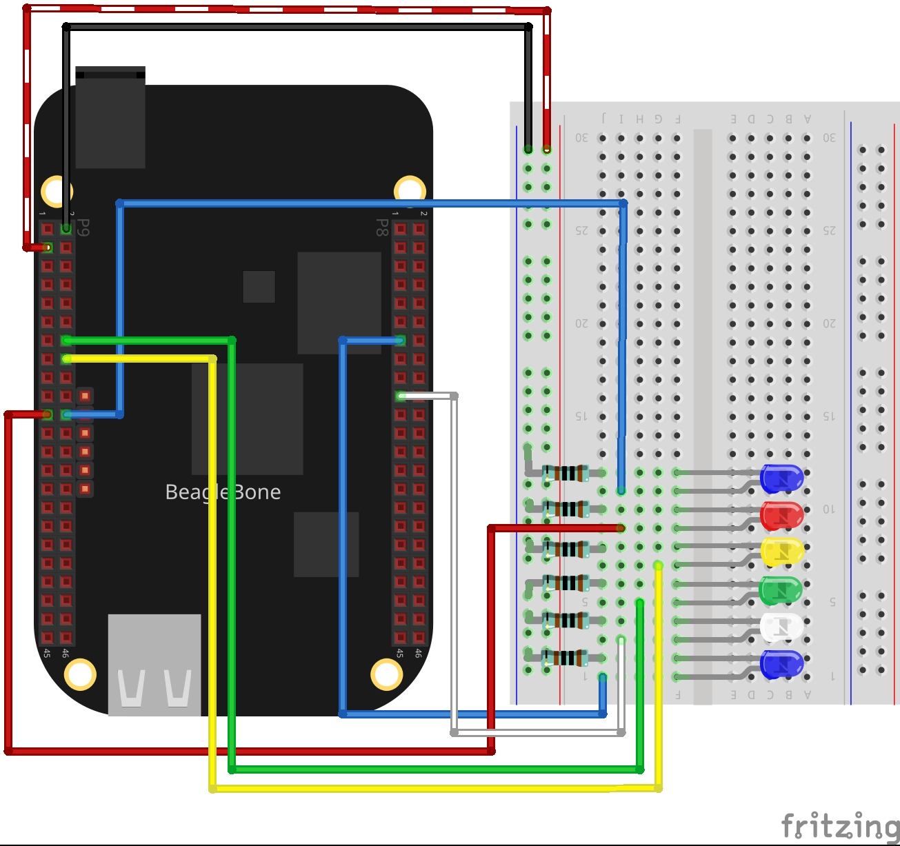

In this post, I use the six PWM pins available on the BeagleBone and show how to work with them in order to control the brightness of six LEDs. Remembering the PWM is a technique that lets us emulate an analog signal in a digital pin. This is done by changing the time that a signal is On in a fixed period of time. The ratio between the time ON and OFF is named duty cycle. The more duty cycle, the more is the "analog" average voltage measured on the digital pin. In <a href="{{ site.baseurl }}"> this post </a> you can find updated code of the class.

## Circuit and components

The circuit can be seen in Figure 1. Please keep in mind that the BeagleBone works at <font color="red">3.3V</font> and not 5V like microcontrollers as Arduino. It is so muy important to avoid damage to the board, especially when you are working with buttons or digital inputs in general.


The components are:
- 5 Resistors of 1KΩ
- 1 LED
- Jumpers male-male to make the connections

<figure style="text-align: center; width:70%; 
              margin-left: auto; 
              margin-right: auto;">
    
  <figcaption>
    Figure 1: Circuit to control the brightness of six LEDs through a PWM technique.
  </figcaption>
</figure>

## Coding
  
First of all, each one of the six `PWM` class objects is declared:

```cpp
// Global pwm pin declaration
PWM pwmBlueLedPin(P8_13);
PWM pwmWhiteLedPin(P8_19);
PWM pwmGreenLedPin(P9_14);
PWM pwmYellowLedPin(P9_16);
PWM pwmRedLedPin(P9_21);
PWM pwmBlueLedPin2(P9_22);
```

Secondly, a function to do a "stairs pattern" is defined. This function takes an argument a `PWM` object and makes a cycle increasing the duty cycle from 0 to 100 and after, decreasing it from 100 to 0.

```cpp
int DoStairs(PWM pwmPin)
{
  // Make a 'stairs pattern to up' on the Led
  cout << "Doing a stairs pattern to up on a Blue Led..." << endl;

  for (int pwmValue = 0; pwmValue <= 100; pwmValue += 10)
  {
    cout << "Setting a duty cycle of: " << pwmValue << endl;
    pwmPin.SetDutyCycle(pwmValue);
    pwmPin.Delayms(50);
  }
  cout << endl;

  // Make a 'stairs pattern to down' on the Led
  cout << "Doing a stairs pattern to down on a Blue Led..." << endl;

  for (int pwmValue = 100; pwmValue >= 0; pwmValue -= 10)
  {
    cout << "Setting a duty cycle of: " << pwmValue << endl;
    pwmPin.SetDutyCycle(pwmValue);
    pwmPin.Delayms(50);
  }
  cout << endl;
    
  return 0;
}
```

Finally, in the main code the function is called for every PWM pin:

```cpp
pDoStairs(pwmBlueLedPin);
DoStairs(pwmWhiteLedPin);
DoStairs(pwmGreenLedPin);
DoStairs(pwmYellowLedPin);
DoStairs(pwmRedLedPin);
DoStairs(pwmBlueLedPin2);
```

The complete code for this application is shown in the next listing together with its corresponding execution video.


### Listing_4.2
```cpp
#include <iostream>
#include <cmath>
#include "../../Sources/PWM.h"

using namespace std;

// Global pwm pin declaration
PWM pwmBlueLedPin(P8_13);
PWM pwmWhiteLedPin(P8_19);
PWM pwmGreenLedPin(P9_14);
PWM pwmYellowLedPin(P9_16);
PWM pwmRedLedPin(P9_21);
PWM pwmBlueLedPin2(P9_22);

int DoStairs(PWM pwmPin)
{
  // Make a 'stairs pattern to up' on the Led
  cout << "Doing a stairs pattern to up on a Blue Led..." << endl;

  for (int pwmValue = 0; pwmValue <= 100; pwmValue += 10)
  {
    cout << "Setting a duty cycle of: " << pwmValue << endl;
    pwmPin.SetDutyCycle(pwmValue);
    pwmPin.Delayms(50);
  }
  cout << endl;

  // Make a 'stairs pattern to down' on the Led
  cout << "Doing a stairs pattern to down on a Blue Led..." << endl;

  for (int pwmValue = 100; pwmValue >= 0; pwmValue -= 10)
  {
    cout << "Setting a duty cycle of: " << pwmValue << endl;
    pwmPin.SetDutyCycle(pwmValue);
    pwmPin.Delayms(50);
  }
  cout << endl;
    
  return 0;
}

int main()
{
  string message = "Main program starting here...";
  cout << RainbowText(message,"Blue", "White", "Bold") << endl;
  
  DoStairs(pwmBlueLedPin);
  DoStairs(pwmWhiteLedPin);
  DoStairs(pwmGreenLedPin);
  DoStairs(pwmYellowLedPin);
  DoStairs(pwmRedLedPin);
  DoStairs(pwmBlueLedPin2);

  message = "Main program finishes here...";
  cout << RainbowText(message,"Blue", "White","Bold") << endl;

  return 0;
}
```

### Execution of the program:</h2>
<figure style="text-align: center; width:100%; 
              margin-left: auto; 
              margin-right: auto;">
  <video width="100%" controls poster="../assets/images/Post30/VideoCover.png">
    <source src="../assets/images/Post30/Video.mp4" type="video/mp4">
  </video>
  <figcaption>
    Video: Execution of the program.
  </figcaption>
</figure>

Se you in the next post. 
