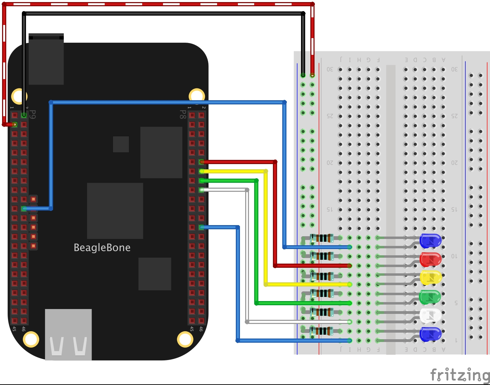

In this post, I show how to blink in order six LEDs in the BeagleBone Black using Delays routines. This is done with the `DelayMilliseconds` function which uses the `C++` `sleep_for` method for <font color="red">blocking</font> the program while the delay is executing.

## Circuit and components

The circuit can be seen in Figure 1. Please keep in mind that the BeagleBone works at <font color="red">3.3V</font> and not 5V like microcontrollers as Arduino. It is so important to avoid damage to the board, especially when you are working with buttons or digital inputs in general. 

The components are:
- 6 Resistors of 1KΩ
- 6 LEDs
- Jumpers male-male to make the connections

<figure style="text-align: center; width:70%; 
              margin-left: auto; 
              margin-right: auto;">
    
  <figcaption>
    Figure 1: Circuit to blink six LEDs with DelayMilliseconds() member function.
  </figcaption>
</figure>

## Coding
  
Initially, the `GPIO` objects are initialized as `OUTPUT` pins.

```cpp
GPIO blueLed1(P9_22, OUTPUT);
GPIO redLed(P8_12, OUTPUT);
GPIO yellowLed(P8_14, OUTPUT);
GPIO greenLed(P8_16, OUTPUT);
GPIO whiteLed(P8_18, OUTPUT);
GPIO blueLed2(P8_26, OUTPUT);
```

Next, each one of six LEDs are set to `HIGH`, waiting in this state for a certain time through the  `DelayMilliseconds()` function <span style="color: red;">before` turning ON the next one. 

```cpp
int time = 100;
blueLed1.DigitalWrite(HIGH);
DelayMilliseconds(time);
```

After that, the program does the inverse process setting each one of the six LEDs to `LOW` and waiting with the `DelayMilliseconds()` function <span style="color: red;">before` turning OFF the previous one.

```cpp
int time = 100;
DelayMilliseconds(time);
blueLed1.DigitalWrite(HIGH);
```

The complete code for the application are shown in the next listing together with its corresponding execution video.


### Listing_1.3
```cpp
/************************************************************************
Listing_1.3.cpp
@wgaonar
24/03/2021
https://github.com/wgaonar/BeagleCPP

Turning ON / OFF  six LEDs in order

Class: GPIO
************************************************************************/
#include <iostream>
#include "../../Sources/GPIO.h"

using namespace std;

int main()
{

  string message = "Main program starting here...";
  cout << RainbowText(message,"Blue", "White", "Bold") << endl;
  
  GPIO blueLed1(P9_22, OUTPUT);
  GPIO redLed(P8_12, OUTPUT);
  GPIO yellowLed(P8_14, OUTPUT);
  GPIO greenLed(P8_16, OUTPUT);
  GPIO whiteLed(P8_18, OUTPUT);
  GPIO blueLed2(P8_26, OUTPUT);

  char userInput = '\0';
  while (userInput != 'y')
  {
    int time = 100;
    blueLed1.DigitalWrite(HIGH);
    DelayMilliseconds(time);

    redLed.DigitalWrite(HIGH);
    DelayMilliseconds(time);

    yellowLed.DigitalWrite(HIGH);
    DelayMilliseconds(time);

    greenLed.DigitalWrite(HIGH);
    DelayMilliseconds(time);

    whiteLed.DigitalWrite(HIGH);
    DelayMilliseconds(time);

    blueLed2.DigitalWrite(HIGH);
    DelayMilliseconds(time);

    blueLed2.DigitalWrite(LOW);
    DelayMilliseconds(time);

    whiteLed.DigitalWrite(LOW);
    DelayMilliseconds(time);

    greenLed.DigitalWrite(LOW);
    DelayMilliseconds(time);

    yellowLed.DigitalWrite(LOW);
    DelayMilliseconds(time);

    redLed.DigitalWrite(LOW);
    DelayMilliseconds(time);

    blueLed1.DigitalWrite(LOW);
    DelayMilliseconds(time);

    cout << "Enter 'y', to finish the program: " << endl;
    cin >> userInput;
  }
  
  message = "Main program finishes here...";
  cout << RainbowText(message,"Blue", "Bold") << endl;
  return 0;
}
```

### Execution of the program:
<figure style="text-align: center; width:100%; 
              margin-left: auto; 
              margin-right: auto;">
  <video width="100%" controls poster="../assets/images/Post31/VideoCover.png">
    <source src="../assets/images/Post31/Listing_1.3.mp4" type="video/mp4">
  </video>
  <figcaption>
    Video: Execution of the program.
  </figcaption>
</figure>

Se you in the next post. 
