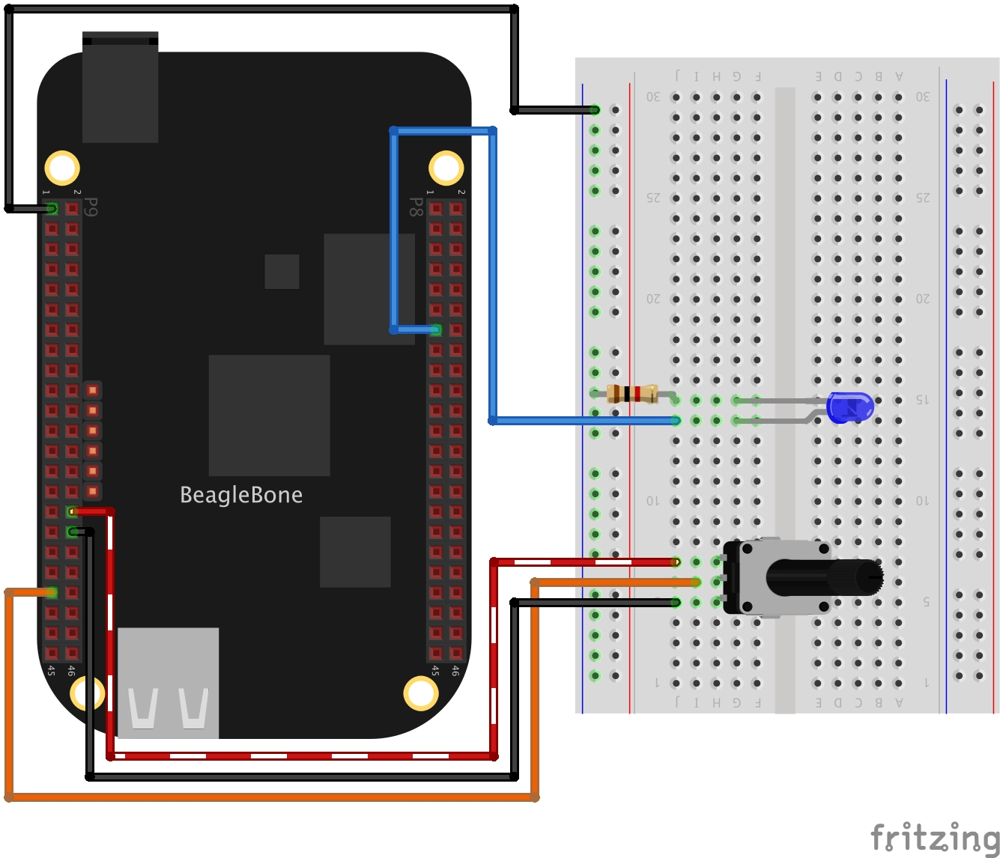

In this post, I show how to control the brightness of a LED with a potentiometer. The LED is wired to a PWM pin and the Potentiometer to an ADC pin. Remembering that the BeagleBone has 7 analog inputs and ADC of 12 bits that let the user to represent an analog signal within a range of 4096 values. It is important to remember that the reference for analog voltage is <font color="red">1.8V</font>. If the user provides a greater voltage, the BeagleBone could be damaged. 

## Circuit and components

The circuit can be seen in Figure 1. It consists of a Potentiometer with a power supplied using the analog ground pin **0V** located at the pin **P9_34** and to analog VDD pin at <font color="purple"><b>1.8V</b></font> located at the pin <font color="purple"><b>P9_32</b></font>. Finally, its output is connected to the **P9_39** pin. On the other hand, the LED is connected to PWM pin **P8_13** to see how its brightness can vary according to the potentiometer's voltage value.

The components are:
- 1 Potentiometer of 1MΩ
- 1 Resistor of 1KΩ
- 1 LED of 3mm
- Jumpers male-male to make the connections

<figure style="text-align: center; width:70%; 
              margin-left: auto; 
              margin-right: auto;">
    
  <figcaption>
    Figure 1: Circuit to control the brightness of a LED with an analog input from a potentiometer.
  </figcaption>
</figure>

## Coding

First, `ADC` and `PWM` class objects are declared as global variables:

```cpp
// Global ADC pin declaration 
ADC adcPin(P9_39);
// Global PWM pin declaration
PWM pwmBlueLedPin(P8_13);
```

An integer variable is declared and initialized to store the analog value on the pin. You can note the name contains the suffix `Out` because this variable is passed by reference to the corresponding method, after in the main program. On the other hand, boolean and integer variables are declared and initialized to stop and keep the execution of the PWM cycle on the pin and the value on this, respectively.

```cpp
// Global variables
bool stopBrightLed = false;
int adcValueOut = 0;
int pwmValue = 0;
```

A user function is defined to read the analog value (0-4095) on the potentiometer and to write the mapped value (0-100) on the PWM pin. This function is controlled by the boolean variable `stopBrightLed` which gives the signal to stop the execution.

```cpp
int BrightLed()
{
  while (stopBrightLed == false)
  {
    adcPin.ReadADC(adcValueOut);
    cout << "ADC value on pin: " << adcValueOut << " / ";
    pwmValue = adcValueOut / 4095.0 * 100; 
    cout << "PWM value: " << pwmValue << endl;
    pwmBlueLedPin.SetDutyCycle(pwmValue);
    Delayms(100);
  }
  return 0;
}
```

In the main program a `while loop` can be used to wait for a user keypress to stop the continuous sampling method before finishing the program. 

```cpp
char userInput = '\0';
while (userInput != 'y')
{
  message = "Do you want to stop the readings on the pin? Enter 'y' for yes:";
  cout << RainbowText(message, "Blue") << endl;
  cin >> userInput;
  if (userInput == 'y') stopBrightLed = true;
}
```

Before finishing the program, the PWM value on the pin is cleaned. 

```cpp
// Clean the pwm value on pin
pwmBlueLedPin.SetDutyCycle(0);
```

The complete code for this application is shown in the next listing together with its corresponding execution video.

### Listing_5.5

```cpp
/******************************************************************************
Listing_5.5.cpp
@wgaonar
03/04/2021
https://github.com/wgaonar/BeagleCPP

Control de brightness of a LED with an analog value from a POT wired to AIN0 (P9_39) in background each 100 milliseconds while polling an key stroke by the user

Class: ADC
******************************************************************************/
#include <iostream>
#include "../../Sources/ADC.h"
#include "../../Sources/PWM.h"

using namespace std;

// Global ADC pin declaration 
ADC adcPin(P9_39);

// Global PWM pin declaration
PWM pwmBlueLedPin(P8_13);

// Global variables
bool stopBrightLed = false;
int adcValueOut = 0;
int pwmValue = 0;

int BrightLed()
{
  while (stopBrightLed == false)
  {
    adcPin.ReadADC(adcValueOut);
    cout << "ADC value on pin: " << adcValueOut << " / ";
    pwmValue = adcValueOut / 4095.0 * 100; 
    cout << "PWM value: " << pwmValue << endl;
    pwmBlueLedPin.SetDutyCycle(pwmValue);
    Delayms(100);
  }
  return 0;
}

int main()
{
  string message = "Main program starting here...";
  cout << RainbowText(message,"Blue", "White", "Bold") << endl;
  
  // Call the function to read the pin
  adcPin.DoUserFunction(&BrightLed);

  char userInput = '\0';
  while (userInput != 'y')
  {
    message = "Do you want to stop the readings on the pin? Enter 'y' for yes:";
    cout << RainbowText(message, "Blue") << endl;
    cin >> userInput;
    if (userInput == 'y') stopBrightLed = true;
  }

  // Clean the pwm value on pin
  pwmBlueLedPin.SetDutyCycle(0);
  
  message = "Main program finishes here...";
  cout << RainbowText(message,"Blue", "White","Bold") << endl;

  return 0;
}
```

### Execution of the program:

<figure style="text-align: center; width:100%; 
              margin-left: auto; 
              margin-right: auto;">
  <video width="100%" controls poster="../assets/images/Post33/VideoCover.png">
    <source src="../assets/images/Post33/Listing_5.5.mp4" type="video/mp4">
  </video>
  <figcaption>
    Video: Execution of the program.
  </figcaption>
</figure>

Besides, the internal `PWM` signal can be seen in the next oscilloscope recording:

<figure style="text-align: center; width:100%; 
              margin-left: auto; 
              margin-right: auto;">
  <video width="100%" controls poster="../assets/images/Post33/VideoOscilloscopeCover.png">
    <source src="../assets/images/Post33/VideoOscilloscope.mp4" type="video/mp4">
  </video>
  <figcaption>
    Video: PWM Signal from the oscilloscope to bright the LED.
  </figcaption>
</figure>

Se you in the next post. 
