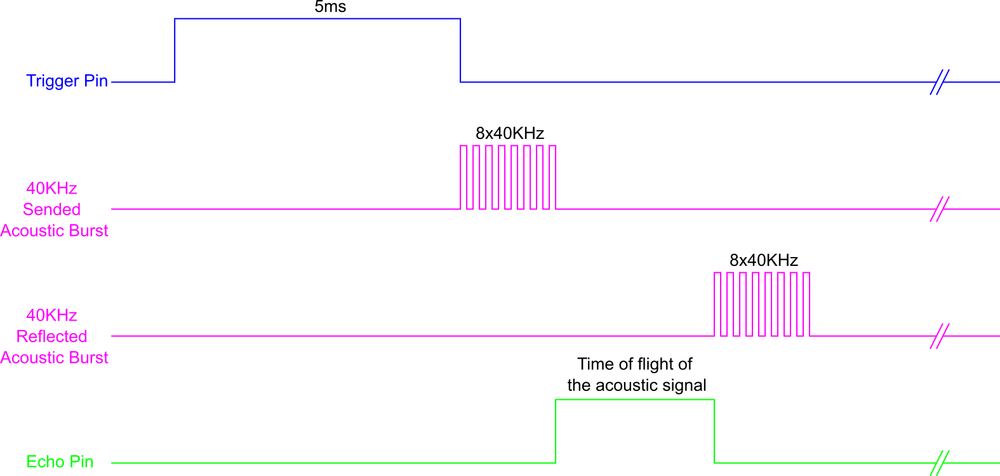

In this post, I show how to measure distance with the cheap ultrasonic sensor HC_SR04. The main contribution is to provide a class in C++ with implemented methods to get the distance with this sensor. This class is part of a whole library that can be found  <a href="https://github.com/wgaonar/BeagleCPP">here</a>. There a few <a href="https://tutorials-raspberrypi.com/raspberry-pi-ultrasonic-sensor-hc-sr04/">working examples</a> for this sensor using Python on the Raspberry Pi instead of the BeagleBone or in <a href="https://sheldondwill.wordpress.com/2014/02/04/using-an-ultrasonic-sensor-hc-sr04-with-a-3-3v-micro-controller-tiva-c-series/">3.3V microcontrollers</a>. But, I did not found one example for C++. 

I use a voltage level shifter between 3.3V and 5.0V to prevent damage to the BeagleBone. It is important to remember that the logic voltage for the BeagleBone is <font color="red">3.3V</font>. If the user provides a greater voltage, the BeagleBone could be damaged.

It is important to note that the HC_SR04 can be used with the same timing parameters as it is used with a microcontroller. The nominal timing times can be seen in Figure 1 with a 10us pulse to activate the sensor with the trigger pin. 

<figure style="text-align: center; width:70%; 
              margin-left: auto; 
              margin-right: auto;">
    
  <figcaption>
    Figure 1: Timing module for the ultrasonic sensor HC_SR04 with a microcontroller.
  </figcaption>
</figure>
  
With the BeagleBone, Raspberry Pi and other Single Board Computers the time required to access the system files of the pins has to take into account. In the BeagleBone this time is about <font color="red">200us</font> with <a href="https://github.com/wgaonar/BeagleCPP/blob/main/Sources/HC_SR04.h">this library</a>. For this reason, to use the HC_SR04 with the BeagleBone the pulse to activate the sensor has to be at least 5ms, as you can see in the diagram of Figure 2.

<figure style="text-align: center; width:70%; 
              margin-left: auto; 
              margin-right: auto;">
    
  <figcaption>
    Figure 2: Timing module for the ultrasonic sensor HC_SR04 with a microprocessor as in the BeagleBone.
  </figcaption>
</figure>

## Circuit and components

The circuit can be seen in Figure 3. It consists of a voltage level shifter, an HC-SRO4, and the BeagleBone. The pins used for trigger and echo are **P9_15** and **P9_17** and these were configured as digital output and input respectively.

The components are:
- 1 Ultrasonic Sensor HC_SR04
- 1 Level Shifter for 3.3V - 5.0V TXS0108E
- 1 Protoboard mini
- Jumpers male-male to make the connections

<figure style="text-align: center; width:70%; 
              margin-left: auto; 
              margin-right: auto;">
    
  <figcaption>
    Figure 3: Circuit to measure the distance with the ultrasonic sensor HC_SR04.
  </figcaption>
</figure>

## Coding
 
First, an `HC_SR04` object is declared with global scope:

```cpp
// Declaring the pins and the HC_SR04 object
HC_SR04 distanceSensor (P9_15, P9_17);
```

A double variable is declared to store the distance readings. Then, the `distanceSensor.MeasureDistanceCm()` method is called on the previously defined `HC_SR04` object. This activates the sensor through the trigger pin and waits for the pulse in the echo pin. Once the sent pulse is received, the time travel is counted and this calculates the distance multiplying the standard speed sound by this time and dividing this result by 2, due that the emitted sound wave has to come back to the sensor once it hits an object. The units for the calculated distance are in cm and this is bounded in a range of 0 - 400cm. The method is:

```cpp
double HC_SR04::MeasureDistanceCm() 
{
  // Send the pulse and keep it for at least 5ms in HIGH state
  triggerPin.DigitalWrite(HIGH);
  Delayms(5);
  triggerPin.DigitalWrite(LOW);

  double distanceCm = (this->PulseDuration() * soundSpeed / 2.0) + this->offset;
  
  if (distanceCm <= 0) 
    return 0;
  else if (distanceCm > 400) 
    return 400;
  else
    return distanceCm;
}
```

The HC_SR04 implements the `PulseDuration()` method that is in charge of count the time that the sound wave takes to come back to the sensor.

```cpp
double HC_SR04::PulseDuration() 
{
  auto pulseStart = std::chrono::steady_clock::now();
  auto pulseEnd = std::chrono::steady_clock::now();

  while (echoPin.DigitalRead() == LOW)
    pulseStart = std::chrono::steady_clock::now();
    
  while (echoPin.DigitalRead() == HIGH)
    pulseEnd = std::chrono::steady_clock::now();
  
  std::chrono::duration<double> duration = (pulseEnd-pulseStart);
  return duration.count();
}
```

In the main program a `for loop` can be used to measure the distance each 500ms for example:  

```cpp
double distance = 0.0;
for (size_t i = 0; i < 20; i++) {
  distance = distanceSensor.MeasureDistanceCm();
  cout << "Distance reading: " << i << " = " << distance << "cm\n";
  Delayms(500);
}
```

The complete code for this application is shown in the next listing together with its corresponding execution video.


### HC_SR04_1.1.cpp</h2>
```cpp
/******************************************************************************
HC_SR04_1.1.cpp
@wgaonar
22/06/2021
https://github.com/wgaonar/BeagleCPP

Make and show 20 distance readings each half second

Class: HC_SR04
******************************************************************************/

#include <iostream>
#include <thread>         // std::this_thread::sleep_for
#include <chrono>         // std::chrono::milliseconds

#include "../../../Sources/GPIO.h"
#include "../../../Sources/HC_SR04.h"

using namespace std;

// Declaring the pins and the HC_SR04 object
HC_SR04 distanceSensor (P9_15, P9_17);

int main() {
  string message = "Main program starting here...";
  cout << RainbowText(message,"Blue", "White", "Bold") << endl;

  double distance = 0.0;
  for (size_t i = 0; i < 20; i++) {
    distance = distanceSensor.MeasureDistanceCm();
    cout << "Distance reading: " << i << " = " << distance << "cm\n";
    Delayms(500);
  }
  
  message = "Main program finishes here...";
  cout << RainbowText(message,"Blue", "White","Bold") << endl;

  return 0;
}
```

### Execution of the program:
<figure style="text-align: center; width:100%; 
              margin-left: auto; 
              margin-right: auto;">
  <video width="100%" controls poster="../assets/images/Post34/VideoCover.jpg">
    <source src="../assets/images/Post34/HC_SR04_1.1.mp4" type="video/mp4">
  </video>
  <figcaption>
    Video: Execution of the program.
  </figcaption>
</figure>

Se you in the next post. 
