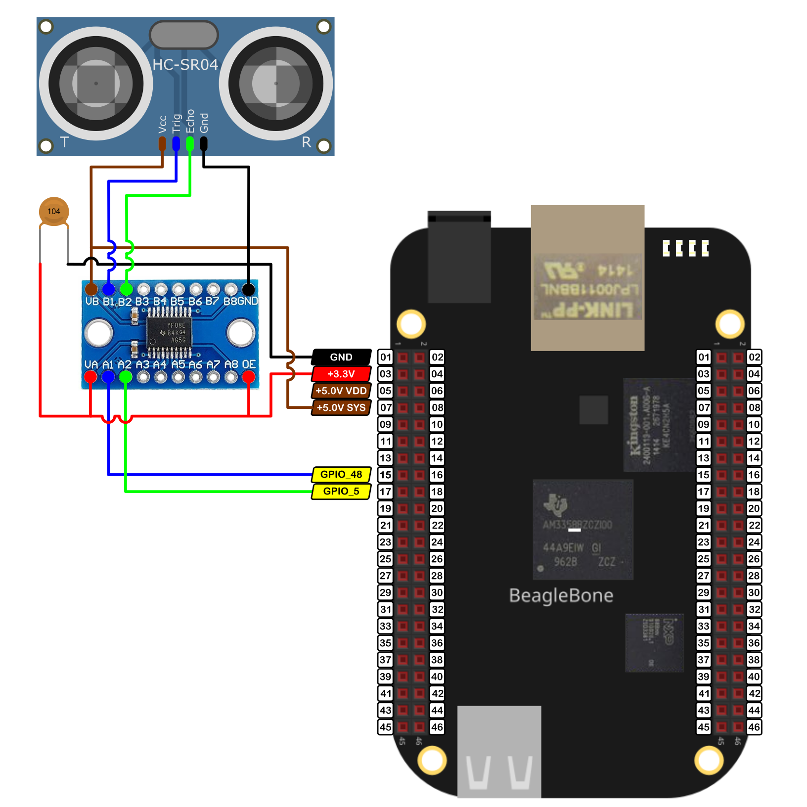
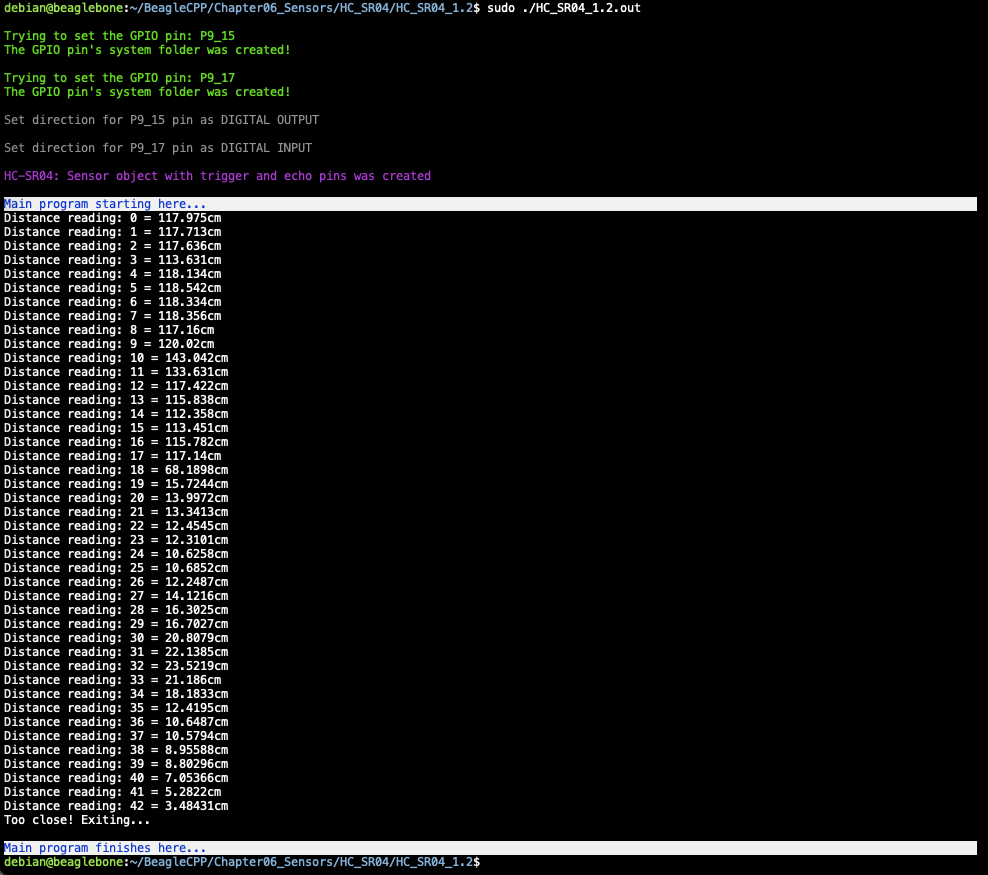

In this post, I show how to use a median filter for measuring the distance with the cheap ultrasonic sensor HC_SR04. This class is part of a whole library that can be found  <a href="https://github.com/wgaonar/BeagleCPP">here</a>. As a reference, an excellent article about how to implement a median filter on Arduino can be found <a href="https://www.luisllamas.es/arduino-filtro-mediana-rapido/">here</a> in the Luis Llamas Blog. 

I use a voltage level shifter between 3.3V and 5.0V to prevent damage to the BeagleBone. It is important to remember that the logic voltage for the BeagleBone is <font color="red">3.3V</font>. If the user provides a greater voltage, the BeagleBone could be damaged.


## Circuit and components

The circuit can be seen in Figure 1. It consists of a voltage level shifter, an HC-SRO4, and the BeagleBone. The pins used for trigger and echo are **P9_15** and **P9_17** and these were configured as digital output and input respectively.

The components are:
- 1 Ultrasonic Sensor HC_SR04
- 1 Level Shifter for 3.3V - 5.0V TXS0108E
- 1 Protoboard mini
- Jumpers male-male to make the connections

<figure style="text-align: center; width:70%; 
              margin-left: auto; 
              margin-right: auto;">
    
  <figcaption>
    Figure 1: Circuit to measure the distance with the ultrasonic sensor HC_SR04.
  </figcaption>
</figure>

## Coding
First, an `HC_SR04` object is declared with global scope and using a previously `GPIO` declared objects:

```cpp
// Declaring the pins
GPIO triggerPin(P9_15);
GPIO echoPin(P9_17);

// Declaring the HC_SR04 object
HC_SR04 distanceSensor (triggerPin, echoPin);
```
The `distanceSensor.MeasureDistanceCmWithMedian()` method is called on the previously defined `HC_SR04` object. This activates the sensor through the trigger pin and waits for the pulse in the echo pin to measure the distance by counting the time required by the acoustic wave to come back to the sensor after it has hit an object. The method is shown in the next listing where it can be seen that some measurements are done and stored in a `list<>` which is a container which sorts its values and therefore the median can be extracted easily. The minimum and maximum values for the number of measurements (window size) are 3 and 11, respectively. 

```cpp
double HC_SR04::MeasureDistanceCmWithMedian(int windowSize)
{
  // Check for unreasonable window sizes values
  if (windowSize < 3)
    windowSize = 3;
  if (windowSize > 11) 
    windowSize = 11;

  std::list <double> windowValues;

  // Make the measures for the window
  for (size_t i = 0; i < windowSize; i++) {
    windowValues.push_back(this->MeasureDistanceCm());
  }

  // Sort the list of values 
  windowValues.sort();

  // Search for the median position
  auto median = windowValues.begin();
  advance(median , windowValues.size() / 2 );

  return *median;
}
```

In the main program a `while loop` can be used to measure the distance each 250ms until the distance measurement will be less than 5cm:  

```cpp
while (true) 
{
  cout << "Distance reading: " << count << " = " << distance << "cm\n";
  count++;
  Delayms(250);
  if (distance <= 5) 
  {
    cout << "Too close! Exiting...\n";
    break;
  }
  else distance = distanceSensor.MeasureDistanceCmWithMedian(7);
}
```

  
The complete code for this application is shown in the next listing together with its corresponding execution output.


### HC_SR04_1.2.cpp
```cpp
/******************************************************************************
HC_SR04_1.2.cpp
@wgaonar
28/06/2021
https://github.com/wgaonar/BeagleCPP

Uses a Median filter for the sensor readings, if detected distance 
is less than 5cm the program finishes 

Class: HC_SR04
******************************************************************************/

#include <iostream>
#include <list>

#include "../../../Sources/GPIO.h"
#include "../../../Sources/HC_SR04.h"

using namespace std;

// Declaring the pins
GPIO triggerPin(P9_15);
GPIO echoPin(P9_17);

// Declaring the HC_SR04 object
HC_SR04 distanceSensor (triggerPin, echoPin);


int main() {
  string message = "\nMain program starting here...";
  cout << RainbowText(message,"Blue", "White", "Bold") << endl;

  double distance = distanceSensor.MeasureDistanceCmWithMedian(7);
  int count = 0;
  while (true) 
  {
    cout << "Distance reading: " << count << " = " << distance << "cm\n";
    count++;
    Delayms(250);
    if (distance <= 5) 
    {
      cout << "Too close! Exiting...\n";
      break;
    }
    else distance = distanceSensor.MeasureDistanceCmWithMedian(7);
  }

  message = "\nMain program finishes here...";
  cout << RainbowText(message,"Blue", "White","Bold") << endl;

  return 0;
}
```

### Execution of the program:
<figure style="text-align: center; width:100%; 
              margin-left: auto; 
              margin-right: auto;">
    
  <figcaption>
    Figure 2: Execution of the program.
  </figcaption>
</figure>

Se you in the next post. 
