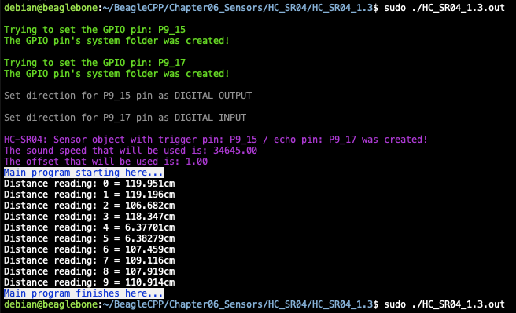

In this post, I show how to include the air temperature in the calculus of the speed sound and include an offset value for the distance reported by the sensor. This value can be useful for example when the sensor is placed not at the edge of a robot and the measurements have to be subtracted to reference these at the robot's boundary avoiding an undesired collision. This class is part of a whole library that can be found <a href="https://github.com/wgaonar/BeagleCPP">here</a>.

I use a voltage level shifter between 3.3V and 5.0V to prevent damage to the BeagleBone. It is important to remember that the logic voltage for the BeagleBone is <font color="red">3.3V</font>. If the user provides a greater voltage, the BeagleBone could be damaged.

## Circuit and components

The circuit can be seen in Figure 1. It consists of a voltage level shifter, an HC-SRO4, and the BeagleBone. The pins used for trigger and echo are **P9_15** and **P9_17** and these were configured as digital output and input respectively.

The components are:
- 1 Ultrasonic Sensor HC_SR04
- 1 Level Shifter for 3.3V - 5.0V TXS0108E
- 1 Protoboard mini
- Jumpers male-male to make the connections

<figure style="text-align: center; width:70%; 
              margin-left: auto; 
              margin-right: auto;">
    
  <figcaption>
    Figure 1: Circuit to measure the distance with the ultrasonic sensor HC_SR04.
  </figcaption>
</figure>

## Coding
  
First, an `HC_SR04` object is declared with global scope using a previously `GPIO` declared objects and an overloaded constructor is used to include the offset in cm and the temperature in °Celsius:

```cpp
GPIO triggerPin(P9_15);
GPIO echoPin(P9_17);

// Declaring the pins and the HC_SR04 object with offset and temperature correction factors
HC_SR04 distanceSensor (triggerPin, echoPin, 1, 25);
```

The overloaded constructor of the class takes these user values to include an offset and the temperature to estimate the sound's speed in the air that will be used in the calculus of the distance. Both values are class private members of type `double`. For including the temperature to correct the speed sound, the next equation can be used. This is explained  <a href="http://hyperphysics.phy-astr.gsu.edu/hbase/Sound/souspe3.html">here</a>. 

$$V_{sound} = 33,130 + 60.6 * T \mspace{18mu} \textrm{ Units are in } \frac{cm}{s} \textrm{ and } ^\circ C$$

The corresponding overloaded constructor with this corrections is shown in the next listing:

```cpp
// Overload Constructor with offset and temperature for correction 
HC_SR04::HC_SR04(GPIO newTriggerPin, GPIO newEchoPin, double newOffset, double temperature) :
        triggerPin(newTriggerPin), echoPin(newEchoPin) 
{
  this->offset = newOffset; 
  this->soundSpeed = 33130 + 60.6 * temperature; // Units in cm/s and ºC
  InitSensor();

  std::string message;
  message = "\nHC-SR04: Sensor object with trigger pin: " +
            this->triggerPin.GetPinHeaderId() + " / echo pin: " +
            this->echoPin.GetPinHeaderId() + 
            " was created!\n";
  std::cout << RainbowText(message, "Violet");
  
  std::stringstream streamSoundSpeed;
  std::cout << RainbowText("The sound speed that will be used is: ", "Violet");
  streamSoundSpeed << std::fixed << std::setprecision(2) << this->soundSpeed;
  std::cout << RainbowText(streamSoundSpeed.str(), "Violet") << std::endl;
  
  std::stringstream streamOffset;
  std::cout << RainbowText("The distance offset that will be used is: ","Violet");
  streamOffset << std::fixed << std::setprecision(2) << this->offset;
  std::cout << RainbowText(streamOffset.str(), "Violet") << std::endl; 
}
```

The class method `MeasureDistanceCm()` to measure the distance works with the modified `offset` and `speedSound` values if the user has included these in the constructed `HC_SR04` object. In another case, that method works with the default and standard values,i.e., an offset of `0.0` and a sound speed of `34300.0`, respectively.

In the main program a `for loop` can be used to  measure the distance 10 times each second using the `MeasureDistanceCmWithMedian()` which defines a window size to filter the data with a median value and calls the `MeasureDistanceCm()` method to do the reading:  

```cpp
double distance = distanceSensor.MeasureDistanceCmWithMedian(5);
for (size_t i = 0; i < 10; i++) {
  distance = distanceSensor.MeasureDistanceCmWithMedian(5);;
  cout << "Distance reading: " << i << " = " << distance << "cm\n";
  Delayms(1000);
}
```

The complete code for this application is shown in the next listing together with its corresponding execution output.

### HC_SR04_1.3.cpp
```cpp
/******************************************************************************
HC_SR04_1.3.cpp
@wgaonar
29/06/2021
https://github.com/wgaonar/BeagleCPP

Uses a Median filter for each one of the 10 sensor readings each second. 
The sensor object is constructed with offset and temperature correction factors

Class: HC_SR04
******************************************************************************/

#include <iostream>
#include <list>

#include "../../../Sources/GPIO.h"
#include "../../../Sources/HC_SR04.h"

using namespace std;

GPIO triggerPin(P9_15);
GPIO echoPin(P9_17);

// Declaring the pins and the HC_SR04 object with offset and temperature correction factors
HC_SR04 distanceSensor (triggerPin, echoPin, 1, 25);


int main() {
  string message = "Main program starting here...";
  cout << RainbowText(message,"Blue", "White", "Bold") << endl;

  double distance = distanceSensor.MeasureDistanceCmWithMedian(5);
  for (size_t i = 0; i < 10; i++) {
    distance = distanceSensor.MeasureDistanceCmWithMedian(5);;
    cout << "Distance reading: " << i << " = " << distance << "cm\n";
    Delayms(1000);
  }

  message = "Main program finishes here...";
  cout << RainbowText(message,"Blue", "White","Bold") << endl;

  return 0;
}
```

### Execution of the program:
<figure style="text-align: center; width:100%; 
              margin-left: auto; 
              margin-right: auto;">
    
  <figcaption>
    Figure 2: Execution of the program.
  </figcaption>
</figure>

Se you in the next post. 
