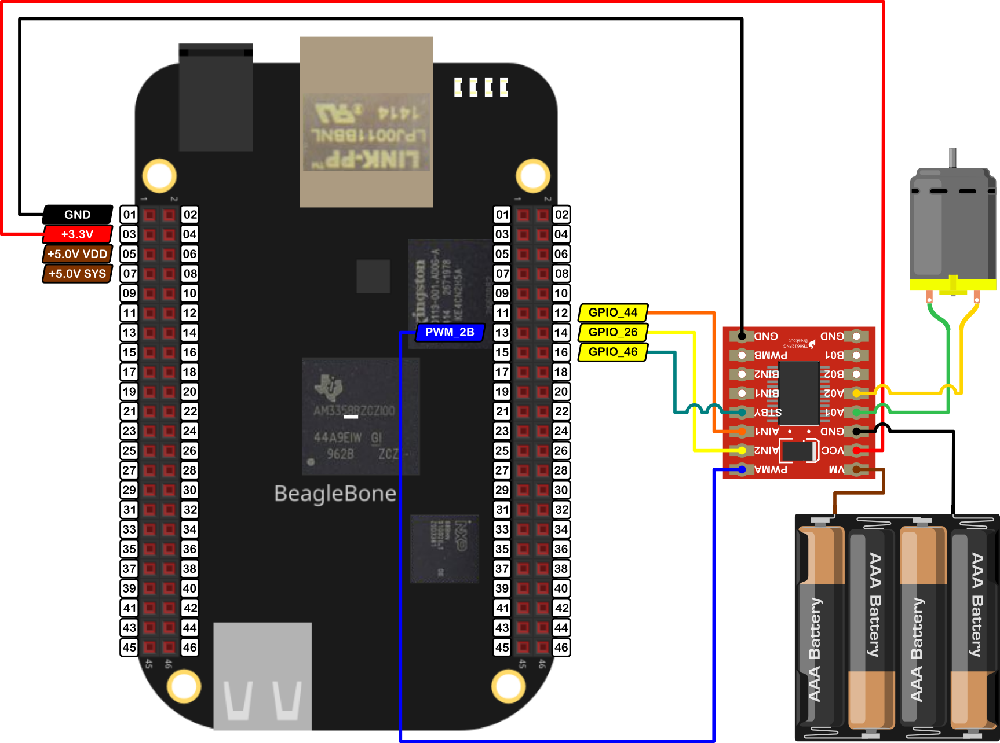

In this post, I show how to drive a DC Motor with the <a href="https://toshiba.semicon-storage.com/ap-en/semiconductor/product/motor-driver-ics/brushed-dc-motor-driver-ics/detail.TB6612FNG.html">TB6612FNG</a> driver from Toshiba. 

This driver is able to drive a couple of DC motors with a current of 1.2A and in a range of <font color="red">2.5V to 13.5V</font>. On the other hand, this uses 3 pins in a range of 2.7V to 5.5V to control each motor, 2 pins of these are to set the direction of rotation, and the last one to control the speed through PWM. More info can be found on the site of  <a href= "https://learn.sparkfun.com/tutorials/tb6612fng-hookup-guide/all">Sparkfun</a> 

This class is part of a whole library that can be found <a href="https://github.com/wgaonar/BeagleCPP">here</a>.
  
It is important to remember that the logic voltage for the BeagleBone is <font color="red">3.3V</font>. If the user provides a greater voltage, the BeagleBone could be damaged.

## Circuit and components

The circuit can be seen in Figure 1. It consists of a **TB6612FNG** driver, a low voltage DC Motor, 4 AA batteries, and the BeagleBone. 

<figure style="text-align: center; 
              margin-left: auto; 
              margin-right: auto;">
    
  <figcaption>
    Figure 1: Circuit to drive a DC motor with the TB6612FNG driver.
  </figcaption>
</figure>

The components are:
- 1 DC Motor driver TB6612FNG
- 1 DC Motor 3.0 - 6.0V
- 4 AA Batteries 
- 1 Protoboard mini
- Jumpers male-male to make the connections

The pins used for control the motor are:
- GPIO **P8_12** and **P8_14** to control the motor rotation direction
- PWM **P8_13** to control the speed
- GPIO **P8_16** to activate / deactivate de driver

## Coding
  
First, a `GPIO` and `TB6612FNG` objects are declared with global scope to initialize the digital pin to activate/deactivate the driver and the Motor that will be driven. These objects are named `standByPin` and `MotorA`, respectively. In this object, the user can include a boolean initialization parameter `true/false` to invert by software the motor direction rotation instead of inverting the motor's jumpers physically.

```cpp
// Declare the pin to activate / deactivate the TB6612FNG module
GPIO standByPin(P8_16, OUTPUT);

// Declare the motor object directly with the header pin's names
TB6612FNG MotorA (P8_12, P8_14, P8_13, false);
```

The constructor of the class is shown in the next listing:
```cpp
// Overload Constructor
TB6612FNG::TB6612FNG (GPIO newInput1Pin, 
                      GPIO newInput2Pin,
                      PWM newPWMPin, 
                      bool newSwapSpin) :
                      input1Pin(newInput1Pin), 
                      input2Pin(newInput2Pin),
                      pwmPin(newPWMPin), 
                      swapSpin(newSwapSpin)
{
  InitTB6612FNGPins();

  std::string message;
  message = "\nTB6612FNG object with the next parameters / pins was created:\n" +
            std::string("\tIN1: ") + this->input1Pin.GetPinHeaderId() + "\n" + 
            std::string("\tIN2: ") + this->input2Pin.GetPinHeaderId() + "\n" + 
            std::string("\tPWM: ") + this->pwmPin.GetPinHeaderId() + "\n\n";
  std::cout << RainbowText(message, "Light Red");
}
```

The first thing to do is to activate the TB6612FNG driver. This can be done with the next line:

```cpp
// Activate the module
ActivateTB6612FNG(standByPin);
```

The TB6612FNG driver has a pin designed as `StandBy` to power it ON and OFF. If this pin is set to `HIGH` the module will be ON and if this pin is set to `LOW` the module will be OFF.

A couple of functions included in the class file let the user do that:
- `void ActivateTB6612FNG(GPIO &);`
- `void DeactivateTB6612FNG(GPIO &);`

The instruction to move the motors is `MotorA.Drive(i,1000,stop);` which is an overladed class method that receives three parameters: the speed, the time that the motor will be running at that speed and finally, the signal to do after the time has expired. 

The ranges or values of these parameters are:
- Speed in percentage, i.e. integer values between `-100 and 100`
- Time of movement duration in milliseconds
- Flag to indicate what the motor will do after the movement, i.e. `brake/stop` keywords
  
This overloaded class method `Drive(int, int , ACTION)` can be seen in the next listings:

```cpp
/*
  Public method to drive and brake / stop the motor after certain time
  @param int: The desired speed (-100,100)
  @param int: The desired duration in milliseconds
  @param ACTION: Confirm to brake or stop the motor after driving it.     
*/
void TB6612FNG::Drive(int speed, int duration, ACTION action)
{
  if (duration < 0) 
    duration *= -1;

  this->Drive(speed);
  Delayms(duration);
  if (action == brake)
    this->SetStopMode();
  else if (action == stop)
    this->SetShortBrakeMode();
}
```


The core class method is `Drive(int)` which receives as an argument the speed value and depending on that, it configures the desired rotation direction and speed for the motor. This method can be seen in the next listing:

```cpp
/*
  Public method to drive the motor
  @param int: the desired speed (-100,100)     
*/
void TB6612FNG::Drive(int speed)
{
  // If it is desired, swap the turning direction 
  speed *= swapSpinMotor;

  // Verify and limit the speed
  if (speed >= maxSpeed)
    speed = maxSpeed;
  if (speed <= -maxSpeed)
    speed = -maxSpeed;

  // Select and set the correct turn direction
  std::string message;
  if (speed >= 0)
  {
    message = "Turning motor CW with speed: ";
    std::cout << RainbowText(message, "Light Red", "Default", "Bold") 
              << speed << "%\n";
    this->SetCWMode();
  }
  else
  {
    speed *= -1;
    message = "Turning motor CCW with speed: ";
    std::cout << RainbowText(message, "Light Red", "Default", "Bold") 
              << speed << "%\n";
    this->SetCCWMode();
  }

  // Set the motor speed
  this->SetSpeed(speed);
}
```

The main program, some `for loops` can be used to drive the motor increasing and decreasing the speed and driving it in both directions.

```cpp
for (size_t i = 0; i < 100; i+=10)
MotorA.Drive(i,1000,stop);
for (size_t i = 100; i > 0; i-=10)
MotorA.Drive(i,1000,stop);

for (size_t i = 0; i < 100; i+=10)
MotorA.Drive(-i,1000,stop);
for (size_t i = 100; i > 0; i-=10)
MotorA.Drive(-i,1000,stop);
```


Finally, the TB6612FNG has to be deactivated using the next line.

```cpp
// Deactivate the module
DeactivateTB6612FNG(standByPin);
```

The complete code for this application is shown in the next listing together with its corresponding execution output.

### TB6612FNG_1.1.cpp
```cpp
/******************************************************************************
TB6612FNG_1.1.cpp
@wgaonar
02/07/2021
https://github.com/wgaonar/BeagleCPP

- Move the motor each second increasing the speed 10% each time and then reversing it.
- Move the motor in the other direction increasing the speed 10% and then reversing it.

Class: TB6612FNG
******************************************************************************/
#include <iostream>
#include "../../../Sources/TB6612FNG.h"

using namespace std;

// Declare the pin to activate / deactivate the TB6612FNG module
GPIO standByPin(P8_16, OUTPUT);

// Declare the motor object directly with the header pin's names
TB6612FNG MotorA (P8_12, P8_14, P8_13, false);

int main()
{

  string message = "Main program starting here...";
  cout << RainbowText(message,"Blue", "White", "Bold") << endl;
  
   // Activate the module
  ActivateTB6612FNG(standByPin);
  
  for (size_t i = 0; i < 100; i+=10)
    MotorA.Drive(i,1000,stop);
  for (size_t i = 100; i > 0; i-=10)
    MotorA.Drive(i,1000,stop);

  for (size_t i = 0; i < 100; i+=10)
    MotorA.Drive(-i,1000,stop);
  for (size_t i = 100; i > 0; i-=10)
    MotorA.Drive(-i,1000,stop);

  // Deactivate the module
  DeactivateTB6612FNG(standByPin);
  
  message = "Main program finishes here...";
  cout << RainbowText(message,"Blue", "White","Bold") << endl;

  return 0;
}
```

### Execution of the program:
<figure style="text-align: center; width:100%; 
              margin-left: auto; 
              margin-right: auto;">
  <video width="100%" controls poster="../assets/images/Post37/VideoCover-TB6612FNG_1.1.png">
    <source src="../assets/images/Post37/TB6612FNG_1.1.mp4" type="video/mp4">
  </video>
  <figcaption>
    Video: Execution of the program.
  </figcaption>
</figure>

Se you in the next post. 
