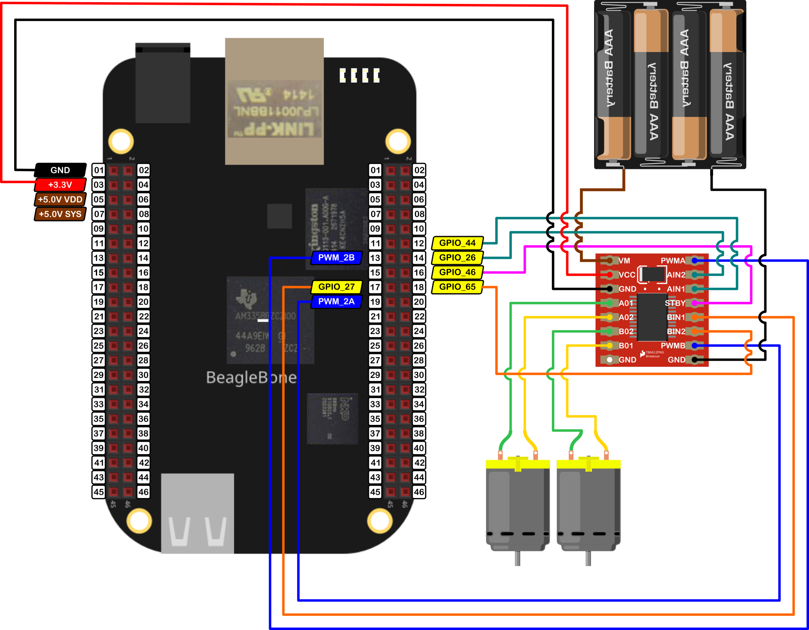

In this post, I show how to control a pair of DC Motors forward and backward. I am using the BeagleBone and the <a href="https://toshiba.semicon-storage.com/ap-en/semiconductor/product/motor-driver-ics/brushed-dc-motor-driver-ics/detail.TB6612FNG.html">TB6612FNG</a> driver from Toshiba. The remarkable aspect is the use of some class functions to drive the motors simultaneously in the same rotation direction. 

In the <a href="{{ site.baseurl }}"> first entry</a> dedicated to this driver, you can read about how to drive only one motor with it.

It is important to remember that the logic voltage for the BeagleBone is <font color="red">3.3V</font>. If the user provides a greater voltage, the BeagleBone could be damaged.


## Circuit and components

The circuit can be seen in Figure 1. It consists of a TB6612FNG driver, 2 low voltage DC Motors, 4 AA batteries, and the BeagleBone Black. 

<figure style="text-align: center; 
              margin-left: auto; 
              margin-right: auto;">
    
  <figcaption>
    Figure 1: Circuit to drive a pair of DC motors with the TB6612FNG driver.
  </figcaption>
</figure>

The components are:
- 1 DC Motor driver TB6612FNG
- 2 DC Motor 3.0 - 6.0V
- 4 AA Batteries 
- 1 Protoboard mini
- Jumpers male-male to make the connections

The pins used for control the driver and the motors are:
- GPIO **P8_16** to activate / deactivate de driver
- The pins used for control the **motor A** are:
  - GPIO **P8_12** and **P8_14** to control the motor rotation direction
  - PWM **P8_13** to control the speed
- The pins used for control the **motor B** are:
  - GPIO **P8_17** and **P8_18** to control the motor rotation direction
  - PWM **P8_19** to control the speed

## Coding
  
First, `GPIO` and `TB6612FNG` objects are declared with global scope to initialize the digital pin to activate/deactivate the driver and the pins that will control the motors. These `GPIO` objects are used as the parameters to construct the `TB6612FNG` objects. 

Remember that the user can include a boolean initialization parameter `true/false` to invert by software the motor rotation direction instead of inverting the motor's jumpers physically. 

As is shown next, I have used this parameter to invert the rotation direction of the `Motor B` setting the last parameter to `true`, instead of inverting the jumpers physically. This feature can be useful when you do not have access to the circuit or the motor directly.   

```cpp
// Declare the pin to activate / deactivate the TB6612FNG module
GPIO standByPin(P8_16);

// Declaring the pins for motor 1 
GPIO AIN1 (P8_12);
GPIO AIN2 (P8_14);
PWM PWMA (P8_13);

// Declaring the  pins for motor 2
GPIO BIN1 (P8_17);
GPIO BIN2 (P8_18);
PWM PWMB (P8_19);

// Declare the object for motor 1
TB6612FNG MotorA (AIN1, AIN2, PWMA, false);

// Declare the object for motor 2 
TB6612FNG MotorB (BIN1, BIN2, PWMB, true);
```

The next line shows how to activate the TB6612FNG driver:

```cpp
// Activate the module
ActivateTB6612FNG(standByPin);
```

To control the speed of both motors, the user can change it using the keys "W" and "S" to increase or decrease it, respectively. The class method `Drive()` checks if the user has input a value for the speed beyond the limits of `100` and `-100` and keeps it between this range, but in this case, the user code can do that too. If the user presses the key "Y", the program finishes.

```cpp
// Update the motors speed
switch (userInput)
{
case 'w':
  motorSpeed += 10;
  if (motorSpeed >= 100)
    motorSpeed = 100;
  break;
case 's':
  motorSpeed -= 10;
  if (motorSpeed <= -100)
    motorSpeed = -100;
  break;
default:
  break;
}
```

To move the motors, the code uses the functions `Forward()` and `Backward()` defined in the same  `TB6612FNG` class. These functions <b>are not members</b> of any `TB6612FNG` object, on the contrary, they are independent and can be called directly from the main implementation code.

The `Forward()` and `Backward()` take as argument 2 `TB6612FNG` objects passed by reference and the speed value that will be used to drive the motors.

```cpp
/*
  Function to drive FORWARD a robot with a couple of motors
  @param TB6612FNG &: The reference to the left motor of the robot
  @param TB6612FNG &: The reference to the right motor of the robot
  @param int: The desired speed (0,100). It set up the correct value if
              the user enters a negative value.    
*/
void Forward (TB6612FNG &motorLeft, TB6612FNG &motorRight, int speed)
{
  if (speed < 0)
    speed *= -1;
  motorLeft.Drive(speed);
  motorRight.Drive(speed);
}
```

```cpp
/*
  Function to drive BACKWARD a robot with a couple of motors
  @param TB6612FNG &: The reference to the motor of the robot
  @param TB6612FNG &: The reference to the motor of the robot
  @param int: The desired speed (-100,0). It set up the correct value if
              the user enters a positive value. 
*/
void Backward (TB6612FNG &motorLeft, TB6612FNG &motorRight, int speed)
{
  if (speed > 0)
    speed *= -1;
  motorLeft.Drive(speed);
  motorRight.Drive(speed);
}
```

In order to complement the behavior of the class,  the `Brake()` function is defined too. It brakes both motors which are `TB6612FNG` objects passed by reference. 


```cpp
/*
  Function to BRAKE a robot with a couple of motors
  @param TB6612FNG &: The reference to the motor of the robot
  @param TB6612FNG &: The reference to the motor of the robot
*/ 
void Brake (TB6612FNG &motorLeft, TB6612FNG &motorRight)
{
  motorLeft.Brake();
  motorRight.Brake();
}
```

In the implementation code, the user can decide when calls one, other, or one-third option to brake both motors with the `Brake()` function.

```cpp
// Move the motors
if (motorSpeed > 0)
  Forward(MotorA, MotorB, motorSpeed);
else if (motorSpeed < 0)
  Backward(MotorA, MotorB, motorSpeed);
else
  Brake(MotorA, MotorB);
```

Finally, the TB6612FNG has to be deactivated using the next line.

```cpp
// Deactivate the module
DeactivateTB6612FNG(standByPin);
```

The complete code for this application uses a <span class="coding">while loop` to control both motors increasing and decreasing the speed until the user press the key "Y". This code is shown in the next listing together with its corresponding execution output.


### TB6612FNG_1.4.cpp
```cpp
/******************************************************************************
TB6612FNG_1.4.cpp
@wgaonar
08/07/2021
https://github.com/wgaonar/BeagleCPP

- Move forward and backward 2 motors with the same speed

Class: TB6612FNG
******************************************************************************/
#include <iostream>
#include "../../../Sources/TB6612FNG.h"

using namespace std;

// Declare the pin to activate / deactivate the TB6612FNG module
GPIO standByPin(P8_16);

// Declaring the pins for motor 1 
GPIO AIN1 (P8_12);
GPIO AIN2 (P8_14);
PWM PWMA (P8_13);

// Declaring the  pins for motor 2
GPIO BIN1 (P8_17);
GPIO BIN2 (P8_18);
PWM PWMB (P8_19);

// Declare the object for motor 1
TB6612FNG MotorA (AIN1, AIN2, PWMA, false);

// Declare the object for motor 2 
TB6612FNG MotorB (BIN1, BIN2, PWMB, true);

int main()
{
  string message = "Main program starting here...";
  cout << RainbowText(message,"Blue", "White", "Bold") << endl;

  // Activate the module
  ActivateTB6612FNG(standByPin);

  message = "If you want to stop the program, enter 'y' for yes";
  cout << RainbowText(message, "Blue") << endl;
  message = "Or enter 'w' for increase speed or 's' for decrease it";
  cout << RainbowText(message, "Blue") << endl;

  int motorSpeed = 0;
  char userInput = '\0';
  while (userInput != 'y')
  {
    message = "Enter an option 'y', 'w', 's': ";
    cout << RainbowText(message, "Blue");
    cin >> userInput;

    // Update the motors speed
    switch (userInput)
    {
    case 'w':
      motorSpeed += 10;
      if (motorSpeed >= 100)
        motorSpeed = 100;
      break;
    case 's':
      motorSpeed -= 10;
      if (motorSpeed <= -100)
        motorSpeed = -100;
      break;
    default:
      break;
    }

    // Move the motors
    if (motorSpeed > 0)
      Forward(MotorA, MotorB, motorSpeed);
    else if (motorSpeed < 0)
      Backward(MotorA, MotorB, motorSpeed);
    else
      Brake(MotorA, MotorB);
  }  

  // Deactivate the module
  DeactivateTB6612FNG(standByPin);

  message = "Main program finishes here...";
  cout << RainbowText(message,"Blue", "White","Bold") << endl;

  return 0;
}
```

### Execution of the program:
<figure style="text-align: center; width:100%; 
              margin-left: auto; 
              margin-right: auto;">
  <video width="100%" controls poster="../assets/images/Post40/VideoCover-TB6612FNG_1.4.png">
    <source src="../assets/images/Post40/TB6612FNG_1.4.mp4" type="video/mp4">
  </video>
  <figcaption>
    Video: Execution of the program.
  </figcaption>
</figure>

Se you in the next post. 
