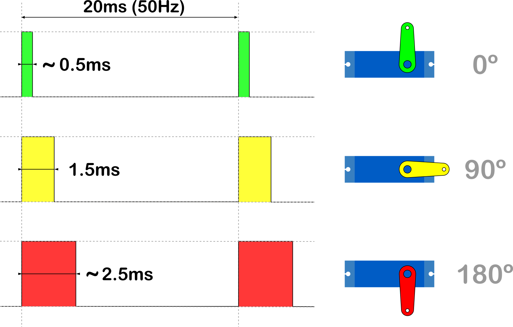
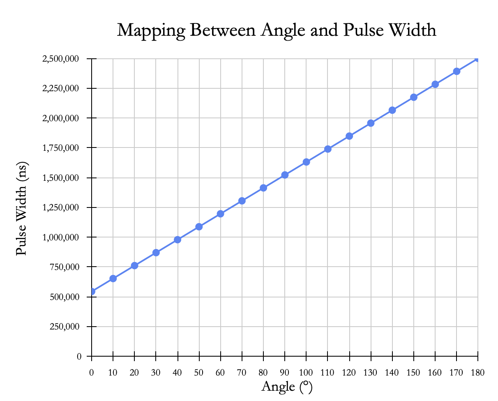
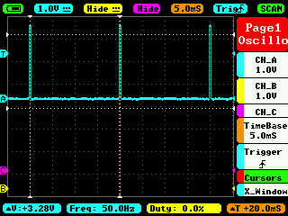
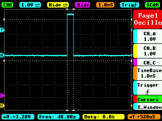
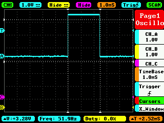

In this post, I show how to control the position of a Servomotor  <a href="http://www.ee.ic.ac.uk/pcheung/teaching/DE1_EE/stores/sg90_datasheet.pdf">SG90</a> using the BeagleBone and the library that I have been written in C++ which you can find it <a href="https://github.com/wgaonar/BeagleCPP">here</a>. The remarkable aspect is the use of the **OOP** paradigm to work with the SG90 servomotor.

The control of a servomotor position is done by means of a PWM signal with a period of **20ms**. The pulse width of this signal should be between 0.5ms and 2.5ms, i.e., between 2.5% and 12.5% of the duty cycle to move the servo between 0° and 180°, respectively. Figure 1 shows a diagram of the signal and its corresponding servomotor position. As you can see in that figure, when you send a pulse width of approximately 0.5ms the servo will rotate to 0° when you send 1.5ms the servo will rotate to 90°, and finally, when you send approximately 2.5ms the servo will rotate to 180°. 

<figure style="text-align: left; 
              width:70%; margin-left: auto; 
              margin-right: auto;">
    
  <figcaption>
    Figure 1: Diagram about the pulse width and its corresponding servomotor position for 0°, 90° and 180°.
  </figcaption>
</figure>

If you have another servo, it can be used as well. The difference will be in the minimum and maximum values for the pulse width. In the case of the servomotor SG90, the exact values are **0.54ms and 2.5ms**, in other servos, these values could be in ranges of 0.5 to 1.0ms for 0° and 2.0 to 2.5° for 180°. On the page of <a href="https://www.luisllamas.es/controlar-un-servo-con-arduino/">Luis Llamas</a>you can find a very well condensed way, general information about servomotors and how to control the SG90 with Arduino. It can be a good start point if you want to know more about it.

It is important to remember that the logic voltage for the BeagleBone is <font color="red">3.3V</font>. If the user provides a greater voltage, the BeagleBone could be damaged. Furthermore, if your servo is like the SG90, which needs 4.8V or more, you should provide an <font color="red">external power</font> source, wiring its ground to the BeagleBone's ground. 

## Circuit and components

The circuit can be seen in Figure 2. It consists of an SG90 servomotor, 4 AA batteries, and the BeagleBone. 

<figure style="text-align: center; 
              margin-left: auto; 
              margin-right: auto;">
    
  <figcaption>
    Figure 2: Circuit to control a servomotor SG90.
  </figcaption>
</figure>

The components are:
- 1 Servomotor SG90 4.8 - 6.0V
- 4 AA Batteries 
- 1 Protoboard mini
- Jumpers male-male to make the connections

The PWM pin to control the servomotor is:
- PWM P8_13

## Coding
  
An `Servo` object is declared with global scope to initialize the PWM pin to control the servomotor.

```cpp
// Declare the SG90 object
Servo myServo(P8_13);
```

This `Servo` object is initialized with default values of 544444 and 2500000 for the minimum and maximum pulse width, respectively. It is important to note that the pulse width units in the BeagleBone are in <font color="red">nanoseconds</font> instead of milliseconds. For this reason, these default values are used, instead of the typical values of 544 and 2500 which are in microseconds and are used in the Arduino <a href="https://www.arduino.cc/reference/en/libraries/servo/attach/">attach()</a> function. 


```cpp
// Overload Constructor
Servo::Servo (PWM newPWMPin) : pwmPin(newPWMPin)
{
  angle = 0;
  minimumPulseWidth = 544444;
  maximumPulseWidth = 2500000;

  this->InitServo();
}
```

```cpp
// Private method to set the Servo period for the PWM pin 
void Servo::InitServo()
{
  // Set the period of Servo in ns
  pwmPin.SetPeriod(ServoPeriod);

  std::string message;
  message = "\nServo object with the next parameters / pins was created:\n" +
            std::string("\tPWM Pin: ") + 
            this->pwmPin.GetPinHeaderId() + "\n" +
            std::string("\tPWM Period: ") + 
            std::to_string(this->pwmPin.GetPeriod()) + "ns\n" +
            std::string("\tMinimum Pulse Width: ") + 
            std::to_string(this->GetMinimumPulseWidth()) + "ns\n" +
            std::string("\tMaximum Pulse Width: ") + 
            std::to_string(this->GetMaximumPulseWidth()) + "ns\n\n";
  std::cout << RainbowText(message, "Light Blue");
}
```

Finally, the period for the PWM signal is declared and initialized to a constant value of 20000000 (instead of 20) inside the class. The next listings show the constructor for this `Servo` object: 

```cpp
/* The standard period of 20ms to control any servo */
const int ServoPeriod = 20000000;
```

To rotate the servo you can use the `SetAngle()` method which receives the angle en degrees and makes the mapping between this value to the corresponding pulse width. After that, this mapped value is sent to the PWM pin.
 
```cpp
/*
  Public method to set the speed rotation
  @param int: the desired angle (0-180)     
*/
void Servo::SetAngle(int newAngle)
{
  angle = newAngle;
  double mapping = (maximumPulseWidth-minimumPulseWidth)/180.0 * angle + minimumPulseWidth;
  int pulseWidth = static_cast<int>(mapping);
  pwmPin.SetDutyCycleByPeriod(pulseWidth);

  std::string message;
  message = "angle: " + std::to_string(angle) + " -> pulse width: " +
            std::to_string(pulseWidth) + "ns\n";
  std::cout << RainbowText(message, "Light Blue"); 
}
```  

This mapping is a linear function that takes the angle and returns the corresponding pulse width taking into account the minimum and maximum pulse width values defined when the `SG90` object is constructed at the begging of code. The graph of this mapping can be seen in Figure 3.

<figure style="text-align: center; 
              width: 100%; margin-left: auto; 
              margin-right: auto;">
    
  <figcaption>
    Figure 3: Mapping between the angle and the pulse width for the servomotor SG90.
  </figcaption>
</figure>

In order to make a sweep with the servomotor, two `for loops` can be used in both directions, from 0° to 180° and vice versa, giving a delay of 1000ms to observe the movement and giving to the servomotor more than enough time to reach the desired angle.

```cpp
// Sweep from 0-180
for (int angle = 0; angle <= 180; angle += 10)
{
  myServo.SetAngle(angle);
  Delayms(1000);  // Wait 1000ms for the servo to reach the position
}

// Sweep from 180-0
for (int angle = 180; angle >= 0; angle -= 10)
{
  myServo.SetAngle(angle);
  Delayms(1000);  // Wait 1000ms for the servo to reach the position
}
```

The complete code for this implementation is shown in the next listing:


### SG90_1.1.cpp
```cpp
/******************************************************************************
SG90_1.1.cpp
@wgaonar
21/07/2021
https://github.com/wgaonar/BeagleCPP

- Sweep a Servomotor 

Class: Servo
******************************************************************************/
#include <iostream>
#include "../../../Sources/Servo.h"

using namespace std;

// Declare the Servo object
Servo myServo(P8_13);

int main()
{
  string message = "Main program starting here...";
  cout << RainbowText(message,"Blue", "White", "Bold") << endl;

  // Sweep from 0-180
  for (int angle = 0; angle <= 180; angle += 10)
  {
    myServo.SetAngle(angle);
    Delayms(1000);  // Wait 1000ms for the servo to reach the position
  }

  // Sweep from 180-0
  for (int angle = 180; angle >= 0; angle -= 10)
  {
    myServo.SetAngle(angle);
    Delayms(1000);  // Wait 1000ms for the servo to reach the position
  }
  
  message = "Main program finishes here...";
  cout << RainbowText(message,"Blue", "White","Bold") << endl;

  return 0;
}
```

To check the pulse width that is sent by the BeagleBone to the servomotor, it has been captured with an oscilloscope at 0°, 90°, and 180°. These pictures are shown in hte next set of figures:

<style>
/* Three image containers (use 25% for four, and 50% for two, etc) */
.column {
  float: left;
  width: 50%;
  padding: 2%;
}
</style>

<div class="row">
  <div class="column">
    <figure style="text-align: justify;">
      
      <figcaption>
        Figure 4a: The signal for 0° with a period of 20ms. 
      </figcaption>
    </figure>
  </div>
  <div class="column">
    <figure style="text-align: justify;">
      
      <figcaption>
        Figure 4b: The theoretical pulse width for 0° of 520ms (544444ns exactly).  
      </figcaption>
    </figure>
  </div>
</div>

<div class="row">
  <div class="column">
    <figure style="text-align: justify;">
      
      <figcaption>
        Figure 5a: The signal for 90° with a period of 20ms. 
      </figcaption>
    </figure>
  </div>
  <div class="column">
    <figure>
      
      <figcaption>
        Figure 5b: The theoretical pulse width for 90° of 1.5ms (1500000ns exactly).  
      </figcaption>
    </figure>
  </div>
</div>

<div class="row">
  <div class="column">
    <figure style="text-align: justify;">
      
      <figcaption>
        Figure 6a: The signal for 180° with a period of 20ms.
      </figcaption>
    </figure>
  </div>
  <div class="column">
    <figure>
      
      <figcaption>
        Figure 6b: The theoretical pulse width for 180° of 2.5ms (2520000ns exactly).
      </figcaption>
    </figure>
  </div>
</div>


### Execution of the program:
<figure style="text-align: center; width:100%; 
              margin-left: auto; 
              margin-right: auto;">
  <video width="100%" controls poster="../assets/images/Post42/VideoCover-SG90_1.1.png">
    <source src="../assets/images/Post42/SG90_1.1.mp4" type="video/mp4">
  </video>
  <figcaption>
    Video: Execution of the program.
  </figcaption>
</figure>

Se you in the next post. 
