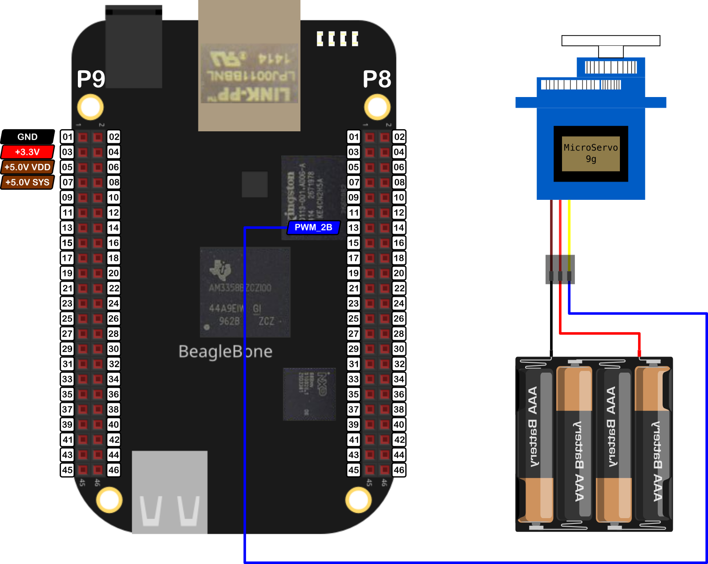

In this post, I show how to control the position of a Servomotor <a href="http://www.ee.ic.ac.uk/pcheung/teaching/DE1_EE/stores/sg90_datasheet.pdf">SG90</a> from the keyboard using the BeagleBone and the library that I have been written in C++ which you can find <a href="https://github.com/wgaonar/BeagleCPP">here</a> to control it

In the <a href="{{ site.baseurl }}">last post</a>, I showed the technical details about how this servomotor works and how can be controlled with the BeagleBone Black for doing a sweep.

It is important to remember that the logic voltage for the BeagleBone is <font color="red">3.3V</font>. If the user provides a greater voltage, the BeagleBone could be damaged. Furthermore, if your servo is like the SG90, which needs 4.8V or more, you should provide an <font color="red">external power</font> source, wiring its ground to the BeagleBone's ground. 


## Circuit and components

The circuit can be seen in Figure 1. It consists of an SG90 servomotor, 4 AA batteries, and the BeagleBone. 

<figure style="text-align: center; 
              margin-left: auto; 
              margin-right: auto;">
    
  <figcaption>
    Figure 1: Circuit to control a servomotor SG90.
  </figcaption>
</figure>

The components are:
- 1 Servomotor SG90 4.8 - 6.0V
- 4 AA Batteries 
- 1 Protoboard mini
- Jumpers male-male to make the connections

The PWM pin to control the servomotor is:
- PWM P8_13

## Coding
  
Some `PWM` and `Servo` objects are declared with global scope to initialize the PWM pin to control and then the servomotor.

```cpp
// Declare the SG90 object
PWM pwmPin(P8_13);

// Declare the SG90 object
Servo myServo(pwmPin);
```

This `Servo` object is initialized with default values of 544444 and 2500000 for the minimum and maximum pulse width, respectively. It is important to note that the pulse width units in the BeagleBone are in <font color="red">nanoseconds</font> instead of milliseconds. For this reason, these default values are used, instead of the typical values of 544 and 2500 which are in microseconds and are used in the Arduino <a href="https://www.arduino.cc/reference/en/libraries/servo/attach/">attach()</a> function. 

Two global variables are defined and initialized to control the amount of increment the servo will rotate each time the user presses a key, in this case 5°.

```cpp
int angle = 0;
int incrementAngle = 5;
```
  
To rotate the servo you can use the `SetAngle()` method which receives the angle en degrees and makes the mapping between this value to the corresponding pulse width. After that, this mapped value is sent to the PWM pin.
 
To control the servomotor position with some keys from the keyboard, a `switch` structure can be used to increase and decrease the angle according to the pressed key. In this case, "w" and "s", respectively. Remember the range from 0° to 180° to rotate the servomotor. In this time, there is no a delay, the user have to wait until the servomotor reaches the commanded position.

```cpp
switch (userInput)
{
case 'w':
  angle += incrementAngle;
  if (angle > 180)
    angle = 180;
  break;
case 's':
  angle -= incrementAngle;
  if (angle < 0)
    angle = 0;
  break;
default:
  break;
}

myServo.SetAngle(angle);
```

The complete code for this implementation is shown in the next listing:

### SG90_1.2.cpp
```cpp
/******************************************************************************
SG90_1.2.cpp
@wgaonar
26/07/2021
https://github.com/wgaonar/BeagleCPP

- Change the servomotor angle with the keyboard entry  

Class: Servo
******************************************************************************/
#include <iostream>
#include "../../../Sources/Servo.h"

using namespace std;

// Declare the SG90 object
PWM pwmPin(P8_13);

// Declare the SG90 object
Servo myServo(pwmPin);

int main()
{
  string message = "Main program starting here...";
  cout << RainbowText(message,"Blue", "White", "Bold") << endl;

  message = "If you want to stop the program, enter 'y' for yes";
  cout << RainbowText(message, "Blue") << endl;
  message = "Or enter 'w' for increase angle or 's' for decrease it";
  cout << RainbowText(message, "Blue") << endl;
  
  int angle = 0;
  int incrementAngle = 5;

  char userInput = '\0';
  while (userInput != 'y')
  {
    message = "Enter an option 'y', 'w', 's': ";
    cout << RainbowText(message, "Blue");
    cin >> userInput;

    switch (userInput)
    {
    case 'w':
      angle += incrementAngle;
      if (angle > 180)
        angle = 180;
      break;
    case 's':
      angle -= incrementAngle;
      if (angle < 0)
        angle = 0;
      break;
    default:
      break;
    }

    myServo.SetAngle(angle);
  }
  
  message = "Main program finishes here...";
  cout << RainbowText(message,"Blue", "White","Bold") << endl;

  return 0;
}
```
### Execution of the program:
<figure style="text-align: center; width:100%; 
              margin-left: auto; 
              margin-right: auto;">
  <video width="100%" controls poster="../assets/images/Post43/VideoCover-SG90_1.2.png">
    <source src="../assets/images/Post43/SG90_1.2.mp4" type="video/mp4">
  </video>
  <figcaption>
    Video: Execution of the program.
  </figcaption>
</figure>

Se you in the next post. 
