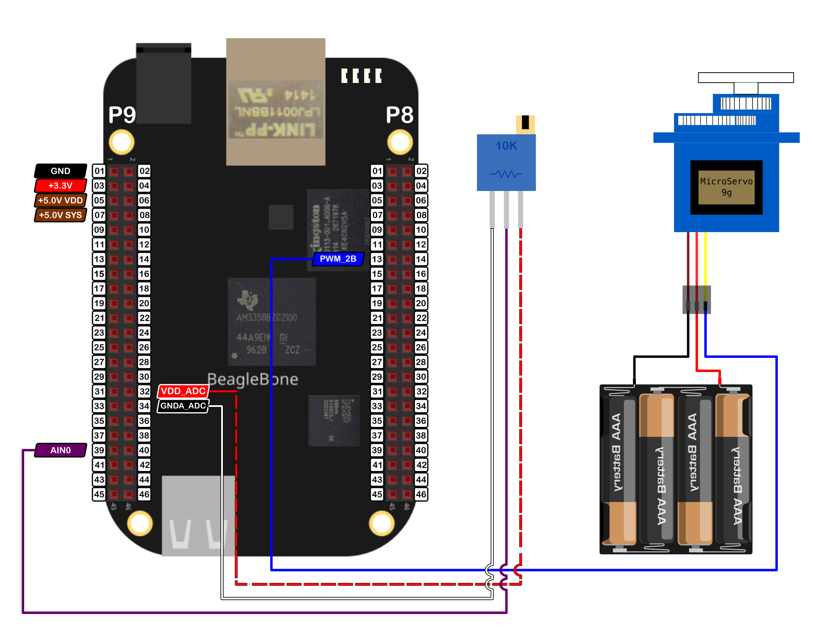

In this post, I show how to control the position of a Servomotor <a href="http://www.ee.ic.ac.uk/pcheung/teaching/DE1_EE/stores/sg90_datasheet.pdf">SG90</a> with a potentiometer using the BeagleBone and the library that I have been written in C++ which you can find <a href="https://github.com/wgaonar/BeagleCPP">here</a> to control it

In the <a href="{{ site.baseurl }}">last post</a>, I showed the technical details about how this servomotor works and how can be controlled with the BeagleBone Black for doing a sweep.

It is important to remember that the logic voltage for the BeagleBone is <font color="red">3.3V</font>. If the user provides a greater voltage, the BeagleBone could be damaged. Furthermore, if your servo is like the SG90, which needs 4.8V or more, you should provide an <font color="red">external power</font> source, wiring its ground to the BeagleBone's ground. 


## Circuit and components

The circuit can be seen in Figure 1. It consists of an SG90 servomotor, 1 Potentiometer, 4 AA batteries, and the BeagleBone. 

<figure style="text-align: center; 
              margin-left: auto; 
              margin-right: auto;">
    
  <figcaption>
    Figure 1: Circuit to control a servomotor SG90.
  </figcaption>
</figure>

The components are:
- 1 Servomotor SG90 4.8 - 6.0V
- 1 Potentiometer 10KΩ
- 4 AA Batteries 
- 1 Protoboard mini
- Jumpers male-male to make the connections

The PWM pin to control the servomotor is:
- PWM P8_13

The ADC pin to read the potentiometer is:
- ADC P9_39


## Coding
  
Some `Servo` and `ADC` objects are declared with global scope to initialize the servomotor and the pin from which the potentiometer will be attached to.

```cpp
// Declare the Servo object
Servo myServo(P8_13);

// Declare the ADC pin to attach the potentiometer
ADC myPotentiometer(P9_39);
```

This `Servo` object is initialized with default values of 544444 and 2500000 for the minimum and maximum pulse width, respectively. It is important to note that the pulse width units in the BeagleBone are in <font color="red">nanoseconds</font> instead of milliseconds. For this reason, these default values are used, instead of the typical values of 544 and 2500 which are in microseconds and are used in the Arduino <a href="https://www.arduino.cc/reference/en/libraries/servo/attach/">attach()</a> function.

Three global variables are defined and initialized to disable the servo movement, store the reading coming from the potentiometer, and store the desired angle, respectively.

```cpp
// Global variables
bool stopMoveServo = false;
int adcValueOut = 0;
int angle = 0;
```

To control the servomotor position from the potentiometer, the `ReadADC()` method is used and store in the `adcValueOut` variable. Then, this value which is between 0 - 4095, is mapped to the range of the servomotor angles, i.e. 0°- 180° and store in the `angle` variable.

```cpp
// Read the analog converted value
adcValueOut = myPotentiometer.ReadADC();

// Map the adc value to the angle
angle = adcValueOut / 4095.0 * 180;
```
To rotate the servo you can use the `SetAngle()` method which receives the angle en degrees and makes the mapping between this value to the corresponding pulse width that will be sent to the PWM pin.
 
```cpp
myServo.SetAngle(angle);
```

The last lines of code are inside a callback function in order to do these processes in background while th e `stopMoveServo` variable will be `true`. This callback function is activated on the `ADC` object, in this case, the `myPotentiometer` object 
 
```cpp
// Activate the ADC object's callback function
myPotentiometer.DoUserFunction(&MoveServo);
```

The complete code for this implementation is shown in the next listing:

### SG90_1.3.cpp
```cpp
/******************************************************************************
SG90_1.3.cpp
@wgaonar
28/07/2021
https://github.com/wgaonar/BeagleCPP

- Move a servo with the readings from a potentiometer 

Class:Servo
******************************************************************************/
#include <iostream>
#include "../../../Sources/Servo.h"
#include "../../../Sources/ADC.h"

using namespace std;

// Declare the Servo object
Servo myServo(P8_13);

// Declare the ADC pin to attach the potentiometer
ADC myPotentiometer(P9_39);

// Global variables
bool stopMoveServo = false;
int adcValueOut = 0;
int angle = 0;

// Function to move the servo in background
int MoveServo() 
{
  while (stopMoveServo == false)
  {
    // Read the analog converted value
    adcValueOut = myPotentiometer.ReadADC();

    // Map the adc value to the angle
    angle = adcValueOut / 4095.0 * 180;

    // Move the servo
    myServo.SetAngle(angle);

    Delayms(250);
  }
  return 0;
}

int main()
{
  string message = "Main program starting here...";
  cout << RainbowText(message,"Blue", "White", "Bold") << endl;

  // Activate the ADC object's callback function
  myPotentiometer.DoUserFunction(&MoveServo);

  char userInput = '\0';
  while (userInput != 'y')
  {
    message = "Enter an option 'y' for exit: ";
    cout << RainbowText(message, "Blue");
    
    cin >> userInput;
    if (userInput == 'y') 
      stopMoveServo = true;
  }
  
  message = "Main program finishes here...";
  cout << RainbowText(message,"Blue", "White","Bold") << endl;

  return 0;
}
```

### Execution of the program:
<figure style="text-align: center; width:100%; 
              margin-left: auto; 
              margin-right: auto;">
  <video width="100%" controls poster="../assets/images/Post44/VideoCover-SG90_1.3.png">
    <source src="../assets/images/Post44/SG90_1.3.mp4" type="video/mp4">
  </video>
  <figcaption>
    Video: Execution of the program.
  </figcaption>
</figure>

Se you in the next post. 
