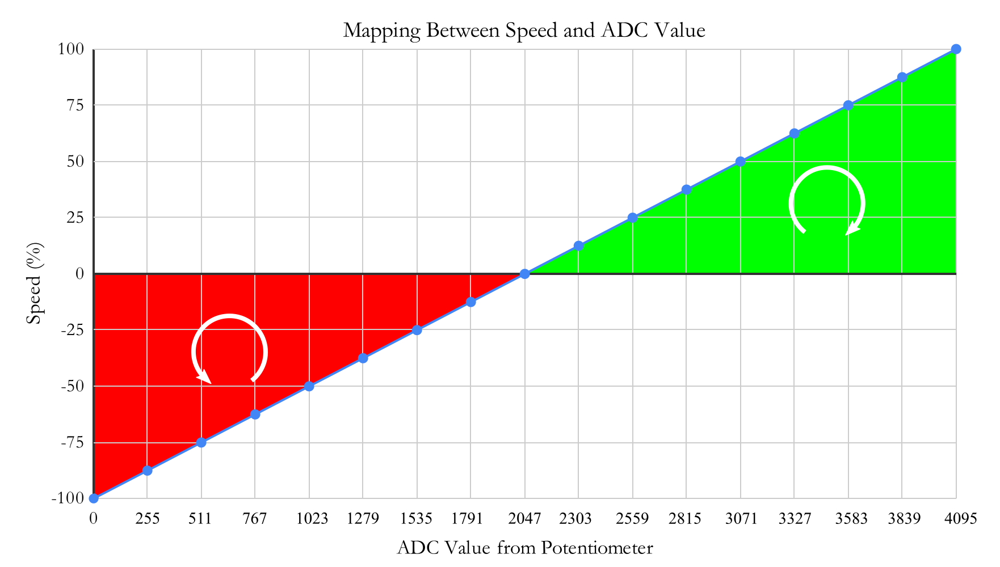

In this post, I show how to control the speed of the <font color="red">360° continuous rotation</font> servomotor <a href="https://www.sparkfun.com/datasheets/Robotics/servo-360_e.pdf">SM-S4303R</a> which can run to 60rpm if the servomotor is powered with 4.8V or 70rpm if it is powered with6.0V. 

In this work, these absolute values for the speed will not be used, instead, the speed wil be computed in percentage ranging from <font color="red">-100</font> for the maximum speed in the <font color="red">counterclockwise</font> direction and <font color="blue">100%</font> for the maximum speed in the <font color="blue">clockwise</font> direction. 

The control will be done through a potentiometer using the BeagleBone and the library that I have been written in C++ which you can find <a href="https://github.com/wgaonar/BeagleCPP">here</a>.  In the <a href="{{ site.baseurl }}">last post</a>, I showed the technical details about how to control the position from a potentiometer. In this case, I use the potentiometer too, but to control the speed of the 360° SM-S4303R continuos rotation servomotor instead of the angle of a 180° SG-90 servomotor

It is important to remember that the logic voltage for the BeagleBone is <font color="red">3.3V</font>. If the user provides a greater voltage, the BeagleBone could be damaged. Furthermore, if your servo is like the SM-S4303R, which needs 4.8V or more, you should provide an <font color="red">external power</font> source, wiring its ground to the BeagleBone's ground. 

## Circuit and components

The circuit can be seen in Figure 1. It consists of an SM-S4303R servomotor, 1 Potentiometer, 4 AA batteries, and the BeagleBone. 

<figure style="text-align: center; 
              margin-left: auto; 
              margin-right: auto;">
    
  <figcaption>
    Figure 1: Circuit to control the speed of a 360° continuous rotation servomotor SM-S4303R.
  </figcaption>
</figure>

The components are:
- 1 Servomotor SM-S4303R 4.8 - 6.0V
- 4 AA Batteries 
- 1 Protoboard mini
- Jumpers male-male to make the connections

The PWM pin to control the servomotor is:
- PWM P8_13

## Coding</h1>
  
  Some `Servo` and `ADC` objects are declared with global scope to initialize the servomotor and the pin from which the potentiometer will be attached to.

```cpp
// Declare the Servo object
Servo myServo(P8_13);

// Declare the ADC pin to attach the potentiometer
ADC myPotentiometer(P9_39);
```

This `Servo` object is initialized with default values of 544444 and 2500000 for the minimum and maximum pulse width, respectively. It is important to note that the pulse width units in the BeagleBone are in <font color="red">nanoseconds</font> instead of milliseconds. For this reason, these default values are used, instead of the typical values of 544 and 2500 which are in microseconds and are used in the Arduino <a href="https://www.arduino.cc/reference/en/libraries/servo/attach/">attach()</a> function. 

Three global variables are defined and initialized to disable the servo movement, store the reading coming from the potentiometer, and store the desired speed, respectively.

```cpp
// Global variables
bool stopMoveServo = false;
int adcValueOut = 0;
int speed = 0;
```

To control the servomotor speed from the potentiometer, the `ReadADC()` method is used and store in the `adcValueOut` variable. Then, this value which is between 0 - 4095, is mapped to the range of the servomotor speed, i.e. -100% - 100%, and store in the `speed` variable.


```cpp
// Read the analog converted value
adcValueOut = myPotentiometer.ReadADC();

// Map the adc value to the speed
speed = (adcValueOut - 2048) / 4095.0 * 200;
```

This mapping is a linear function that takes the ADC value from the potentiometer and returns the corresponding speed, taking into account the clockwise and counterclockwise direction. The graph of this mapping can be seen in Figure 2.

<figure style="text-align: center; 
              width: 100%; margin-left: auto; 
              margin-right: auto;">
    
  <figcaption>
    Figure 2: Mapping between the potentiometer reading and the speed for the 360° continuous rotation servomotor SM-S4303R. The green area corresponds to the clockwise direction while the red area to counterclockwise.
  </figcaption>
</figure>

To rotate the servo you can use the `SetSpeed()` method which receives the speed in percentage in a range from -100 to 100 and delivers the corresponding pulse width in a range from the minimum and maximum pulse width for the servomotor. In this case, the default values of the class are 544444ns and 2500000ns, respectively. The positive speed values correspond to the clockwise direction and the negative values to the counterclockwise
 
```cpp
// Move the servo
myServo.SetSpeed(speed);
```

The implementation of this method in the class `Servo` can be shown in the next listing where can be observed the equation which does the mapping between the desired speed and the corresponding pulse width.
 
```cpp
/*
Public method to set the speed for a continuous servo
@param int: the desired angle (-100-100)     
*/
void Servo::SetSpeed(int newSpeed)
{
  speed = newSpeed;
  int averagePulseWidth = (maximumPulseWidth-minimumPulseWidth) / 2 + minimumPulseWidth;
  double mapping = (maximumPulseWidth-minimumPulseWidth)/200.0 * speed + averagePulseWidth;
  int pulseWidth = static_cast<int>(mapping);
  pwmPin.SetDutyCycleByPeriod(pulseWidth);
  
  std::string message;
  message = "speed: " + std::to_string(speed) + " -> pulse width: " +
  std::to_string(pulseWidth) + "ns\n";
  std::cout << RainbowText(message, "Light Blue"); 
}
```

This mapping can be seen in Figure 3 where a linear function takes the speed and returns the corresponding pulse width.

<figure style="text-align: center; 
              width: 100%; margin-left: auto; 
              margin-right: auto;">
    
  <figcaption>
    Figure 3: Mapping between the Pulse Width and the Speed for the 360° continuous rotation servomotor SM-S4303R. The green area corresponds to the clockwise direction while the red area to counterclockwise.
  </figcaption>
</figure>

The lines of code that read the potentiometer and move the servo are inside of a callback function to do these processes in the background while the `stopMoveServo` variable will be `true`. This callback function is activated on the `ADC` object, in this case, through the `myPotentiometer` object with this line:
 
```cpp
// Activate the ADC object's callback function
myPotentiometer.DoUserFunction(&MoveServo);
```

The complete code for this implementation is shown in the next listing:

### SM-S4303R_1.1.cpp
```cpp
/******************************************************************************
SM-S4303R_1.1.cpp
@wgaonar
31/07/2021
https://github.com/wgaonar/BeagleCPP

- Move a continuous rotation servo with the readings from a potentiometer

Class: Servo
******************************************************************************/
#include <iostream>
#include "../../../Sources/Servo.h"
#include "../../../Sources/ADC.h"

using namespace std;

// Declare the Servo object
Servo myServo(P8_13);

// Declare the ADC pin to attach the potentiometer
ADC myPotentiometer(P9_39);

// Global variables
bool stopMoveServo = false;
int adcValueOut = 0;
int speed = 0;

// Function to move the servo in background
int MoveServo() 
{
  while (stopMoveServo == false)
  {
    // Read the analog converted value
    adcValueOut = myPotentiometer.ReadADC();

    // Map the adc value to the speed
    speed = (adcValueOut - 2048) / 4095.0 * 200;

    // Move the servo
    myServo.SetSpeed(speed);

    Delayms(250);
  }
  return 0;
}

int main()
{
  string message = "Main program starting here...";
  cout << RainbowText(message,"Blue", "White", "Bold") << endl;

  // Activate the ADC object's callback function
  myPotentiometer.DoUserFunction(&MoveServo);

  char userInput = '\0';
  while (userInput != 'y')
  {
    message = "Enter an option 'y' for exit: ";
    cout << RainbowText(message, "Blue");
    
    cin >> userInput;
    if (userInput == 'y') 
      stopMoveServo = true;
  }
  
  message = "Main program finishes here...";
  cout << RainbowText(message,"Blue", "White","Bold") << endl;

  return 0;
}
```

### Execution of the program:
<figure style="text-align: center; width:100%; 
              margin-left: auto; 
              margin-right: auto;">
  <video width="100%" controls poster="../assets/images/Post45/VideoCover-SM-S4303R_1.1.png">
    <source src="../assets/images/Post45/SM-S4303R_1.1.mp4" type="video/mp4">
  </video>
  <figcaption>
    Video: Execution of the program.
  </figcaption>
</figure>

Se you in the next post. 