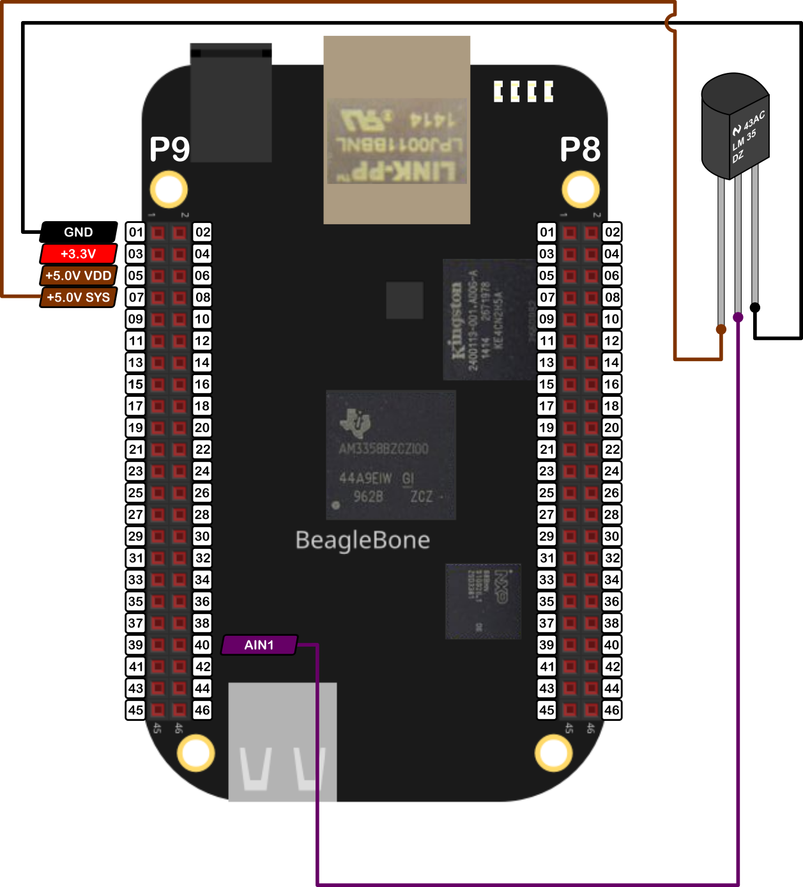

In this post, I show how to read the temperature from the analog sensor LM35. The datasheet can be found <a href="https://www.ti.com/document-viewer/LM35/datasheet">here</a>. This sensor has an output voltage linearly-proportional to the Centigrade temperature of 10mV/°C and, it can measure in a range of -55°C - 150°C attaching a resistor from the output pin to a negative source voltage, but it is common used to using it in a temperature range from 2° to 150°C, due that, the resistor is not necessary.

It is important to remember that the BeagleBone has 7 analog inputs and ADC of 12 bits that let to de user to represent an analog signal within a range of 4096 values. It is important to remember that the reference for analog voltage is <font color="red">1.8V</font>. If the user provides a greater voltage, the BeagleBone could be damaged. 

Keeping this in mind, at 150°C this sensor will produce an output voltage of 1.5V, which is inside the range of the ADC. For reference, in <a href="{{ site.baseurl }}">this post</a>, I showed how to use the ADC module in the BeagleBone.

## Circuit and components

The circuit can be seen in Figure 1. It consists of an LM35 and the BeagleBone. 

<figure style="text-align: center; 
              margin-left: auto; 
              margin-right: auto;">
    
  <figcaption>
    Figure 1: Circuit to read the temperature with the analog LM35 sensor.
  </figcaption>
</figure>

The components are:
- 1 LM35
- Jumpers male-male to make the connections 

## Coding
  
An `LM35` object is declared with global scope to initialize the sensor from which the LM35 sensor will be attached to.

```cpp
// Global ADC pin declaration 
LM35 mySensor(P9_40);
```

Three global variables are defined and initialized to stop the reading process and store the temperature in **°C** and **°F**.

```cpp
// Global Variables
bool stopReadTemperature = false;
double temperatureCelsius = 0.0;
double temperatureFahrenheit = 0.0;
```
A callback function is used to measure in background the temperature while a `bool` variable is false.

```cpp
int ReadTemperature() {
  while (stopReadTemperature == false) 
  {
    temperatureCelsius = mySensor.ReadTemperatureCelsius();
    temperatureFahrenheit = mySensor.ReadTemperatureFahrenheit();
    cout << "'y' for exit" << endl;
    Delayms(250);
  }
  return 0;
}
```
 The methods to get the temperature are `ReadTemperatureCelsius()` and `ReadTemperatureFahrenheit()` which get the data from the sensor and return the read value stored in a private member of the class `LM35`.

```cpp
/*
  Public method to get the temperature in °C
  @return double: the measured temperature (2°C - 150°C)
*/
double LM35::ReadTemperatureCelsius() 
{
  // Get the reading
  this->ReadDataFromSensor();

  std::string message;
  message = "Temperature: " + std::to_string(temperatureCelsius) + " °C\n";
  std::cout << RainbowText(message, "Neon Green");

  return temperatureCelsius; 
}

/*
  Public method to get the temperature in °F
  @return double: the measured temperature (35.6°F - 302°F)
*/
double LM35::ReadTemperatureFahrenheit() 
{
  // Get the reading
  this->ReadDataFromSensor();

  std::string message;
  message = "Temperature: " + std::to_string(temperatureFahrenheit) + " °F\n";
  std::cout << RainbowText(message, "Neon Green");

  return temperatureFahrenheit; 
}
```
The core method used to get the data from the sensor is `ReadDataFromSensor()` which interacts with the ADC pin directly reading the voltage, mapping it to a °C and °F and, finally store these values in private variables which can be accessed by the `ReadTemperatureCelsius()` and `ReadTemperatureFahrenheit()` methods.

```cpp
/*
  Private method to read and store the data from the sensor
*/
void LM35::ReadDataFromSensor() 
{
  double voltageFromSensor = ADCPin.ReadVoltage();

  temperatureCelsius = voltageFromSensor * 100;
  temperatureFahrenheit = temperatureCelsius * 1.8 + 32;
}
```

The complete code for this implementation is shown in the next listing:

### LM35_1.1.cpp
```cpp
/******************************************************************************
LM35_1.1.cpp
@wgaonar
05/08/2021
https://github.com/wgaonar/BeagleCPP

Read the temperature each 250 ms until the user enter a keystroke

Class: LM35
******************************************************************************/

#include <iostream>
#include "../../../Sources/LM35.h"

using namespace std;

// Global ADC pin declaration 
LM35 mySensor(P9_40);

// Global Variables
bool stopReadTemperature = false;
double temperatureCelsius = 0.0;
double temperatureFahrenheit = 0.0;

int ReadTemperature() {
  while (stopReadTemperature == false) 
  {
    temperatureCelsius = mySensor.ReadTemperatureCelsius();
    temperatureFahrenheit = mySensor.ReadTemperatureFahrenheit();
    cout << "'y' for exit" << endl;
    Delayms(250);
  }
  return 0;
}

int main()
{
  string message = "Main program starting here...";
  cout << RainbowText(message,"Blue", "White", "Bold") << endl;

  // Call the function to read the temperature
  mySensor.DoUserFunction(&ReadTemperature);

  char userInput = '\0';
  while (userInput != 'y') 
  {
    message = "Do you want to stop the readings on the pin? Enter 'y' for yes: ";
    cout << RainbowText(message, "Blue")  << endl;
    
    cin >> userInput;
    if (userInput == 'y') 
      stopReadTemperature = true;
  }

  message = "Main program finishes here...";
  cout << RainbowText(message,"Blue", "White","Bold") << endl;

  return 0;
}
```

### Execution of the program:
<figure style="text-align: center; width:100%; 
              margin-left: auto; 
              margin-right: auto;">
  <video width="100%" controls poster="../assets/images/Post46/VideoCover-LM35_1.1.png">
    <source src="../assets/images/Post46/LM35_1.1.mp4" type="video/mp4">
  </video>
  <figcaption>
    Video: Execution of the program.
  </figcaption>
</figure>

Se you in the next post. 