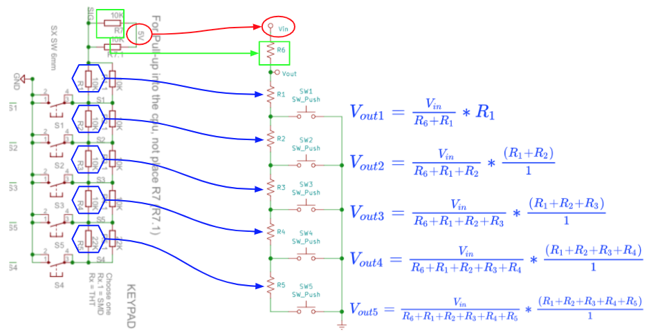
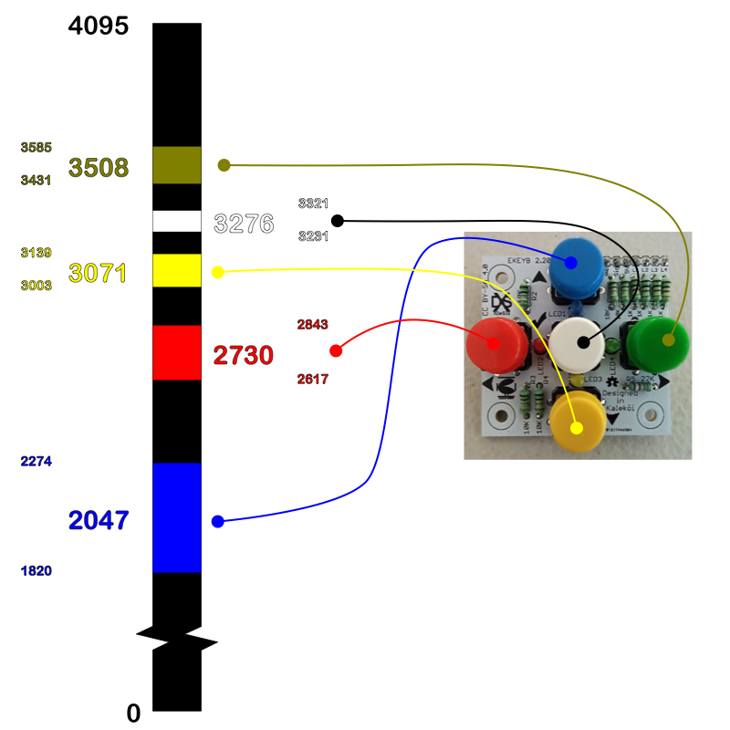
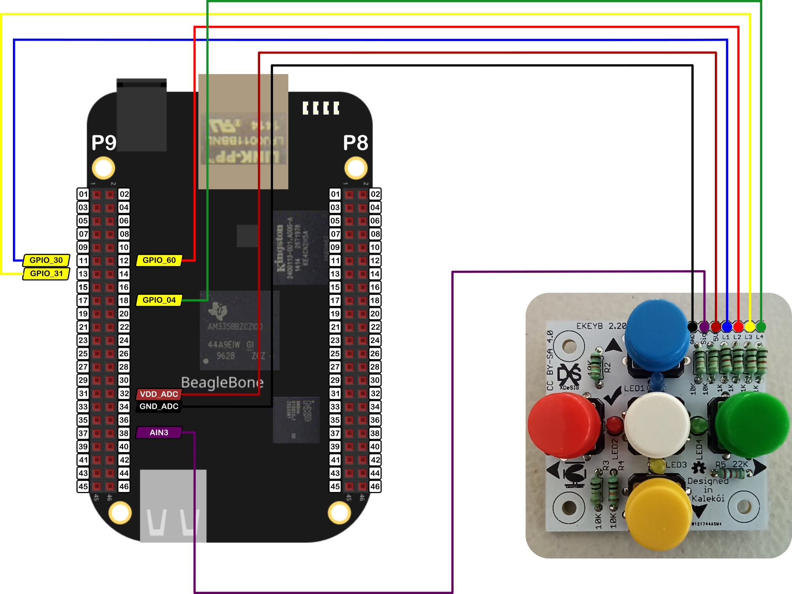

In this post, I show how to read the signal from an analog keypad with 5 buttons. The keypad used is the <a href="https://www.pcbway.com/project/shareproject/E_KEYPAD_2_2.html">E_KEYPAD_2_2</a> that was designed by Xabier Rosas and is shown the Figure 1:

<figure style="text-align: center; 
              margin-left: auto; 
              margin-right: auto;">
    
  <figcaption>
    Figure 1: The keypad V2.2.
  </figcaption>
</figure>

This works as a multiple voltage divider for 5 buttons where the signal voltage will vary depending on which button was pressed. This voltage can be detected by BeagleBone analog digital converter (ADC) in order to determine which button was pressed. The electric schema and its corresponding equations are shown in Figure 2: 


<figure style="text-align: center; 
              margin-left: auto; 
              margin-right: auto;">
    
  <figcaption>
    Figure 2: Schema and equations of the keypad's voltage divider.
  </figcaption>
</figure>

This keypad has 4 LEDs that can be used to show which button was pressed. Each LED is attached to a 1K resistor and can be turned `ON / OFF` with a digital pin of the BeagleBone. The next table shows the corresponding LEDs layout:

<table style="width: 50%; margin-left: auto; margin-right: auto;">
  <colgroup>
     <col span="1" style="width: 10%;">
     <col span="1" style="width: 10%;">
     <col span="1" style="width: 10%;">
  </colgroup>
  <caption>
    Tabla 1: LED colors in the keypad.
  </caption>
  <tr>
    <th style="text-align:center">LED NAME</th>
    <th style="text-align:center">LED COLOR</th>
    <th style="text-align:center">BUTTON LAYOUT</th>
  </tr>
  <tr>
    <td style="text-align:center">LED1 (L1)</td>
    <td style="text-align:center">Blue</td>
    <td style="text-align:center">Up</td>
  </tr>
  <tr>
    <td style="text-align:center">LED2 (L2)</td>
    <td style="text-align:center">Red</td>
    <td style="text-align:center">Left</td>
  </tr>
  <tr>
    <td style="text-align:center">LED3 (L3)</td>
    <td style="text-align:center">Yellow</td>
    <td style="text-align:center">Down</td>
  </tr>
  <tr>
    <td style="text-align:center">LED4 (L4)</td>
    <td style="text-align:center">Green</td>
    <td style="text-align:center">Right</td>
  </tr>
</table>

It is important to remember that the maximum voltage that can be read by the analog to digital conversion (ADC) module in the BeagleBone is <font color="red">1.8V</font>. For reference, in <a href="{{ site.baseurl }}">this post</a>, I showed how to use the BeagleBone ADC module. The pins `P9_32` and `P9_34`, `VDD_ADC` and `GND_ADC` respectively, can be used to power the keypad. As a result, the next ADC and voltage values can be obtained in the keypad when each one of the buttons was pressed: 

<table style="width: 50%; margin-left: auto; margin-right: auto;">
  <colgroup>
     <col span="1" style="width: 10%;">
     <col span="1" style="width: 10%;">
     <col span="1" style="width: 10%;">
     <col span="1" style="width: 10%;">
  </colgroup>
  <caption>
    Tabla 2: Analog voltages in the keypad.
  </caption>
  <tr>
    <th style="text-align:center">BUTTON LAYOUT</th>
    <th style="text-align:center">BUTTON COLOR</th>
    <th style="text-align:center">ADC VALUE</th>
    <th style="text-align:center">ADC VOLTAGE (V)</th>
  </tr>
  <tr>
    <td style="text-align:center">-</td>
    <td style="text-align:center">-</td>
    <td style="text-align:center">4095</td>
    <td style="text-align:center">1.8</td>
  </tr>
  <tr>
    <td style="text-align:center">Up</td>
    <td style="text-align:center">Blue</td>
    <td style="text-align:center">2047</td>
    <td style="text-align:center">0.9</td>
  </tr>
  <tr>
    <td style="text-align:center">Left</td>
    <td style="text-align:center">Red</td>
    <td style="text-align:center">2730</td>
    <td style="text-align:center">1.2</td>
  </tr>
  <tr>
    <td style="text-align:center">Down</td>
    <td style="text-align:center">Yellow</td>
    <td style="text-align:center">3071</td>
    <td style="text-align:center">1.35</td>
  </tr>
  <tr>
    <td style="text-align:center">Center</td>
    <td style="text-align:center">White</td>
    <td style="text-align:center">3276</td>
    <td style="text-align:center">1.44</td>
  </tr>
  <tr>
    <td style="text-align:center">Right</td>
    <td style="text-align:center">Green</td>
    <td style="text-align:center">3508*</td>
    <td style="text-align:center">1.5</td>
  </tr>
</table>
* This value was empirically estimated. The nominal value corresponds to 4212.

To detect a press on a button is necessary to consider a tolerance because each time the user press a button, the read ADC value is not exactly the same. It cans vary by some mV, furthermore, certain range values were defined to consider a valid press for each button. The amplitude of this range values does not have to overlap between them, because a press on two different buttons could not be distinguished. 

For this reason, as a thumb rule, the amplitude of these range values was defined as one-third of the difference between two consecutive nominal values. For example, the difference between the nominal values for the <font color="red">red</font> (2730) and <font color="blue">blue</font> (2047) buttons is 683, and the third of its value is 227 and can be used to calculates the upper (2047 + 227 = 2274) and lower (2047 - 227 = 1820) limits for considering a valid a press on the <font color="blue">blue</font> button. All these range values can be seen graphically in Figure 3:


<figure style="text-align: center; 
              margin-left: auto; 
              margin-right: auto;">
    
  <figcaption>
    Figure 3: The corresponding ADC value ranges to detect a press on each one of the buttons.
  </figcaption>
</figure>

## Circuit and components

  The circuit can be seen in Figure 4. It consists of the keypad and the BeagleBone. Note that to power the keypad, the VDD_ADC and GND_ADC pins are used.


<figure style="text-align: center; 
              margin-left: auto; 
              margin-right: auto;">
    
  <figcaption>
    Figure 4: Circuit to read the signal from a analog keypad with 5 buttons.
  </figcaption>
</figure>

The components are:
- 1 Analog keypad <a href="https://www.pcbway.com/project/shareproject/E_KEYPAD_2_2.html">E_KEYPAD_2_2</a
- Jumpers female-male to make the connections 

## Coding
  
A `KEYPAD_5BUTTONS` object is declared with global scope to initialize the pines used by the keypad. The first pin is the ADC pin used to read the signal that comes from the voltage divider. The next 4 pines are the digital pines used to turn the ON the LEDs when a button is pressed.

```cpp
// Global KEYPAD_5BUTTONS object instantiation
KEYPAD_5BUTTONS myKeyPad(P9_38, P9_11, P9_12, P9_13, P9_18);
```

  
  Two global variables are defined and initialized. The first one is a `bool` type for signaling the stop flag on the reading process. The second is a `COMMAND` type. This is an `enum` type defined in the `KEYPAD_5BUTTONS` class and is used to store the command value returned when a button is pressed. The defined values that can take are `FORWARD`, `LEFT`, `BACKWARD`, `GO`, `RIGHT`, and `NOT_IDENTIFIED`.  

```cpp
// Global Variables
bool stopReadKeyPad = false;
COMMAND command = NOT_IDENTIFIED;
```

A callback function is used to read the keypad signal in the background each 250ms while a `bool` variable is false.

```cpp
int ReadKeyPad() 
{
  while (stopReadKeyPad == false) 
  {
    command = myKeyPad.ReadPushedButton();
    cout << "'y' for exit" << endl;
    Delayms(250);
  }
  return 0;
}
```

The method to read the keypad signal is `ReadPushedButton()` which gets the data reading from the ADC module and through a consecutive numeric range comparisons of the read ADC value establishes the button that was pressed. In each case, the method turns ON the LED for a certain amount of time, assigns the corresponding `COMMAND` value, and returns this value. 

```cpp
/*
  Public method to read the pushed button
  @return COMMAND: The chosen command according to the pushed button
*/
COMMAND KEYPAD_5BUTTONS::ReadPushedButton() 
{
  // Get the reading
  int adcValue = ADCPin.ReadADC();

  if (2047 - 227 <= adcValue && adcValue <= 2047 + 227)
  {
    this->command = FORWARD;
    blueLedPin.TurnOn(ledDuration);
  }
  
  else if (2730 - 113 <= adcValue && adcValue <= 2730 + 113)
  {
    this->command = LEFT;
    redLedPin.TurnOn(ledDuration);
  }

  else if (3071 - 68 <= adcValue && adcValue <= 3071 + 68)
  {
    this->command = BACKWARD;
    yellowLedPin.TurnOn(ledDuration);
  }
  else if (3276 - 45 <= adcValue && adcValue <= 3276 + 45)
    this->command = GO;

  else if (3508 - 77 <= adcValue && adcValue <= 3508 + 77)
  {
    this->command = RIGHT;
    greenLedPin.TurnOn(ledDuration);
  }
  else
    this->command = NOT_IDENTIFIED;   

  std::string message;
  message = "The command read is: " + commandNameMap.at(command) + "\n";
  switch (command)
  {
  case FORWARD:
    std::cout << RainbowText(message, "Blue");
    break;
  case LEFT:
    std::cout << RainbowText(message, "Red");
    break;
  case BACKWARD:
    std::cout << RainbowText(message, "Yellow");
    break;
  case GO:
    std::cout << RainbowText(message, "White");
    break;
  case RIGHT:
    std::cout << RainbowText(message, "Green");
    break;
  default:
    break;
  }

  return command; 
}
```

The complete code for this implementation is shown in the next listing:


### KEYPAD_5BUTTONS_1.1.cpp
```cpp
/******************************************************************************
KEYPAD_5BUTTONS_1.1.cpp
@wgaonar
24/09/2021
https://github.com/wgaonar/BeagleCPP

Read the pushed button from a 5 buttons keypad

Class: KEYPAD_5BUTTONS
******************************************************************************/

#include <iostream>
#include "../../../Sources/KEYPAD_5BUTTONS.h"

using namespace std;

// Global KEYPAD_5BUTTONS object instantiation
KEYPAD_5BUTTONS myKeyPad(P9_38, P9_11, P9_12, P9_13, P9_18);

// Global Variables
bool stopReadKeyPad = false;
COMMAND command = NOT_IDENTIFIED;

int ReadKeyPad() 
{
  while (stopReadKeyPad == false) 
  {
    command = myKeyPad.ReadPushedButton();
    cout << "'y' for exit" << endl;
    Delayms(250);
  }
  return 0;
}

int main()
{
  string message = "Main program starting here...";
  cout << RainbowText(message,"Blue", "White", "Bold") << endl;

  // Call the function to read the temperature
  myKeyPad.DoUserFunction(&ReadKeyPad);

  char userInput = '\0';
  while (userInput != 'y') 
  {
    message = "Do you want to stop the readings on the pin? Enter 'y' for yes: ";
    cout << RainbowText(message, "Blue")  << endl;
    
    cin >> userInput;
    if (userInput == 'y') 
      stopReadKeyPad = true;
  }

  message = "Main program finishes here...";
  cout << RainbowText(message,"Blue", "White","Bold") << endl;

  return 0;
}
```

Se you in the next post. 