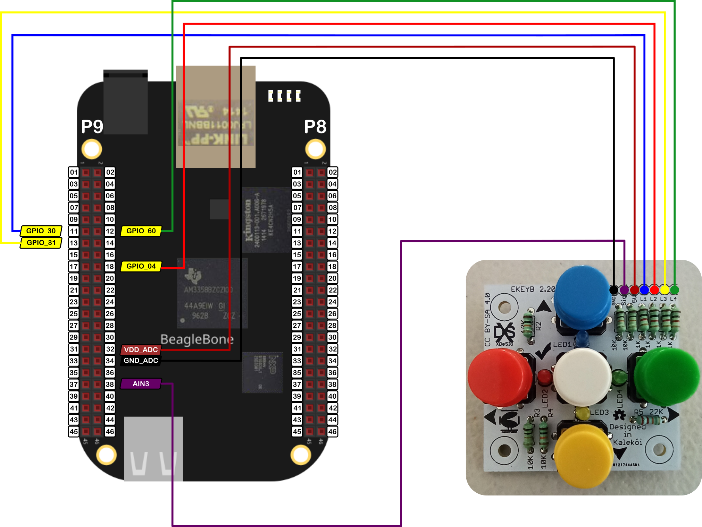

In this post, I show how to read and store the keypad pressed buttons sequence in a vector. In the <a href="{{ site.baseurl }}">last post</a>, I showed how to read the signal from the keypad <a href="https://www.pcbway.com/project/shareproject/E_KEYPAD_2_2.html">E_KEYPAD_2_2</a> designed by Xabier Rosas. Now, I show how to read and store a movements sequence in a `vector`. 

It is important to remember that the maximum voltage that can be read by the analog to digital conversion (ADC) module in the BeagleBone is <font color="red">1.8V</font>. For reference, in <a href="{{ site.baseurl }}">this post</a>, I showed how to use the BeagleBone ADC module. The pins `P9_32` and `P9_34`, `VDD_ADC` and `GND_ADC` respectively, can be used to power the keypad and obtain voltage values between 0.9V and 1.5V that can be used to distinguish which of the 5 buttons was pressed.

## Circuit and components

The circuit can be seen in Figure 1. It consists of the keypad and the BeagleBone. Note that to power the keypad, the VDD_ADC, and GND_ADC pins are used.


<figure style="text-align: center; 
              margin-left: auto; 
              margin-right: auto;">
    
  <figcaption>
    Figure 1: Circuit to read the signal from a analog keypad with 5 buttons.
  </figcaption>
</figure>

The components are:
- 1 Analog keypad <a href="https://www.pcbway.com/project/shareproject/E_KEYPAD_2_2.html">E_KEYPAD_2_2</a
- Jumpers female-male to make the connections 

## Coding
  
One `ADC` and four `LED` objects are declared with global scope to initialize the pines used by the keypad. The first pin is the ADC pin used to read the signal that comes from the voltage divider. The next 4 pines are the digital pines used to turn ON the LEDs when a button is pressed. Right away, The `KEYPAD_5BUTTONS` object is declared and initialized with the previous objects.

```cpp
// Global pin objects instantiation
ADC VoutPin(P9_38);
LED blueLedPin(P9_11);
LED redLedPin(P9_18);
LED yellowLedPin(P9_13);
LED greenLedPin(P9_12);

// Global KEYPAD_5BUTTONS object instantiation
KEYPAD_5BUTTONS myKeyPad (VoutPin, blueLedPin, redLedPin, yellowLedPin, greenLedPin);
```

Two global variables are defined and initialized. The first one is a `COMMAND` type. This is an `enum` type defined in the `KEYPAD_5BUTTONS` class and is used to store the command value returned when a button is pressed. The defined values that can take are `FORWARD`, `LEFT`, `BACKWARD`, `GO`, `RIGHT`, and `NOT_IDENTIFIED`. The second, is the `vector` where the pressed buttons,i.e. the `COMMAND` sequence, will be stored. In this case, this is the vector `movements`.

```cpp
// Global Variables
COMMAND command = NOT_IDENTIFIED;
vector<COMMAND> movements;
```

A `while` cycle is used to read the keypad signal each 250ms while the read `command` will be different from the `GO` option, i.e., while the pressed button will be different from the white button located at the keypad's center. Each time, the read command will be stored in the last position in the vector `movements`.

```cpp
command = myKeyPad.ReadPushedButton();
while (command != GO)
{
  if (command != NOT_IDENTIFIED)
    movements.push_back(command);
  Delayms(250);
  command = myKeyPad.ReadPushedButton();
}
```

Once a command `GO` was detected the entered sequence is printed in the screen from the first read command to the last entered by the user.

```cpp
cout << "The entered sequence of movements was: \n";
for (int index = 0; index < movements.size(); ++index)
{
  cout << "Movement[" << index << "] = ";
  cout  << movements.at(index) 
        << " (" << myKeyPad.GetCommandName(movements.at(index)) << ")" 
        << endl;
}
```

The complete code for this implementation is shown in the next listing:

### KEYPAD_5BUTTONS_1.2.cpp
```cpp
/******************************************************************************
KEYPAD_5BUTTONS_1.2.cpp
@wgaonar
24/10/2021
https://github.com/wgaonar/BeagleCPP

Read and store the keypad pressed buttons sequence in a vector.

Class: KEYPAD_5BUTTONS
******************************************************************************/

#include <iostream>
#include <vector>

#include "../../../Sources/KEYPAD_5BUTTONS.h"

using namespace std;

// Global pin objects instantiation
ADC VoutPin(P9_38);
LED blueLedPin(P9_11);
LED redLedPin(P9_18);
LED yellowLedPin(P9_13);
LED greenLedPin(P9_12);

// Global KEYPAD_5BUTTONS object instantiation
KEYPAD_5BUTTONS myKeyPad (VoutPin, blueLedPin, redLedPin, yellowLedPin, greenLedPin);

// Global Variables
COMMAND command = NOT_IDENTIFIED;
vector<COMMAND> movements;

int main()
{
  string message = "Main program starting here...";
  cout << RainbowText(message,"Blue", "White", "Bold") << endl;

  command = myKeyPad.ReadPushedButton();
  while (command != GO)
  {
    if (command != NOT_IDENTIFIED)
      movements.push_back(command);
    Delayms(250);
    command = myKeyPad.ReadPushedButton();
  }

  cout << "The entered sequence of movements was: \n";
  for (int index = 0; index < movements.size(); ++index)
  {
    cout << "Movement[" << index << "] = ";
    cout  << movements.at(index) 
          << " (" << myKeyPad.GetCommandName(movements.at(index)) << ")" 
          << endl;
  }

  message = "Main program finishes here...";
  cout << RainbowText(message,"Blue", "White","Bold") << endl;

  return 0;
}
```

Se you in the next post. 