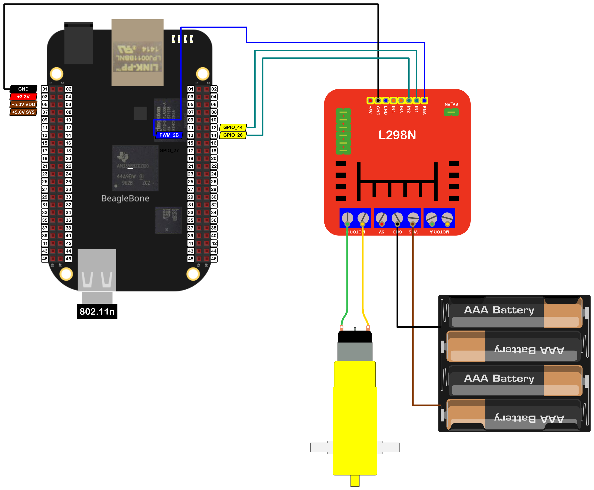

<p align="center">
Pink spool icon made by <a href="https://www.flaticon.com/authors/iconixar" title="iconixar">iconixar</a> from <a href="https://www.flaticon.com/" title="Flaticon">www.flaticon.com</a>
</p>

In this post, I show how to drive a DC Motor from the keyboard using the driver <a href="https://www.sparkfun.com/datasheets/Robotics/L298_H_Bridge.pdf">L298N</a> which can drive two DC motors. In practice, this driver can be found in a popular red-colored module that has been designed to make it easy to play and interact with DC motors as this <a href="https://lastminuteengineers.com/l298n-dc-stepper-driver-arduino-tutorial/">tutorial </a> shows. 

The remarkable aspect is the use of <font color="red">threads</font> to drive the motor, an aspect that lets the program does some other things at the same time that the motor is running. In the <a href="{{ site.baseurl }}">first entry</a>, dedicated to this driver, you can read about how to drive a motor with it.

It is important to remember that the logic voltage for the BeagleBone is <font color="red">3.3V</font>. If the user provides a greater voltage, the BeagleBone could be damaged.


## Circuit and components

The circuit can be seen in Figure 1. It consists of a L298N driver module , a low voltage DC Motor, batteries, and the BeagleBone. 

<figure style="text-align: center; 
              margin-left: auto; 
              margin-right: auto;">
    
  <figcaption>
    Figure 1: Circuit to drive a DC motor with the L298N driver.
  </figcaption>
</figure>

The components are:
- 1 DC Motor driver module L298N
- 1 DC Motor 5.0 - 6.0V
- 4 AA Batteries o 6 AA rechargeable batteries at 1.2V
- 1 Protoboard mini
- Jumpers male-male to make the connections

The pins used for control the motor are:
- GPIO **P8_12** and **P8_14** to control the motor rotation direction
- PWM **P8_13** to control the speed

## Coding
  
First, a `DCMotor` object is declared. For that, `GPIO` and ``PWM` objects are declared with global scope to initialize the motor that will be driven. 

These objects are named `AIN1 y AIN2`, `PWMA`. These objects are used to initialize a `DCMotor` named `MotorLeft` which contains methods to set the speed and the spin direction and to drive or stop the DC motor. 

In this `DCMotor` object, the user can include a fourth boolean initialization parameter `true/false` to invert by software the motor direction rotation instead of inverting the motor's jumpers physically.
 
This `DCMotor` object is used to initialize the `L298N` object. This inheritance structure has the goal to encapsulate the corresponding methods for any generic DC motor avoiding repeat code in the `L298N` object and focusing on the methods to **drive / brake** the DC motor, and not only one, but the two motors at the same time and in a different direction if it desired. 


```cpp
// Declaring the pins for motor
GPIO AIN1 (P8_12);
GPIO AIN2 (P8_14);
PWM PWMA (P8_13);

// Declare the motor object
DCMotor MotorLeft (AIN1, AIN2, PWMA);

// Declare the L298N Module
L298N myL298NModule (MotorLeft);
```

In this code, the inherited method `DCMotor::DriveThread` is used to create a thread each time the motor is driven. This method is shown in the next listing:

```cpp
/*
  Public method to drive the motor during a certain time inside a thread
  @param int: the desired speed (-100,100)
  @param int: The desired duration in milliseconds
  @param STOPMODE <brake / idle>: ACtion on the motor after driving it with <idle> as a default action.     
*/
void DCMotor::DriveThread(int speed, int duration, STOPMODE action)
{
  std::thread motorThread = std::thread(&DCMotor::MakeDriveThread, this, speed, duration, action);
  motorThread.detach();
}
```

The method `DCMotor::MakeDriveThread()` takes each thread and calls the method `DCMotor::Drive()` to drive the motor at certain speed during certain time and makes the motor to enter in `stop` or `idle` mode, which is the default, after the movement will be executed. This method is show here:

```cpp
/*
  Private method that contains the routine to drive 
  the motor during a certain time
  @param int: the desired speed (-100,100)
  @param int: The desired duration in milliseconds
  @param STOPMODE <brake / idle>: Generic Stop Action on the motor after driving it with <idle> as a default action.      
*/
void DCMotor::MakeDriveThread(int speed, int duration, STOPMODE action)
{
  // Move the motor
  Drive(speed, duration);

  // Set the desired stop action
  if (action == idle)
    this->Stop(LOW, LOW, LOW);
  else
    this->Stop(HIGH, HIGH, HIGH);
}
```

On the other hand, in the implementation, the user can change the motor speed using the key "W" and "S" to increase or decrease it, respectively. The library does not let to set a speed beyond the limits of <font color="red">100 and -100</font>. If the user presses the key "Y", the program finishes.

```cpp
message = "Enter an option 'y', 'w', 's': ";
cout << RainbowText(message, "Blue");
cin >> userInput;

// Drive the motors and printing messages on the terminal
switch (userInput)
{
  case 'w':
    motorSpeed += 10;
    if (motorSpeed >= 100)
      motorSpeed = 100;
    break;
  case 's':
    motorSpeed -= 10;
    if (motorSpeed <= -100)
      motorSpeed = -100;
    break;
  default:
    break;
}
```

The inherited class method `DCMotor::DriveThread()`, is used to create a thread each time the motor is driven. While the motor is running, a message will be printed on the screen 100 times.

```cpp
// Move the motor in a thread
myL298NModule.MotorA.DriveThread(motorSpeed, 2000);

// Doing other stuff
for(int i = 0; i < 100; i++)
{
  cout << "Doing something else while the motor is running" << endl;
}
```

The complete code for this application using a `while loop` to drive the motor increasing and decreasing the speed until the user press the key "Y" and printing the messages on the screen. This code is shown in the next listing.

### L298N_1.3.cpp
```cpp
/******************************************************************************
L298N_1.3.cpp
@wgaonar
26/03/2022
https://github.com/wgaonar/BeagleCPP

- Drive a motor in a thread and printing messages in the terminal at the same 
  time

Class: L298N
******************************************************************************/
#include <iostream>
#include "../../../Sources/L298N.h"

using namespace std;

// Declaring the pins for motor
GPIO AIN1 (P8_12);
GPIO AIN2 (P8_14);
PWM PWMA (P8_13);

// Declare the motor object
DCMotor MotorLeft (AIN1, AIN2, PWMA);

// Declare the L298N Module
L298N myL298NModule (MotorLeft);

int main()
{
  string message = "Main program starting here...";
  cout << RainbowText(message,"Blue", "White", "Bold") << endl;

  message = "If you want to stop the program, enter 'y' for yes";
  cout << RainbowText(message, "Blue") << endl;
  message = "Or enter 'w' for increase speed or 's' for decrease it";
  cout << RainbowText(message, "Blue") << endl;

  int motorSpeed = 0;
  char userInput = '\0';
  while (userInput != 'y')
  {
    message = "Enter an option 'y', 'w', 's': ";
    cout << RainbowText(message, "Blue");
    cin >> userInput;

    // Drive the motors and printing messages on the terminal
    switch (userInput)
    {
    case 'w':
      motorSpeed += 10;
      if (motorSpeed >= 100)
        motorSpeed = 100;
      break;
    case 's':
      motorSpeed -= 10;
      if (motorSpeed <= -100)
        motorSpeed = -100;
      break;
    default:
      break;
    }

    // Move the motor in a thread
    myL298NModule.MotorA.DriveThread(motorSpeed, 2000);

    // Doing other stuff
    for(int i = 0; i < 100; i++)
    {
      cout << "Doing something else while the motor is running" << endl;
    }
  }

  message = "Main program finishes here...";
  cout << RainbowText(message,"Blue", "White","Bold") << endl;

  return 0;
}
```

Se you in the next post. 
