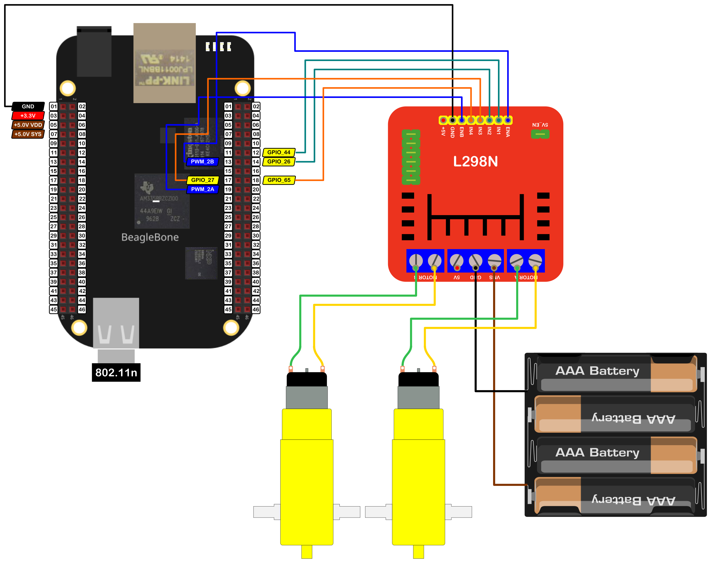

In this post, I show how to control a pair of DC Motors to move forward, backward, and turn left or right. I am using the BeagleBone and the driver <a href="https://www.sparkfun.com/datasheets/Robotics/L298_H_Bridge.pdf">L298N</a> which can drive two DC motors. In practice, this driver can be found in a popular red-colored module that has been designed to make it easy to play and interact with DC motors as this <a href="https://lastminuteengineers.com/l298n-dc-stepper-driver-arduino-tutorial/">tutorial</a> shows. 

In the <a href="{{ site.baseurl }}"> first entry</a> dedicated to this driver, you can read about how to drive only one motor with it.

It is important to remember that the logic voltage for the BeagleBone is <font color="red">3.3V</font>. If the user provides a greater voltage, the BeagleBone could be damaged.


## Circuit and components

The circuit can be seen in Figure 1. It consists of a L298N driver module , 2 low voltage DC Motors, batteries, and the BeagleBone. 

<figure style="text-align: center; 
              margin-left: auto; 
              margin-right: auto;">
    
  <figcaption>
    Figure 1: Circuit to drive a pair of DC motor with the L298N driver.
  </figcaption>
</figure>

The components are:
- 1 DC Motor driver L298N
- 2 DC Motor 5.0 - 6.0V
- 4 AA Batteries 
- 1 Protoboard mini
- Jumpers male-male to make the connections

The pins used for control the driver and the motors are:
- The pins used for control the **motor A** are:
  - GPIO **P8_12** and **P8_14** to control the motor rotation direction
  - PWM **P8_13** to control the speed
- The pins used for control the **motor B** are:
  - GPIO **P8_17** and **P8_18** to control the motor rotation direction
  - PWM **P8_19** to control the speed

## Coding
  
First, two `DCMotor` objects are declared. For that, `GPIO` and `PWM` objects are declared with global scope to initialize each one of both motors that will be driven. 

These objects are named `AIN1`, `AIN2`, `PWMA`, `BIN1`, `BIN2`, and `PWMB` for the `MotorA` and `MotorB` objects, respectively. These are `DCMotor` objects declared as `MotorLeft` and `MotorRight` and contain methods to set the speed and the spin direction to drive the DC motor and to stop it, as well as, a fourth boolean initialization parameter `true/false` to invert by software the motor direction rotation instead of inverting the motor's jumpers physically.

As is shown next, I have used this parameter to invert the rotation direction of the `MotorA`, setting the last parameter to `true`, instead of inverting the jumpers physically. This feature can be useful when you do not have access to the circuit or the motor directly.   


```cpp
// Declaring the pins for MotorA 
GPIO AIN1 (P8_12);
GPIO AIN2 (P8_14);
PWM PWMA (P8_13);

// Declare the MotorA
DCMotor MotorLeft (AIN1, AIN2, PWMA, true);

// Declaring the  pins for MotorB
GPIO BIN1 (P8_17);
GPIO BIN2 (P8_18);
PWM PWMB (P8_19);

// Declare the MotorB
DCMotor MotorRight (BIN1, BIN2, PWMB);
```

These `DCMotor` objects are used to initialize the `L298N` object with two of them. This inheritance structure has the goal to encapsulate the corresponding methods for any generic DC motor in the `DCMotor` object avoiding repeat code in the `L298N` object and focusing on the methods to **drive / brake** not only one, but the two motors at the same time and in a different direction if it desired. 

```cpp
// Declare the L298N Module
L298N myL298NModule (MotorLeft, MotorRight);
```

The `L298N` object constructor for two DC Motors is shown in the next listing. To construct the `L298N` object, the user has to declare previously, two `DCMotor` objects with their respective `GPIO` and `PWM` pins.

```cpp
// Overload constructor from DCMotor objects and for MotorA and MotorB
L298N::L298N (DCMotor& newMotorA, 
              DCMotor& newMotorB):
              MotorA (newMotorA), 
              MotorB (newMotorB)
{
  // Set the flags about which motors are used 
  motorAisUsed = true;
  motorBisUsed = true;

  std::string message;
  std::string swapStringMotorA {this->MotorA.swapSpinFlag ? "True" : "False"};
  std::string swapStringMotorB {this->MotorB.swapSpinFlag ? "True" : "False"};
  message = "\nTB6612FNG driver module with the next components / pins was created and activated:\n" +
            std::string("\tMotorA:\n") +
            std::string("\t\tAIN1: ") + this->MotorA.input1Pin.GetPinHeaderId() + "\n" + 
            std::string("\t\tAIN2: ") + this->MotorA.input2Pin.GetPinHeaderId() + "\n" + 
            std::string("\t\tPWMA: ") + this->MotorA.pwmPin.GetPinHeaderId() + "\n" +
            std::string("\t\tSwap Spin: ") + swapStringMotorA + "\n" +
            std::string("\tMotorB:\n") +
            std::string("\t\tBIN1: ") + this->MotorB.input1Pin.GetPinHeaderId() + "\n" + 
            std::string("\t\tBIN2: ") + this->MotorB.input2Pin.GetPinHeaderId() + "\n" + 
            std::string("\t\tPWMB: ") + this->MotorB.pwmPin.GetPinHeaderId() + "\n" +
            std::string("\t\tSwap Spin: ") + swapStringMotorB + "\n" +
            "\n\n"; 
  std::cout << RainbowText(message, "Light Red");
}
```

In this code, I used the next encapsulated methods in the `L298N` class to move or turn both DC Motors at the same time which receives as arguments the speed and duration of the movement and the action to do after that movement has been executed:

- `L298N::Forward` runs the both in the same direction to forward.
- `L298N::Backward` runs the both in the same direction to backward.
- `L298N::TurnLeft` turns the motors in opposite directions to get a turn to the left of the robot or body to which the DC motors are attached.
- `L298N::TurnRight` turns the motors in opposite directions to get a turn to the right of the robot or body to which the DC motors are attached..

It is different from the <a href="{{ site.baseurl }}">first entry</a> post of the series, where the inherited `DCMotor::Drive()` method was used to drive only one motor with this module. Here, these own `L298N` methods are used and are shown in the next listings:

```cpp
/*
  Interface method to drive FORWARD both motors
  @param int speed: The desired speed (0,100). It set up the correct value if
                    the user enters a negative value.
  @param int duration:  The desired duration in milliseconds with 0 as
                        default value
  @param STOPMODE action <brake / idle>:  Action on the motor after driving it, 
                                        with <idle> as default action. 
*/
void L298N::Forward(int speed, int duration, STOPMODE action)
{
  if (speed < 0)
    speed *= -1;

  if (motorAisUsed)
    this->MotorA.Drive(speed);
  if (motorBisUsed)  
    this->MotorB.Drive(speed);

  if (duration > 0)
  {
    DelayMilliseconds(duration);
    if (action == idle)
      this->Idle();
    else
      this->Brake();
  }
}
```

```cpp
/*
  Interface method to drive BACKWARD both motors
  @param int speed: The desired speed (-100,0). It set up the correct value if
                    the user enters a positive value.
  @param int duration:  The desired duration in milliseconds with 0 as 
                        default value
  @param STOPMODE action <brake / idle>:  Action on the motor after driving it with 
                                        <idle> as default action.   
*/
void L298N::Backward(int speed, int duration, STOPMODE action)
{
  if (speed > 0)
    speed *= -1;

  if (motorAisUsed)
    this->MotorA.Drive(speed);
  if (motorBisUsed)  
    this->MotorB.Drive(speed);

  if (duration > 0)
  {
    DelayMilliseconds(duration);
    if (action == idle)
      this->Idle();
    else
      this->Brake();
  }
}
```

```cpp
/*
  Interface method to DRIVE in OPPOSITE direction both motors
  @param int speed: The desired speed (0,100). It set up the correct value if
                    the user enters a positive value.
  @param int duration:  The desired duration in milliseconds with 0 as 
                        default value
  @param STOPMODE action <brake / idle>:  Action on the motor after driving it with 
                                        <idle> as default action.   
*/
void L298N::TurnLeft(int speed, int duration, STOPMODE action)
{
  if (speed < 0)
    speed *= -1;

  if (motorAisUsed)
    this->MotorA.Drive(-speed);
  if (motorBisUsed)  
    this->MotorB.Drive(speed);

  if (duration > 0)
  {
    DelayMilliseconds(duration);
    if (action == idle)
      this->Idle();
    else
      this->Brake();
  }
}
```

```cpp
/*
  Interface method to DRIVE in ANOTHER OPPOSITE direction both motors
  @param int speed: The desired speed (0,100). It set up the correct value if
                    the user enters a positive value.
  @param int duration:  The desired duration in milliseconds with 0 as 
                        default value
  @param STOPMODE action <brake / idle>:  Action on the motor after driving it with 
                                        <idle> as default action.   
*/
void L298N::TurnRight(int speed, int duration, STOPMODE action)
{
  if (speed < 0)
    speed *= -1;

  if (motorAisUsed)
    this->MotorA.Drive(speed);
  if (motorBisUsed)  
    this->MotorB.Drive(-speed);

  if (duration > 0)
  {
    DelayMilliseconds(duration);
    if (action == idle)
      this->Idle();
    else
      this->Brake();
  }
}
```

In the implementation, the user can change the motor speed using the key "W" and "S" to increase or decrease it, respectively. The library does not let to set a speed value beyond the limits of <font color="red">100 and -100</font>. If the user presses the key "Y", the program finishes.

```cpp
int motorSpeed = 100;
char userInput = '\0';
while (userInput != 'y')
{
  message = "Enter an option 'y', 'w', 's', 'a', 'd': ";
  cout << RainbowText(message, "Yellow");
  cin >> userInput;

  // Update the motors speed and move the motors in 4 directions
  switch (userInput)
  {
  case 'w':
    myL298NModule.Forward(motorSpeed);
    break;
  case 's':
    myL298NModule.Backward(motorSpeed);
    break;
  case 'a':
    myL298NModule.TurnLeft(motorSpeed);
    break;
  case 'd':
    myL298NModule.TurnRight(motorSpeed);
    break;
  default:
    break;
  }
}  
```

To complement the behavior of the `L298N`class, the `Brake()` and `Idle()` methods are defined too. These methods set the correct pins state of the L298N module for getting a brake or idle state in the DC motor. These methods are shown in the next listings:

```cpp
/*
  Interface method to BRAKE the attached motors to the module 
*/ 
void L298N::Brake()
{
  // Set the motor A in brake mode
  if (motorAisUsed)
    this->MotorA.Stop(HIGH, HIGH, HIGH);

  // Set the motor B in brake mode if it is used
  if (motorBisUsed)
    this->MotorB.Stop(HIGH, HIGH, HIGH);
}

/*
  Interface method to IDLE the attached motors to the module 
*/ 
void L298N::Idle()
{
    // Set the motor A in idle mode
  if (motorAisUsed)
    this->MotorA.Stop(LOW, LOW, LOW);

  // Set the motor B in idle mode if it is used
  if (motorBisUsed)
    this->MotorB.Stop(LOW, LOW, LOW);
}
```

The complete code for this application uses a `while loop` to control both motors increasing and decreasing the speed until the user press the key "Y". This code is shown in the next listing.


### L298N_1.4.cpp
```cpp
/******************************************************************************
L298N_1.4.cpp
@wgaonar
26/03/2022
https://github.com/wgaonar/BeagleCPP

- Move TWO motors forward, backward, turning left or right at max speed

Class: L298N
******************************************************************************/
#include <iostream>
#include "../../../Sources/L298N.h"

using namespace std;

// Declaring the pins for MotorA 
GPIO AIN1 (P8_12);
GPIO AIN2 (P8_14);
PWM PWMA (P8_13);

// Declare the MotorA
DCMotor MotorLeft (AIN1, AIN2, PWMA, true);

// Declaring the  pins for MotorB
GPIO BIN1 (P8_17);
GPIO BIN2 (P8_18);
PWM PWMB (P8_19);

// Declare the MotorB
DCMotor MotorRight (BIN1, BIN2, PWMB);

// Declare the L298N Module
L298N myL298NModule (MotorLeft, MotorRight);

int main()
{
  string message = "Main program starting here...";
  cout << RainbowText(message,"Blue", "White", "Bold") << endl;

  message = "If you want to stop the program, enter 'y' for yes";
  cout << RainbowText(message, "Yellow") << endl;
  message = "Or enter 'w' to move forward 's' to move to backward";
  cout << RainbowText(message, "Yellow") << endl;
  message = "Or enter 'a' to move to the left or 'd' to move to the right";
  cout << RainbowText(message, "Yellow") << endl;

  int motorSpeed = 100;
  char userInput = '\0';
  while (userInput != 'y')
  {
    message = "Enter an option 'y', 'w', 's', 'a', 'd': ";
    cout << RainbowText(message, "Yellow");
    cin >> userInput;

    // Update the motors speed and move the motors in 4 directions
    switch (userInput)
    {
    case 'w':
      myL298NModule.Forward(motorSpeed);
      break;
    case 's':
      myL298NModule.Backward(motorSpeed);
      break;
    case 'a':
      myL298NModule.TurnLeft(motorSpeed);
      break;
    case 'd':
      myL298NModule.TurnRight(motorSpeed);
      break;
    default:
      break;
    }
  }  

  // Brake the motors
  cout << "Breaking the motors...\n";
  myL298NModule.Brake();

  message = "Main program finishes here...";
  cout << RainbowText(message,"Blue", "White","Bold") << endl;

  return 0;
}
```

Se you in the next post. 
