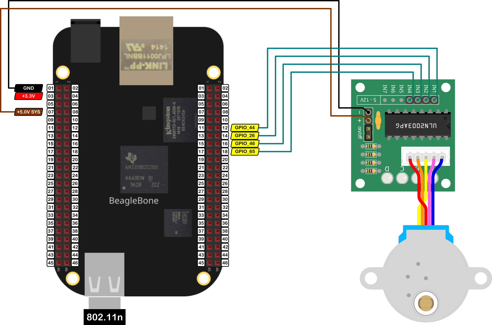

In this post, I show how to drive the stepper motor 28BYJ-48 with the driver <a href="https://www.st.com/resource/en/datasheet/uln2003.pdf">ULN2003</a> which can drive a wide range of loads including solenoids, relay DC motors, LED display filament lamps and thermal printheads. In practice, this driver can be found in a popular green-coloured board that has been designed to make it easy to play and interact with the 28BYJ-48 as <a href="https://lastminuteengineers.com/28byj48-stepper-motor-arduino-tutorial/">this</a> and <a href="https://www.luisllamas.es/motor-paso-paso-28byj-48-arduino-driver-uln2003/">this another tutorial</a> show.

The 28BYJ-48 is a stepper motor that moves in steps or "degree intervals". It has an internal gear set that let it turn <font color="blue">2048</font> steps in each revolution in a mode that is called <font color="blue">Full Step</font> or <font color="orange">4096</font> steps in each revolution in a mode called <font color="orange">Half Step</font>. 

These are theoretical values and depend on the gearbox used by the 28BYJ-48`s manufacturer. Sometimes, instead of 2048 steps, the real value is 2037 steps per revolution.

It is important to remember that the logic voltage for the BeagleBone is <font color="red">3.3V</font>. If the user provides a greater voltage, the BeagleBone could be damaged.

## Circuit and components

The circuit can be seen in Figure 1. It consists of a UNL2003 driver module, 28BYJ48 stepper motor, and the BeagleBone. 

<figure style="text-align: center; 
              margin-left: auto; 
              margin-right: auto;">
    
  <figcaption>
    Figure 1: Circuit to drive a 28BYJ48 stepper motor with the ULN2003 driver.
  </figcaption>
</figure>

The components are:
- 1 28BYJ-48 stepper motor 5V
- 1 ULN2003 module driver
- 1 Protoboard mini
- Jumpers male-male to make the connections

The pins used to control the stepper motor are:
- GPIO **P8_12**, **P8_14**, **P8_16** and **P8_18** to control the motor rotation speed and direction

## Coding
  
First, four `GPIO` objects are declared and named `IN1, IN2, IN3 and IN4`.
```cpp
// Declaring the pins for motor
GPIO IN1 (P8_12);
GPIO IN2 (P8_14);
GPIO IN3 (P8_16);
GPIO IN4 (P8_18);
```

These pins will be used to declare and initialize a `StepperMotor` object with the name of `myStepper` in this manner:
```cpp
StepperMotor myStepper (IN1, IN2, IN3, IN4);
```

The `StepperMotor` object constructor **definition** is in a class named `STEPPERMOTOR` who is part of the whole library to use and program the BeagleBone Black with C++. The source files can be found <a href="https://github.com/wgaonar/BeagleCPP/tree/main/Sources">here. </a> 

The `StepperMotor` object constructor is shown in the next listing: 
```cpp
// Overload constructor
StepperMotor( 
              GPIO, GPIO, GPIO, GPIO, 
              STEPPER_MODE controlMode = fullStep1Coil, 
              unsigned int stepsPerRevolution = 2048, 
              unsigned int maxSpeed = 500
            );
```

It requires seven input parameters, from which, the last three have **default values** avoiding the user to specify these if it does not want to. 
- The first four parameters are the `GPIO` pins to control the stepper motors. 
- The last three define the control mode and other movement parameters for the stepper motor:
  - The `controlMode` parameter defines the stepper motor's control mode to one of the next modes: 
    - `fullStep1Coil`: Full step with one coil activation. It is the default value
    - `fullStep2Coils`: Full step with two coil activation.
    - `halfStep`: Half step with two coil activation by nature.
    - `driver`:  Another way, by example, using another custom driver.
  - The `stepsPerRevolution` defines the number of steps per revolution of the motor. It takes `2048` steps as the default value. 
  - The `maxSpeed` defines the maximum rotation speed of the motor in steps/second. It takes `500` as the default value.

The `StepperMotor` object constructor **declaration** is shown in the next listing. It requires at least, four `GPIO` pins to control the stepper motor and initialize them as `OUTPUT` pins with the private method `InitMotorPins()`. Then, the correct number for the activation sequence steps is set up in the variable `stepsPerMode` according to the control mode that the user wants:
  - 4 steps for **Full Step** mode with 1 or 2 coil activation.
  - 8 steps for **Half Step** mode. 

```cpp
// Overload Constructor
StepperMotor::StepperMotor (GPIO newMotorPin1, 
                            GPIO newMotorPin2,
                            GPIO newMotorPin3,
                            GPIO newMotorPin4,
                            STEPPER_MODE newControlMode,
                            unsigned int newStepsPerRevolution,
                            unsigned int newMaxSpeed) :
                            motorPin1 (newMotorPin1),
                            motorPin2 (newMotorPin2),
                            motorPin3 (newMotorPin3),
                            motorPin4 (newMotorPin4),
                            controlMode (newControlMode),
                            stepsPerRevolution (newStepsPerRevolution),
                            maxSpeed (newMaxSpeed)
{
  InitMotorPins();
  stepsCounter = 0;
  currentStep = 0;

  std::string modeString; 
  switch (controlMode)
  {
    case fullStep1Coil:
      modeString = "Full step with 1 Coil";
      stepsPerMode = fullStep1CoilVector.size(); 
      break;
    case halfStep:
      modeString = "Half step";
      stepsPerMode = halfStepVector.size(); 
      break;
    case fullStep2Coils:
      modeString = "Full step with 2 coils"; 
      stepsPerMode = fullStep2CoilsVector.size(); 
      break;
    case driver:
      modeString = "Driver mode was chosen"; 
      break;
  }

  std::string message;
  message = "\nStepperMotor object with the next parameters / pins was created:\n" + 
            std::string("\tMotorPin1: ") + this->motorPin1.GetPinHeaderId() + 
            "\n" + 
            std::string("\tMotorPin2: ") + this->motorPin2.GetPinHeaderId() + 
            "\n" + 
            std::string("\tMotorPin3: ") + this->motorPin3.GetPinHeaderId() + 
            "\n" +
            std::string("\tMotorPin4: ") + this->motorPin4.GetPinHeaderId() + 
            "\n" +
            std::string("\tControl Mode: ") + modeString + "\n" +
            std::string("\tMax speed: ") + std::to_string(maxSpeed) + "\n\n";
  std::cout << RainbowText(message, "Light Gray");
}

/*
  Private method to initialize the Pins
*/
void StepperMotor::InitMotorPins()
{
  // Set the right modes for the pins
  motorPin1.SetMode(OUTPUT);
  motorPin2.SetMode(OUTPUT);
  motorPin3.SetMode(OUTPUT);
  motorPin4.SetMode(OUTPUT);
}
```
To turn the stepper motor declared as a `StepperMotor` object with the name of `myStepper` in this program, the method `TurnBySteps(CW, 512)` can be used, which specifies the rotation direction, CW in this case, and the number of steps to rotate the stepper motor, 512 in this case, which corresponds to 1/4-turn due that the 28BYJ-48 has 2048 steps per revolution.
```cpp
myStepper.TurnBySteps(CW, 512);
``` 

The code of this method is shown here to illustrate how the movement of each step is done. The logic behind this is to activate each coil in the right order and sequence. The order determines if the stepper motor will rotate in the CCW direction starting the activation of the first terminal of the first coil or, in the other case, it will rotate in the CW direction if the activation starts in the second terminal of the second coil. The right sequence has to ensure that both terminals of both coils are activated sequentially to let the motor rotate.

```cpp
/*
  Public method to turn the motor by steps
  @param DIRECTION: The desired direction for the motor rotation
  @param unsigned int: The steps required
  @param unsigned int: The rotation's speed in steps / sec (0,maxSpeed]    
  @param bool: Flag to print / no print the messages on the console. Default value: <false>     
*/
void StepperMotor::TurnBySteps(
                                DIRECTION direction, 
                                unsigned int stepsRequired, 
                                unsigned int speed, 
                                bool printMessages
                              )
{
  // Check the speed limit value
  if (speed > maxSpeed)
    speed = maxSpeed;

  int coilStep {0};

  if (printMessages == true)
  {
    std::string message;
    if (direction == CW) 
      message = "Turning stepper motor CW ";
    else
      message = "Turning stepper motor CCW ";

    message +=
    std::to_string(stepsRequired) + " steps at " + 
    std::to_string(speed) + " steps/second\n";

    std::cout << RainbowText(message, "Light Gray");
  }

  // Turn 1 step in CW direction
  if (direction == CW)
  {
    for (int i = 0; i < stepsRequired; i++)
    {
      coilStep = stepsPerMode - 1 - (i % stepsPerMode);
      this->Turn1Step(coilStep, speed);
      
      // Update counters
      stepsCounter++;
      currentStep++;
    }
  }
  // Turn 1 step in CCW direction
  else if (direction == CCW)
  {
    for (int i = 0; i < stepsRequired; i++)
    {
      coilStep = i % stepsPerMode;
      this->Turn1Step(coilStep, speed);
      
      // Update counters
      stepsCounter++;
      currentStep--;
    }
  }
}
```


To know how many steps the stepper motor has executed, the next method can be used:
```cpp
myStepper.GetStepsCounter();
```

In the same way, to know the actual position of the stepper motor axis in terms of number of steps, the next method can be used:
```cpp
myStepper.GetCurrentStep()();
```

The complete code for this application is shown in the next listing together with its corresponding execution output.

### 28BYJ-48-ULN2003_1.1.cpp
```cpp
/******************************************************************************
28BYJ48-ULN2003_1.1.cpp
@wgaonar
03/04/2022
https://github.com/wgaonar/BeagleCPP

- Move the stepperMotor by steps in fullStep with 1 Coil mode

Class: STEPPERMOTOR
******************************************************************************/

#include <iostream>
#include "../../../Sources/STEPPERMOTOR.h"

using namespace std;

// Declaring the pins for motor
GPIO IN1 (P8_12);
GPIO IN2 (P8_14);
GPIO IN3 (P8_16);
GPIO IN4 (P8_18);

/*
  Declare the 28BYJ-48 stepper motor object with default parameters:
  full step with the activation of 1 coil, 
  default 2048 steps per revolution 
  and a default maximum speed of 500 steps/second
*/
StepperMotor myStepper (IN1, IN2, IN3, IN4);

int main()
{
  string message = "Main program starting here...";
  cout << RainbowText(message,"Blue", "White", "Bold") << endl;

  /* 
    Turn the stepper motor 1/4-turn in CW direction at 500 steps/second
  */
  myStepper.TurnBySteps(CW, 512);
  cout << "Steps executed by the motor: " << myStepper.GetStepsCounter() << endl;
  cout << "Actual position of the motor axis: " << myStepper.GetCurrentStep() << endl;

  /* 
    Turn the stepper motor 1/4-turn in CCW direction at 500 steps/second
  */
  myStepper.TurnBySteps(CCW, 512);
  cout << "Steps executed by the motor: " << myStepper.GetStepsCounter() << endl;
  cout << "Actual position of the motor axis: " << myStepper.GetCurrentStep() << endl;

  message = "Main program finishes here...";
  cout << RainbowText(message,"Blue", "White","Bold") << endl;

  return 0;
}
```

Se you in the next post. 
