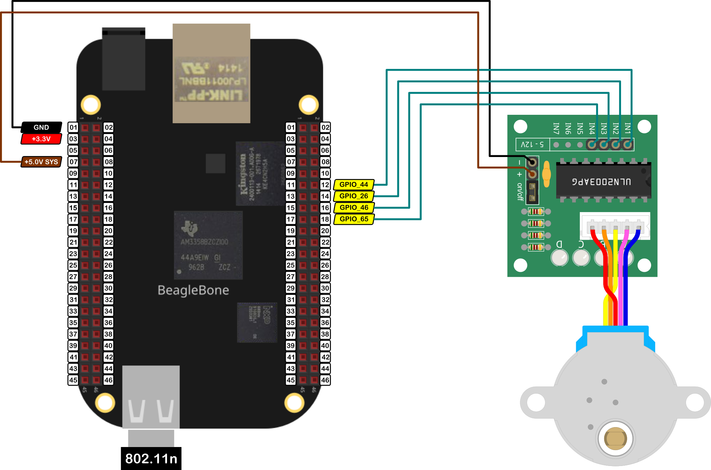

In this post, I show how to drive the stepper motor 28BYJ-48 in full step mode activating 2 coils with the driver <a href="https://www.st.com/resource/en/datasheet/uln2003.pdf">ULN2003</a>. In <a href="{{ site.baseurl }}">this entry</a>, you can find more about this stepper motor, this driver and how to use it in  a <font color="blue">Full Step</font> activation mode with 1 coil.  

Remember that the 28BYJ-48 is a stepper motor that moves of steps or "degree intervals". It has an internal gear set that let it to turn <font color="blue">2048</font> steps in each revolution in a mode that is called <font color="blue">Full Step</font> or <font color="orange">4096</font> steps in each revolution in a mode called <font color="orange">Half Step</font>. 

It is important to remember that the logic voltage for the BeagleBone is <font color="red">3.3V</font>. If the user provides a greater voltage, the BeagleBone could be damaged.

## Circuit and components

The circuit can be seen in Figure 1. It consists of a L298N driver module , a low voltage DC Motor, batteries, and the BeagleBone. 

<figure style="text-align: center; 
              margin-left: auto; 
              margin-right: auto;">
    
  <figcaption>
    Figure 1: Circuit to drive a 28BYJ48 stepper motor with the ULN2003 driver.
  </figcaption>
</figure>

The components are:
- 1 28BYJ-48 stepper motor 5V
- 1 ULN2003 module driver
- 1 Protoboard mini
- Jumpers male-male to make the connections

The pins used for control the stepper motor are:
- GPIO **P8_12**, **P8_14**, **P8_16** and **P8_18** to control the motor rotation speed and direction

## Coding
  
First, four `GPIO` objects are declared and named as `IN1, IN2, IN3 and IN4`. These pines will be used to declare and initialize a `StepperMotor` object after in the code.

```cpp
// Declaring the pins for motor
GPIO IN1 (P8_12);
GPIO IN2 (P8_14);
GPIO IN3 (P8_16);
GPIO IN4 (P8_18);

/*
  Declare the 28BYJ-48 stepper motor object with default parameters:
  full step with the activation of 1 coil, 
  default 2048 steps per revolution 
  and a default maximum speed of 500 steps/second
*/
StepperMotor myStepper (IN1, IN2, IN3, IN4);
```

The `StepperMotor` object constructor **definition** is shown in the next listing. It takes seven input parameters with the last three of them with default values. The first four parameters are the `GPIO` pins to control the stepper motors. The last three have default values if the user does not set up the next:
- The control mode for the stepper motor, i.e., if the stepper motor will be controlled with one of the next three modes: 
  - Full step with one coil activation.
  - Full step with two coil activation.
  - Half step with two coil activation by nature.
  - Other way, by example using another custom driver.
- The steps per revolution of the motor, 2048 steps as default value. 
- The maximum rotation speed of the motor, 500 steps per revolution as a default value.

```cpp
// Overload constructor
StepperMotor( 
              GPIO, GPIO, GPIO, GPIO, 
              STEPPER_MODE controlMode = fullStep1Coil, 
              unsigned int stepsPerRevolution = 2048, 
              unsigned int maxSpeed = 500
            );
```

The `StepperMotor` object constructor **declaration** is shown in the next listing. It requirers at least, the four `GPIO` pins to control the stepper motor an initialize them as `OUTPUT` pins with the private method `InitMotorPins()`. Then, the correct number of activation sequence steps is set up in the variable `stepsPerMode` according to the control mode that the user wants, 4 steps for Full Step mode with 1 or 2 coils activation and 8 steps for Half Step mode. 

```cpp
// Overload Constructor
StepperMotor::StepperMotor (GPIO newMotorPin1, 
                            GPIO newMotorPin2,
                            GPIO newMotorPin3,
                            GPIO newMotorPin4,
                            STEPPER_MODE newControlMode,
                            unsigned int newStepsPerRevolution,
                            unsigned int newMaxSpeed) :
                            motorPin1 (newMotorPin1),
                            motorPin2 (newMotorPin2),
                            motorPin3 (newMotorPin3),
                            motorPin4 (newMotorPin4),
                            controlMode (newControlMode),
                            stepsPerRevolution (newStepsPerRevolution),
                            maxSpeed (newMaxSpeed)
{
  InitMotorPins();
  stepsCounter = 0;
  currentStep = 0;

  std::string modeString; 
  switch (controlMode)
  {
    case fullStep1Coil:
      modeString = "Full step with 1 Coil";
      stepsPerMode = fullStep1CoilVector.size(); 
      break;
    case halfStep:
      modeString = "Half step";
      stepsPerMode = halfStepVector.size(); 
      break;
    case fullStep2Coils:
      modeString = "Full step with 2 coils"; 
      stepsPerMode = fullStep2CoilsVector.size(); 
      break;
    case driver:
      modeString = "Driver mode was chosen"; 
      break;
  }

  std::string message;
  message = "\nStepperMotor object with the next parameters / pins was created:\n" + 
            std::string("\tMotorPin1: ") + this->motorPin1.GetPinHeaderId() + 
            "\n" + 
            std::string("\tMotorPin2: ") + this->motorPin2.GetPinHeaderId() + 
            "\n" + 
            std::string("\tMotorPin3: ") + this->motorPin3.GetPinHeaderId() + 
            "\n" +
            std::string("\tMotorPin4: ") + this->motorPin4.GetPinHeaderId() + 
            "\n" +
            std::string("\tControl Mode: ") + modeString + "\n" +
            std::string("\tMax speed: ") + std::to_string(maxSpeed) + "\n\n";
  std::cout << RainbowText(message, "Light Gray");
}

/*
  Private method to initialize the Pins
*/
void StepperMotor::InitMotorPins()
{
  // Set the right modes for the pins
  motorPin1.SetMode(OUTPUT);
  motorPin2.SetMode(OUTPUT);
  motorPin3.SetMode(OUTPUT);
  motorPin4.SetMode(OUTPUT);
}
```

This `DCMotor` object is used to initialize the `L298N` object. This inheritance structure has the goal to encapsulate the corresponding methods for any generic DC motor avoiding repeat code in the `L298N` object and focusing on the methods to **drive / brake** the DC motor, and not only one, but the two motors at the same time and in a different direction if it desired.

```cpp
// Declare the L298N Module
L298N myL298NModule (MotorLeft);
```

The `L298N` object constructor is shown in the next listing:

```cpp
// Overload constructor from DCMotor object for ONLY the MotorA
L298N::L298N (DCMotor& newMotorA) :
              MotorA (newMotorA)
{
  // Set the flags about which motors are used 
  motorAisUsed = true;
  motorBisUsed = false;

  std::string message;
  std::string swapStringMotorA {this->MotorA.swapSpinFlag ? "True" : "False"};
  message = "\nTB6612FNG driver module with the next components / pins was created and activated:\n" +
            std::string("\tMotorA:\n") +
            std::string("\t\tAIN1: ") + this->MotorA.input1Pin.GetPinHeaderId() + "\n" + 
            std::string("\t\tAIN2: ") + this->MotorA.input2Pin.GetPinHeaderId() + "\n" + 
            std::string("\t\tPWMA: ") + this->MotorA.pwmPin.GetPinHeaderId() + "\n" +
            std::string("\t\tSwap Spin: ") + swapStringMotorA + "\n" +
            "\n\n"; 
  std::cout << RainbowText(message, "Light Red");
}
```

To make turn the DC motor, the method is `L298N::DCMotor::Drive` can be used. This receives two parameters:
- Speed in percentage, i.e. integer values between <font color="red">100 and -100</font>
- Time of the spin duration in milliseconds
  
A positive speed value sets the motor to turn in the CW direction, while, a negative speed value sets the motor to turn in the CCW direction.

```cpp
myL298NModule.MotorA.Drive(speed,duration);
```

A **positive** speed value sets the motor to turn in the **CW** direction, while, a **negative** speed value sets the motor to turn in the **CCW** direction.

```cpp
// Turn the motor in CW direction
for (int speed = 0; speed < 100; speed += 10)
  myL298NModule.MotorA.Drive(speed,1000);
for (int speed = 100; speed > 0; speed -= 10)
  myL298NModule.MotorA.Drive(speed,1000);

// Turn the motor in CCW direction
for (int speed = 0; speed > -100; speed -= 10)
  myL298NModule.MotorA.Drive(speed,1000);
for (int speed = -100; speed < 0; speed += 10)
  myL298NModule.MotorA.Drive(speed,1000);
```

The complete code for this application is shown in the next listing together with its corresponding execution output.

### 28BYJ-48-ULN2003_1.1.cpp
```cpp
/******************************************************************************
28BYJ48-ULN2003_1.2.cpp
@wgaonar
08/04/2022
https://github.com/wgaonar/BeagleCPP

- Move the stepperMotor by steps in fullStep with 2 Coils mode

Class: STEPPERMOTOR
******************************************************************************/

#include <iostream>
#include "../../../Sources/STEPPERMOTOR.h"

using namespace std;

// Declaring the pins for motor
GPIO IN1 (P8_12);
GPIO IN2 (P8_14);
GPIO IN3 (P8_16);
GPIO IN4 (P8_18);

/*
  Declare the stepper motor mode 
  (fullStep1Coil / fullStep2Coils / halfStep)
*/
STEPPER_MODE controlMode {fullStep2Coils};

// Declare the number of steps per revolution
unsigned int stepsPerRevolution {2048};

// Declare the maxSpeed steps/second
unsigned int maxSpeed = 500;

/*
  Declare the 28BYJ-48 stepper motor object with:
  full step with 2 coils at the same time, 
  2048 steps per revolution 
  and a maximum speed of 500 steps/second
*/
StepperMotor myStepper (IN1, IN2, IN3, IN4, 
                        controlMode, stepsPerRevolution, 
                        maxSpeed);

int main()
{
  string message = "Main program starting here...";
  cout << RainbowText(message,"Blue", "White", "Bold") << endl;

  /* 
    Turn the stepper motor 1/4-turn in CW direction in fullstep 
    mode with 2 coils at the same time at 500 steps/second
  */
  myStepper.TurnBySteps(CW, 512);
  cout << "Steps executed by the motor: " << myStepper.GetStepsCounter() << endl;
  cout << "Actual position of the motor axis: " << myStepper.GetCurrentStep() << endl;


  /* 
    Turn the stepper motor 1/4-turn in CCW direction in fullstep 
    mode with 2 coils at the same time at 500 steps/second
  */
  myStepper.TurnBySteps(CCW, 512);
  cout << "Steps executed by the motor: " << myStepper.GetStepsCounter() << endl;
  cout << "Actual position of the motor axis: " << myStepper.GetCurrentStep() << endl;

  message = "Main program finishes here...";
  cout << RainbowText(message,"Blue", "White","Bold") << endl;

  return 0;
}
```

Se you in the next post. 
