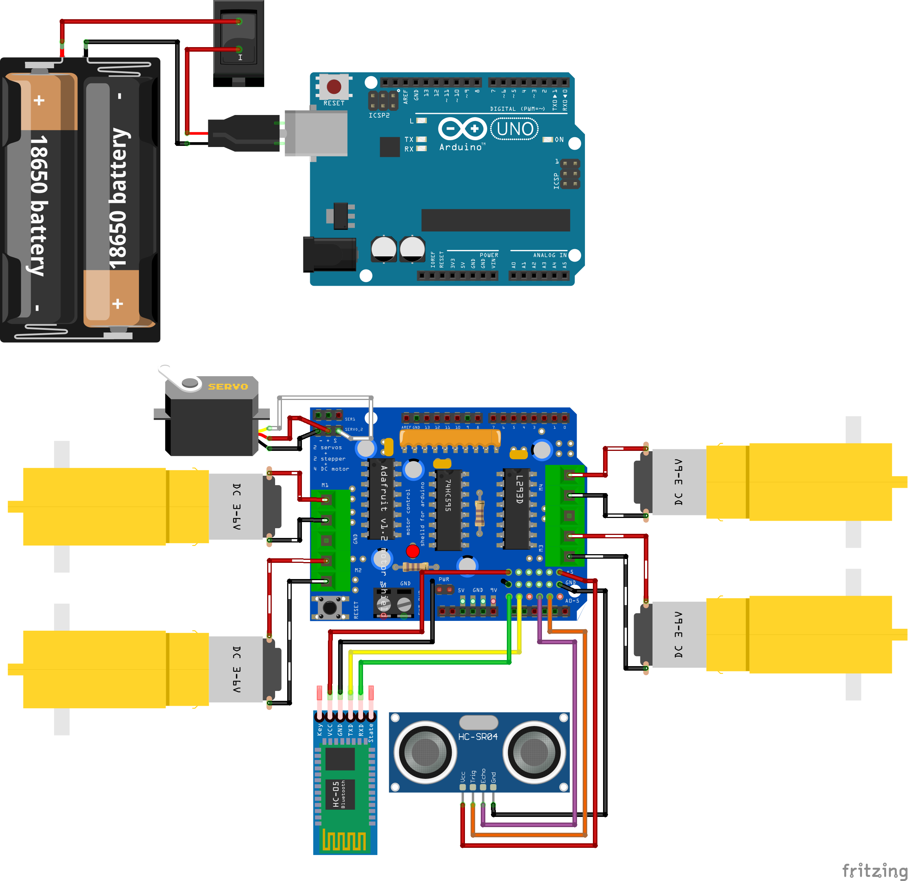
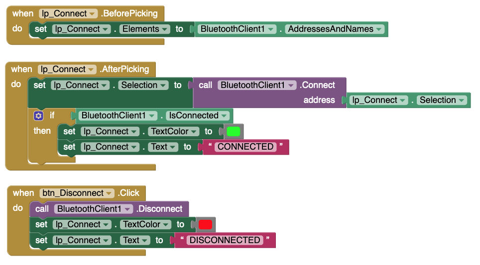
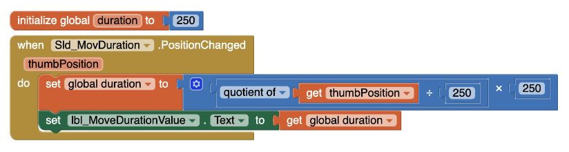
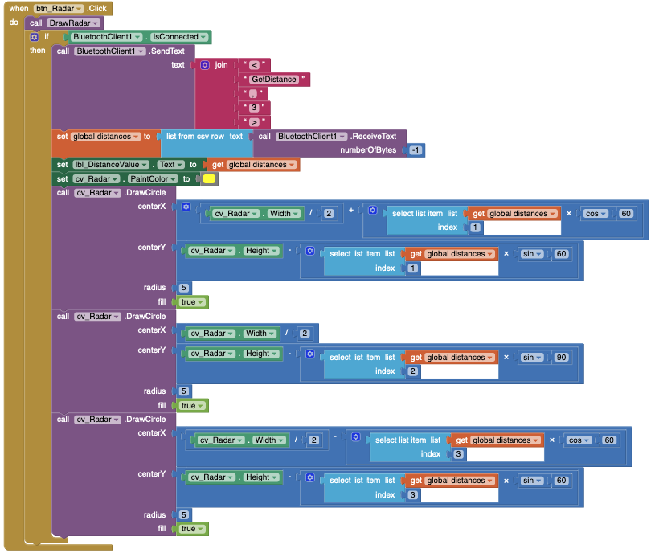
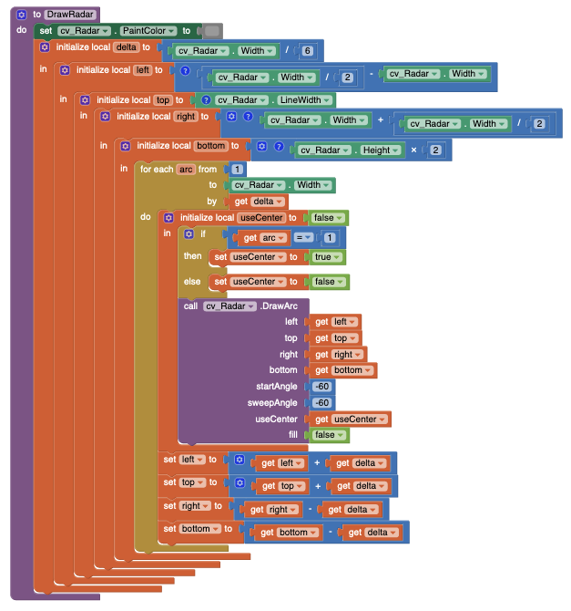
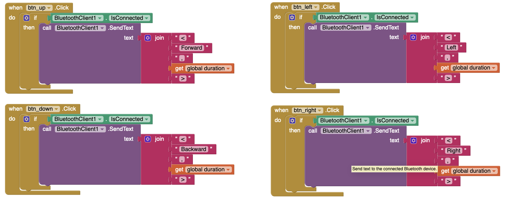

In this post, I show a 4 wheels mobile robot with Arduino.
<style>
  /* Three image containers (use 25% for four, and 50% for two, etc) */
  .column {
    float: left;
    width: 46%;
    padding: 2%;
  }

  /* Clear floats after image containers */
  .row::after {
    content: "";
    clear: both;
    display: table;
  }

  img {
    border-radius: 1%;
  }

  video {
    border-radius: 1%;
  }

  p {
    text-align: justify;
  }

  figure {
    text-align: justify;
  }

  .text table, 
  .text th, 
  .text td {
    width: 100%; 
    margin-left: auto; 
    margin-right: auto;
    border: 1px solid black;
    border-collapse: collapse;
    padding-left: 15px;
    padding-right: 15px;
    text-align: center;
  }
</style>

## Introduction
<p>
  Developing a wheeled mobile robot with Arduino is maybe the most suitable project to introduce the world of digital technology, programming, electronics and the Arduino platform. On this page, you will find all the information to build a mobile robot controlled by Bluetooth with Arduino and powered by DC motors. Moreover, there is a lot of wheeled robot projects with different features which can be used as a reference to replicate or study: 
</p>

<p>
- <a href="https://www.youtube.com/watch?v=1WVb6qyorLc"> A mobile robot by Humberto Higinio</a>
- Type of wheeled transmission: 4WD
- Battery: One lipo 2S of 7.4V
- Main functionality: Line follower
- Features: Ultrasonic sensor HC-SR04
- Motor Driver: L298N
- Connectivity: No one
- Control board: Arduino Nano
</p>

<p>
- <a href="https://www.youtube.com/watch?v=j0RuO9pQvCI"> A mobile robot by Iván Espinoza</a>
- Type of wheeled transmission: 2WD
- Battery: 2 x 18650 of 3.7V
- Main functionality: Generic mobile robot
- Features: Servomotor SG90 + Ultrasonic sensor HC-SR04
- Motor Driver: L293D
- Connectivity: No one
- Control board: Arduino Uno
</p>

<p>
- <a href="https://www.youtube.com/watch?v=xTILIkExKZo"> The kit Elegoo V3 review by DroneBot Workshop</a>
- Type of wheeled transmission: 4WD
- Battery: 2 x 18650 of 3.7V
- Features: Servomotor SG90 + Ultrasonic sensor HC-SR04
- Connectivity: Bluetooth
- Motor Driver: L298N
- Control board: Arduino Uno
</p>

<p>
- <a href="https://www.youtube.com/watch?v=Pqs-3GgWW3s"> The robot kit by UtGo</a>
- Type of wheeled transmission: 4WD
- Battery: 2 x 18650 of 3.7V
- Connectivity: Bluetooth
- Motor Driver: Adafruit Motor Shield V1
- Control board: Arduino Uno
- Android App: <a href="https://play.google.com/store/apps/details?id=braulio.calle.bluetoothRCcontroller&hl=en&pli=1"> Generic Bluetooth RC Controller</a>
</p>

<p>
- <a href="https://www.youtube.com/watch?v=WH49pDwEZM4&t=467s"> The soccer robot kit ANTT Robotics</a>
- Type of wheeled transmission: 2WD
- Battery: 2 x 18650 of 3.7V
- Features: Servomotor SG90 + Ultrasonic sensor HC-SR04 + Line Follower
- Connectivity: Bluetooth
- Motor Driver: L298N
- Control board: Arduino Uno
- Android App: There is no link for the used App, but the generic App could work. 
</p>

## Circuit and components

<figure style="text-align: center; 
              margin-left: auto; 
              margin-right: auto;">
    
  <figcaption>
    Figure 1: Breadboard schema of the circuit.
  </figcaption>
</figure>

The components are:
- 1 Arduino Uno R3
- 1 Adafruit Motor Driver <font color="red">V1</font>
- 4 Generic "Yellow" DC Gear Motor 3V-6V
- 2 Battery 18650
- 1 Battery holder for 18650
- 1 Breadboard mini
- 1 Servomotor Futaba 3003
- 1 Ultrasonic sensor HC-SR04
- 1 Bluetooth module HC05
- 1 Protoboard mini
- 1 Acrylic platform to mount the components 
- Jumpers male-male to make the connections

<p>
  The mapping between the circuit component pins and the Arduino and shield pins is:
</p>

<table class="text">
  <colgroup>
    <col span="1" style="width: 40%;">
    <col span="1" style="width: 20%;">
    <col span="1" style="width: 20%;">
    <col span="1" style="width: 20%;">
  </colgroup>
  <caption>
    Table 1: Pin's mapping between the circuit components pins and the Arduino and shield pins
  </caption>
  <tr>
    <th class="text">COMPONENT NAME</th>
    <th class="text">COMPONENT PIN</th>
    <th class="text">ARDUINO PIN</th>
    <th class="text">SHIELD PIN</th>
  </tr>
  <tr>
    <td class="text" rowspan="3">Servomotor Futaba 3003</td>
    <td class="text">GND</td>
    <td class="text">GND</td>
    <td class="text">GND</td>
  </tr>
  <tr>
    <td class="text">VCC</td>
    <td class="text">5V</td>
    <td class="text">+</td>
  </tr>
  <tr>  
    <td class="text">Signal</td>
    <td class="text">D9</td>
    <td class="text">SERVO_2</td>
  </tr>
  <tr>
    <td class="text" rowspan="4">Ultrasonic sensor HC-SR04</td>
    <td class="text">GND</td>
    <td class="text">GND</td>
    <td class="text">GND</td>
  </tr>
  <tr>
    <td class="text">VCC</td>
    <td class="text">5V</td>
    <td class="text">+5V</td>
  </tr>
  <tr>
    <td class="text">ECHO</td>
    <td class="text">A3</td>
    <td class="text">A3</td>
  </tr>
  <tr>
    <td class="text">TRIGGER</td>
    <td class="text">A4</td>
    <td class="text">A4</td>
  </tr>
  <tr>
  <td class="text" rowspan="4">Bluetooth module HC05</td>
    <td class="text">GND</td>
    <td class="text">GND</td>
    <td class="text">GND</td>
  </tr>
  <tr>
    <td class="text">VCC</td>
    <td class="text">5V</td>
    <td class="text">+5V</td>
  </tr>
  <tr>
    <td class="text">RX</td>
    <td class="text">A0</td>
    <td class="text">A0</td>
  </tr>
  <tr>
    <td class="text">TX</td>
    <td class="text">A1</td>
    <td class="text">A1</td>
  </tr>
</table>

## Code
### Libraries and Variables
The first part of the code consists to include the libraries and define the variables and constants that are going to use. 
The libraries used are:
- `AFMotor.h` to use the <a href="https://learn.adafruit.com/adafruit-motor-shield/overview">  Adafruit Motor Shield</a>.
- `SoftwareSerial.h` to enable serial communication with the HC05 Bluetooth module.
- `Servo.h` <font color="red">Optional</font> if you want to use the standard servo functions. In this case, I wrote a function to control the servo. 


```cpp
#include <AFMotor.h>
#include <SoftwareSerial.h>
#include <Servo.h>

// Pins for the bluetooth module
const int TxPin = A0; // Attach to the RX module's pin
const int RxPin = A1; // Attach to the TX module's pin
SoftwareSerial SerialBluetooth(RxPin,TxPin);

// Pins for the HC-SR04 ultrasonic sensor
const int echoPin = A3; //attach pin A3 Arduino to pin Echo of HC-SR04
const int trigPin = A4; //attach pin A4 Arduino to pin Trig of HC-SR04

// Pin for the Servomotor -> SERVO_2 in Adafruit Motor Shield
const int servoPin = 9;
int positionIndex = 0;

// Variables to store the received data
const byte numChars = 32;     // Num of chars to receive
char receivedChars[numChars]; // Buffer to receive data

char tempChars[numChars];     // Temporary array for use when parsing
char messageFromBluetooth[numChars] = {0};
int integerFromBluetooth = 0;
boolean newData = false;

// Motor objects declaration for Adafruit Motor Shield
AF_DCMotor motorshield_dc_1(1);
AF_DCMotor motorshield_dc_2(2);
AF_DCMotor motorshield_dc_3(3);
AF_DCMotor motorshield_dc_4(4);

// Variables for motor control
int speed = 255;
char phoneCommand[numChars] = {0};
int motorDuration;

// Functions headers
void MoveForward(int speed = 255, int duration = 50);
void MoveBackward(int speed = 255, int duration = 50);

/* Create servo object to control a servo. It is optional 
if you want to control the servo with the servo.h library */
Servo myservo;
```

## Setup() Function
The `setup()' function defines the pin modes, the serial communication baud rate for the main serial port and other software serial ports for the Bluetooth module in an independent way. 

This is a notable aspect of this project due that the main serial can be left open for <a href="https://docs.arduino.cc/tutorials/communication/TwoPortReceive?_gl=1*14gg3c7*_ga*MTIwODUwNTc3Mi4xNjYwMzQ0ODE2*_ga_NEXN8H46L5*MTY4MDUyOTk5MS4zLjEuMTY4MDUzMDA2My4wLjAuMA..">debugging purposes</a>. This feature is not present in the shown projects in the last section and the inconvenience is that each time you have to program the Arduino, you have to disconnect the Bluetooth module.

```cpp
void setup()
{
  // Define pin modes for RX and TX
  pinMode(RxPin, INPUT);
  pinMode(TxPin, OUTPUT);
  
  // Initialize the serial communication:
  Serial.begin(9600); //baud rate

  // Initialize the Bluetooth serial communication with the Arduino:
  SerialBluetooth.begin(9600); //baud rate 

  // Pin to control the servomotor without the servo.h library
  pinMode(servoPin, OUTPUT); 
  
  /// Sensor HC-SR04 Pins
  pinMode(trigPin, OUTPUT);
  pinMode(echoPin, INPUT);
  
  // Set 0 as initial speed value for the motors
  motorshield_dc_1.setSpeed(0);
	motorshield_dc_2.setSpeed(0);
	motorshield_dc_3.setSpeed(0);
	motorshield_dc_4.setSpeed(0);
  
  ///motors Fast stop
  Stop(); 

  /* Attaches the servo on pin 9 to the servo object
  Commented because the code uses a own defined function 
  to control the servo */
  // myservo.attach(9); 
}
```
### Communication Functions
The communication protocol is based on<a href="https://forum.arduino.cc/t/serial-input-basics-updated/382007"> this Arduino introductory tutorial</a> which shows how to receive serial data to the Arduino using complete words, numbers, letters and symbols instead of using only letters.

The first function is `receiveDataFromPhone()` which defines the `<`and `>` characters to delimitate the complete message to be received by the Arduino which can be a set of words, numbers, letters and symbols in only one line-ending or "sentence" for the full message.  

This function checks if new data is available in the serial port and if no new data or line-ending message has been received yet. If this occurs, the full message is read character by character from the start maker until the end marker character is reached and stored in an array of `chars` named `receivedChars[numChars]`. The maximum number of chars that can be stored is 32 which is set in the `numChars` variable. The process finishes when the `\0` character is read and it is signaling to set the boolean variable `newData` to true.
```cpp
void receiveDataFromPhone()
{
  // Get ready for waiting another new data
  newData = false;
  
  static boolean recvInProgress = false;
  static byte ndx = 0;
  char startMarker = '<';
  char endMarker = '>';
  char rc;

  while (SerialBluetooth.available() > 0 && newData == false) 
  {
    rc = SerialBluetooth.read();

    if (recvInProgress == true) 
    {
      if (rc != endMarker) 
      {
        receivedChars[ndx] = rc;
        ndx++;
        if (ndx >= numChars) 
        {
          ndx = numChars - 1;
        }
      }
      else 
      {
        receivedChars[ndx] = '\0'; // terminate the string
        recvInProgress = false;
        ndx = 0;
        newData = true;
      }
    }
    else if (rc == startMarker) 
    {
      recvInProgress = true;
    }
  }  
}
````

To split the data the function named `SplitReceivedDate()` is used. The full message is split character by character using the **comma** (`,`) punctuation mark as the tokenizer symbol for each part of the message. 

Each split part of the message is stored in global variables that will be used by the entire code. The message is made of **two parts: one string and one integer**. The first is the name of the motor command and the second is the duration of this motor command that will be executed by the robot. These two parts are stored in the next two variables:
- `messageFromBluetooth` that will be copied to `phoneCommand` 
- `integerFromBluetooth` that will be copied to `motorDuration`

```cpp
void SplitReceivedData()
{
  if (newData == true)
  {
    /* 
      This temporary copy is necessary to protect the original data
      because strtok() replaces the commas with \0
    */
    strcpy(tempChars, receivedChars);
    
    // Used by strtok() as an index
    char * strtokIndex;
    
    // Get the first part - the string
    strtokIndex = strtok(tempChars, ",");
    strcpy(messageFromBluetooth, strtokIndex);
    
    // Get the second part - the int. This continues where the previous call left off  
    strtokIndex = strtok(NULL, ",");
    // Convert this part to an integer 
    integerFromBluetooth = atoi(strtokIndex);
    
    // Copy the received data to the Robot variables
    strcpy(phoneCommand,messageFromBluetooth);
    motorDuration = integerFromBluetooth;   
    
    // ShowSplitData();  // Uncomment to print the received and tokenized data
  }
}
```

The function `showSplitData()` can show in the terminal the split message that has been received and tokenized. 
```cpp
void showSplitData() 
{
  Serial.print("Message: ");
  Serial.print(messageFromBluetooth);
  Serial.print(" | Integer: ");
  Serial.println(integerFromBluetooth);
}
```

### Logic Functions
The next part of the code consists of some functions that are in charge of controlling the robot's movements and the function of the HC-SR04 ultrasonic sensor. 

The first is the `ChooseCommand()` function. It compares the value in the `phoneCommand` variable against a const string for the four standard movements: **Forward**, **Backward**, **Left**, **Right** and finally with a **GetDistance** option if the user wants to obtain the distance to the surrounding objects. 
```cpp
void ChooseCommand()
{
  // Choose Forward direction
  if (strcmp(phoneCommand,"Forward") == 0 && newData == true) 
  {
    Serial.print("Forward");
    Serial.print(" | duration: ");
    Serial.print(motorDuration);
    Serial.println("ms");
    MoveForward(speed, motorDuration);
  }

  // Choose Backward direction
  if (strcmp(phoneCommand,"Backward") == 0 && newData == true) 
  {
    Serial.print("Backward");
    Serial.print(" | duration: ");
    Serial.print(motorDuration);
    Serial.println("ms");
    MoveBackward(speed, motorDuration);
  }

  // Choose a Left turn
  if (strcmp(phoneCommand,"Left") == 0 && newData == true) 
  {
    Serial.print("Left");
    Serial.print(" | duration: ");
    Serial.print(motorDuration);
    Serial.println("ms");
    TurnLeft(motorDuration);
  }

  // Choose a Right turn
  if (strcmp(phoneCommand,"Right") == 0 && newData == true) 
  {
    Serial.print("Right");
    Serial.print(" | duration: ");
    Serial.print(motorDuration);
    Serial.println("ms");
    TurnRight(motorDuration);
  }

  // Make a sweep with the servo and get the distance
  if (strcmp(phoneCommand,"GetDistance") == 0 && newData == true) 
  {
    MakeSonar();
  }
}
```
## Motor Control Functions
The next functions control the motors directly using the commands from the <a href="https://learn.adafruit.com/adafruit-motor-shield/overview"> Adafruit Motor Shield</a>. There are four functions, one for each movement. To control the motor, the speed and the duration of the movement are required. The speed is set to *255*, which is the maximum value, and the duration comes from the user and can be in the range between *250ms and 2000ms*.

```cpp
void MoveForward(int speed = 255, int duration = 50) 
{
  // Set the back motor's speed for traction  
  motorshield_dc_1.setSpeed(speed);
	motorshield_dc_4.setSpeed(speed);
  // Decrease the front motors speed for power management
	motorshield_dc_2.setSpeed(25);
	motorshield_dc_3.setSpeed(25);
  
  // Set the motor's direction    
	motorshield_dc_1.run(FORWARD);
	motorshield_dc_2.run(FORWARD);
	motorshield_dc_3.run(FORWARD);
	motorshield_dc_4.run(FORWARD);
	delay(duration);
  Stop();
}
```

```cpp
void MoveBackward(int speed = 255, int duration = 50) 
{
  // Set the back motor's speed for traction  
  motorshield_dc_1.setSpeed(speed);
	motorshield_dc_4.setSpeed(speed);
  // Decrease the front motor's speed for power management
	motorshield_dc_2.setSpeed(25);
	motorshield_dc_3.setSpeed(25);
  
  // Set the motor's direction 
	motorshield_dc_1.run(BACKWARD);
	motorshield_dc_2.run(BACKWARD);
	motorshield_dc_3.run(BACKWARD);
	motorshield_dc_4.run(BACKWARD);
  delay(duration);
  Stop();
}
```

```cpp
void TurnLeft (int duration) 
{
  // Set the right motor's speed for traction  
  motorshield_dc_1.setSpeed(255);
	motorshield_dc_2.setSpeed(255);
  
  // Set the motor's direction 
	motorshield_dc_1.run(FORWARD);
	motorshield_dc_2.run(FORWARD);
	motorshield_dc_3.run(RELEASE);
	motorshield_dc_4.run(RELEASE);
	delay(duration);
  Stop();
}
```

```cpp
void TurnRight (int duration) 
{
  // Set the left motor's speed to turn to right
	motorshield_dc_3.setSpeed(255);
	motorshield_dc_4.setSpeed(255);
  
  // Set the motor's direction 
	motorshield_dc_1.run(RELEASE);
	motorshield_dc_2.run(RELEASE);
	motorshield_dc_3.run(FORWARD);
	motorshield_dc_4.run(FORWARD);
	delay(duration);
  Stop();
}  
```

## HC-SR04 Functions
The last function `MakeSonar()`is in charge of operating the HC-SR04 ultrasonic sensor. This function obtains the distance at 3 different angles: *60&deg;*,  *90&deg;* and *125&deg;*. These positions can be reached thanks to the servomotor Futaba 3003 which the ultrasonic sensor is attached to. In the last part of the function, the string `distances` contains the 3 values and it is sent back to the phone with the distance data.
```cpp
void MakeSonar()
{
  // Move the servo
  servoPulse(servoPin,60);
  delay(200); 
  long distance1 = GetDistance();
  
  servoPulse(servoPin,90);
  delay(200); 
  long distance2 = GetDistance();
  
  servoPulse(servoPin,125);
  delay(200); 
  long distance3 = GetDistance();

  // Displays the distance on the Serial Monitor
  Serial.print("[");
  Serial.print(distance1);
  Serial.print(",");
  Serial.print(distance2);
  Serial.print(",");
  Serial.print(distance3);
  Serial.println("]");

  // Send the distance to Bluetooth 
  String distances = (String) distance1 + "," + (String) distance2 + "," + (String) distance3;
  SerialBluetooth.println(distances);
}
```

The function `servoPulse()` moves the servomotor Futaba 3003 converting the desired angle into microseconds which are used to activate the servomotor using the PWM technique.
```cpp
void servoPulse (int servoPin, int angle)
{
  int pwm = (angle*11) + 440;      // Convert angle to microseconds
  for (int i = 0; i < 100; i++) {
    digitalWrite(servoPin, HIGH);
    delayMicroseconds(pwm);
    digitalWrite(servoPin, LOW);
    delayMicroseconds(2420-pwm);    // Refresh cycle of servo
  }
}
```

The function `GetDistance()` controls the activation of the HC-SR04 in a standard way to measure the wave's time travel when it hits an object. Then, the distance is calculated taking into account the sound`s speed and the measured time.
```cpp
long GetDistance () {
  // Clears the trigPin condition
  digitalWrite(trigPin, LOW);
  delayMicroseconds(5);
  
  // Sets the trigPin HIGH (ACTIVE) for 10 microseconds
  digitalWrite(trigPin, HIGH);
  delayMicroseconds(10);
  digitalWrite(trigPin, LOW);

  // Reads the echoPin, returns the sound wave travel time in microseconds
  long duration = pulseIn(echoPin, HIGH);
  
  // Calculating the distance
  long distance = duration * 0.034 / 2; // Speed of sound wave divided by 2 (go and back)
  
  return distance;
}  
```

## The Android App
The phone app is made with the platform <a href="https://appinventor.mit.edu/"> MIT App Inventor</a> for Android Phones. The main advantage consists in that this platform lets to program using blocks, runs online, and lets to connect your phone through WiFi, making the programming so simple.

The app lets to move the robot in four main directions: forward, backward, turn to the left and turn to the right. Besides it lets to measure the distance to the surrounding objects at 3 different angles: *60&deg;*,  *90&deg;* and *125&deg;* and draw this information with small circles in a graph like a sonar on the phone. 

The main screen of the app can be seen in Figure 2. From up to bottom, it consists of the next elements:
- The buttons do connect/disconnect the Bluetooth module from the Arduino.
- A Label box to show numerically the values of the distance measure.
- A Slider to control the movement duration in a range between *250ms and 2000ms*
- A sonar-like graph to draw the location of the surrounding obstacles detected through a distance measure.
- The buttons for controlling the robot's movements and the button that executes a distance measure.

<figure style="text-align: center; 
              margin-left: auto; 
              margin-right: auto;">
    
  <figcaption>
    Figure 2: Main screen of the App with its controls and elements.
  </figcaption>
</figure>

### Bluetooth Connection Blocks
The blocks to control the connection between the Bluetooth HC05 module and the Arduino are shown in Figure 3a. 
<figure style="text-align: center; 
              margin-left: auto; 
              margin-right: auto;">
    
  <figcaption>
    Figure 3a: Set of blocks to control the connection between the Bluetooth HC05 module and the Arduino.
  </figcaption>
</figure>

### Slider Blocks
The coding blocks to map the Slider values to the movement's duration of the robot are shown in Figure 3b. The mapping is done by calculating the quotient of the Slider's values between 250 and multiplying this quotient by 250. This results in steps or intervals of 250 instead of continuous values, which reduces the duration values to eight possible values: 250, 500, 750,1000, 1250, 1500, 1750 and 2000 if the Slider has limited to a maximum value of 2000.
<figure style="text-align: center; 
              margin-left: auto; 
              margin-right: auto;">
    
  <figcaption>
    Figure 3b: Set of blocks to map the Slider values to the movement's duration of the robot.
  </figcaption>
</figure>

### Blocks to Get and Graph the Distance 
To get the distance to the surrounding objects, the app uses the sets of blocks which are shown in Figure 3c. These blocks send the instruction for the robot to measure the distance. Immediately after, the app checks the Bluetooth buffer for the acquired values contained in a list of values separated by commas (`,`). Remember that the robot measures the distance at 3 different angles (60&deg;,  90&deg; and 125&deg;). After these instructions, each value is extracted from the list and drawn in the graph using the graph's width and height as the limits to calculate the center's position of the point that represents a detected obstacle.
<figure style="text-align: center; 
              margin-left: auto; 
              margin-right: auto;">
    
  <figcaption>
    Figure 3c: Set of blocks to draw the surrounding obstacles in the sonar-like graph.
  </figcaption>
</figure>

On the other hand, Figure 3d shows the blocks to draw the arcs and lines that shape the sonar aspect of the graph. This uses a variable called `delta` to define how many arcs will be drawn. By default, this value is set to 6, and this number is the base on which the blocks calculate the coordinates of the six arcs to be drawn.
<figure style="text-align: center; 
              margin-left: auto; 
              margin-right: auto;">
    
  <figcaption>
    Figure 3d: Set of blocks to draw the sonar-like graph.
  </figcaption>
</figure>

### Movements Control Blocks
For controlling the robot's movements, the app has four sets of blocks which are shown in Figure 3d. Each one of these sets sent a string value with the command's name and the desired duration of the movement set with the Slider control.
<figure style="text-align: center; 
              margin-left: auto; 
              margin-right: auto;">
    
  <figcaption>
    Figure 3d: Set of blocks for controlling the robot's movements.
  </figcaption>
</figure>

<figure style="text-align: center; 
              margin-left: auto; 
              margin-right: auto;">
    
  <figcaption>
    Figure 3b: Set of blocks #2 of the App.
  </figcaption>
</figure>

<figure style="text-align: center; 
              margin-left: auto; 
              margin-right: auto;">
    
  <figcaption>
    Figure 3c: Set of blocks #3 of the App.
  </figcaption>
</figure>

## First Test

<figure style="text-align: justify;">
  <video width="100%" controls poster="../assets/images/Post56/ScreenVideo.png">
    <source src="../assets/images/Post56/MOV_2023-03-26_16-52-01.mov  " type="video/mp4">
  </video>
  <figcaption>
    Video 1: First running of the 4WD Robot.
  </figcaption>
  </figure>
