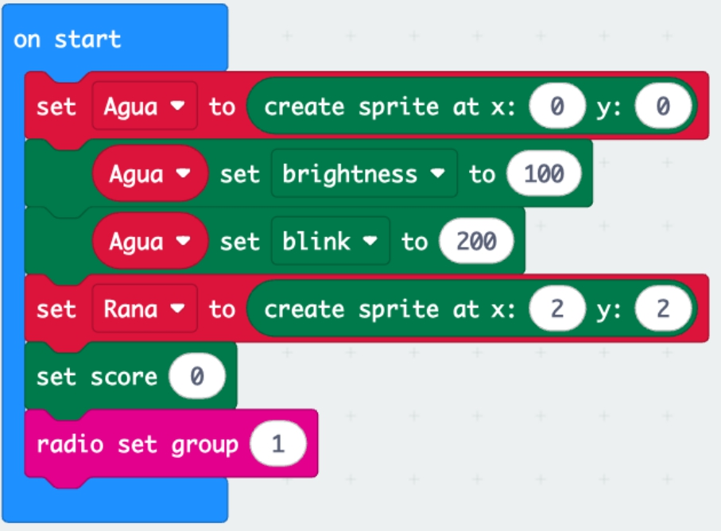
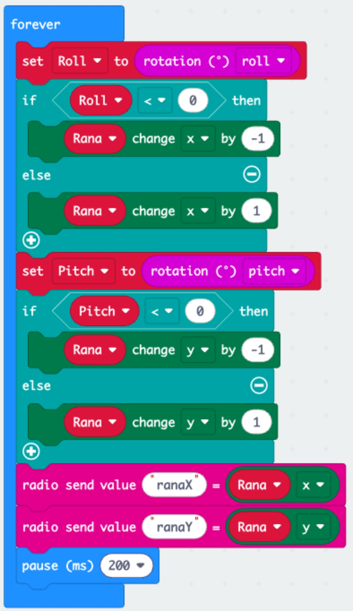
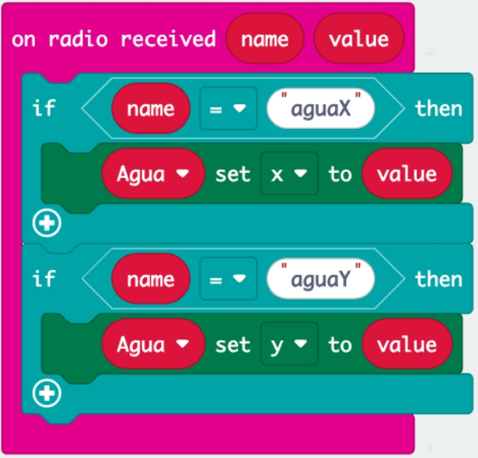
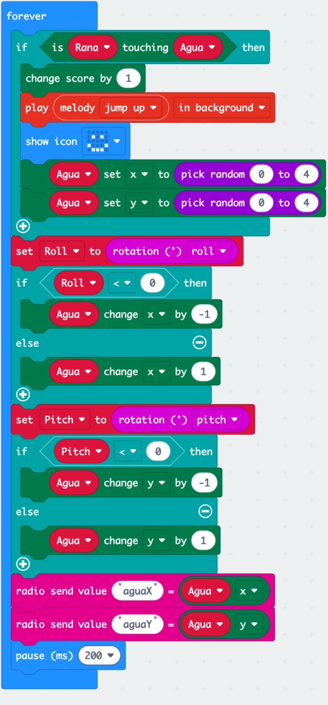
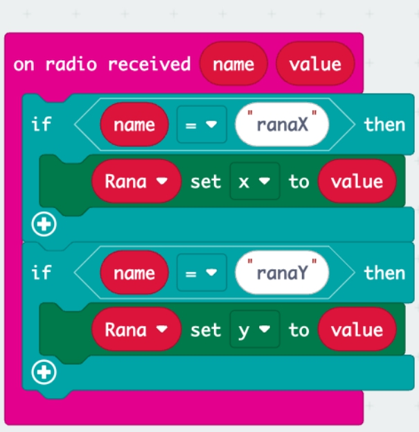

In this post, I show the set of block codes for programming an interactive game between two players using Micro:bit boards 

## Introduction

 Interactive Frog and Water Game for Two Players Using micro:bit
Introduction
Playing with the micro:bit board is always a fun and exciting experience. But did you know you can take it to the next level by making two micro:bit boards communicate with each other? This allows two players to interact in real-time, creating a unique and thrilling gaming experience. In this game, you'll learn how to make this happen using the micro:bit boards' radio communication capability. It’s a fun and simple way to introduce kids, teens, and even adults to the world of embedded programming and digital technology.

The game features two characters: a frog and water. One player controls the frog, while the other controls the water. Each player uses their own micro:bit. The objective is for the frog to reach the water as many times as possible. Player #1 controls the frog using the micro:bit's accelerometer, and Player #2 moves the water using theirs. What makes this game so exciting is that as the water moves, it becomes harder for the frog to reach it. And here’s the cool part: both micro:bits display the real-time position of both characters. This means the two players can interact with each other, making it a truly unique gaming experience.

## Program for Micro:bit 1: Frog character.
The first part of the code shows the setup for both characters. It uses basic components from the micro:bit game module. It's important to note that each micro:bit should have the same characters to achieve real-time synchronization.
<figure>
    
  <figcaption>
    Figure 1: Code blocks for Frog's Setup.
  </figcaption>
</figure>

The second part of the code shows the blocks for moving the frog. The micro:bit's accelerometer is used to measure the tilt along the roll and pitch axes, which then changes the frog character's coordinates on the X and Y axes, respectively. The frog can move up and down, and side to side, as the player tilts the micro:bit in different directions. Once the frog's position is determined, its X and Y coordinates are transmitted via radio to Player #2's micro:bit, who controls the water character. This entire process happens every 200 milliseconds.
<figure>
    
  <figcaption>
    Figure 2: Code blocks for Frog's movement.
  </figcaption>
</figure>

The final part of the code shows how the coordinates of the other character used. When a data from Player #2 who controls the water, is received. via radio, the water’s position on Player #1's micro:bit  is updated.
<figure>
    
  <figcaption>
    Figure 3: Code blocks for Water's sicronization.
  </figcaption>
</figure>

## Program for Micro:bit 2: Water character.
The first part of the code shows the setup for Player #2's micro:bit, which is identical to the setup code for Player #1's micro:bit. Similarly, it's important to note that each micro:bit must contain the same characters to achieve real-time synchronization.

<figure>
    
  <figcaption>
    Figure 4: Code blocks for Water's Setup.
  </figcaption>
</figure>

In the second set of code blocks, there's a sequence to check if the frog character is touching the water character, that is, if Player #1 has managed to reach the water character controlled by Player #2. Right after this check, the code blocks for moving the water are shown. Just like with the frog character, the micro:bit's accelerometer is used to measure the roll along the pitch axes, which updates the water character's coordinates on the X and Y axes, respectively.

The water character can move up and down, and left and right, as the player tilts the micro:bit in different directions. Once the water’s position is determined, its X and Y coordinates are sent via radio to Player #1's micro:bit, who controls the frog character. This entire process happens every 200 milliseconds.

<figure>
    
  <figcaption>
    Figure 5: Code blocks for Water's movement.
  </figcaption>
</figure>

The final part shows how the frog's position data is received from Player #1. Every time new data packets are detected via radio, the frog's position is updated on Player #2's micro:bit, who controls the water character. This ensures that both players' characters stay synchronized in real time.
<figure style="text-align: center; 
              margin-left: auto; 
              margin-right: auto;">
    
  <figcaption>
    Figure 6: Code blocks for Frog's sicronization.
  </figcaption>
</figure>